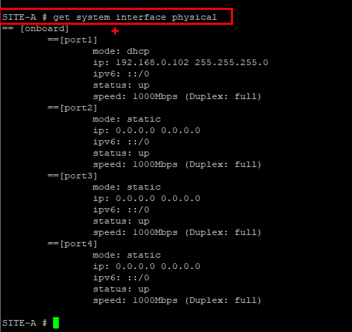
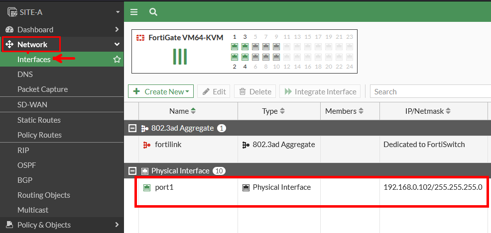
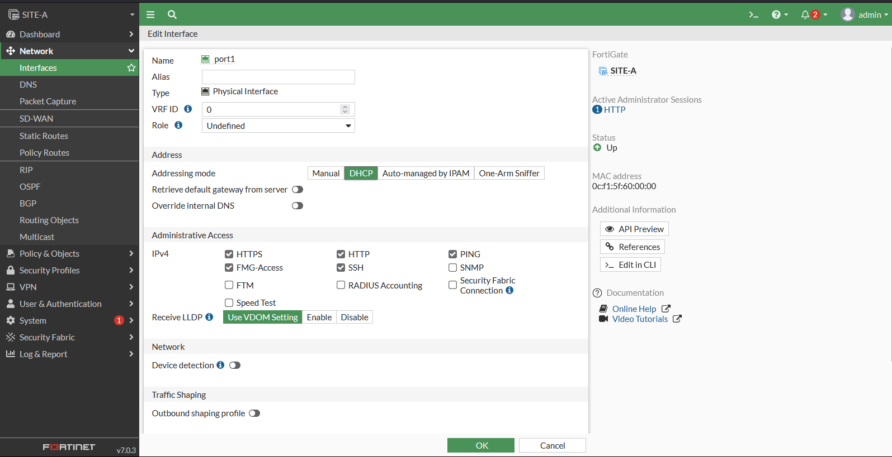
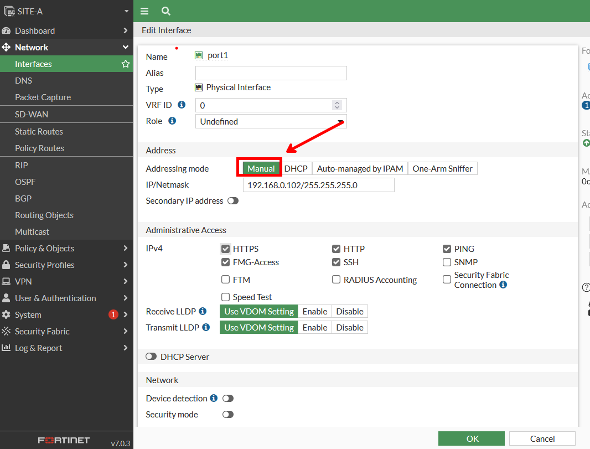
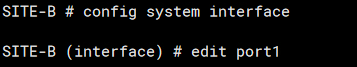
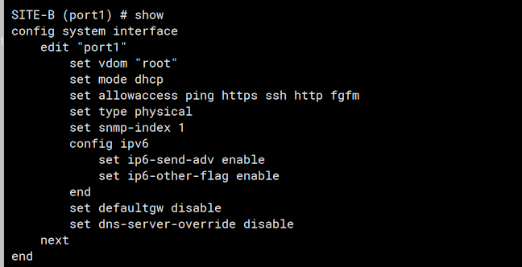
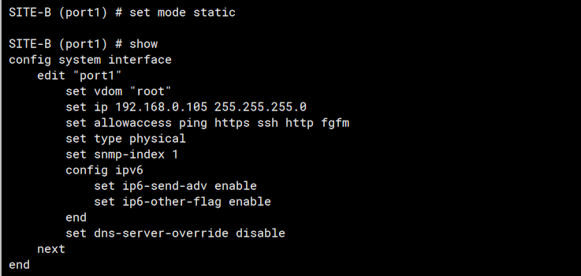
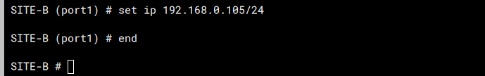

# Configuración estática de Firewall

Antes debemos de obtener la dirección de IP de nuestro Firewall:

Para ello debemos ingresar:

```c
get system interfaces physcal
```



Luego vamos a la dirección IP con el navegador:

Para Cambiar en modo grafico hacemos lo siguiente:

Vamos a la opción de `Network`:



Luego seleccionamos con doble click el puerto o interface numero 1.

Luego de seleccionar la interface (port1) tendremos la siguiente figura o algo parecido:



Entonces seleccionamos la opción de manual y escribimos la dirección que deseamos:



Luego guardamos haciendo click en `OK` y habremos guardado.

Ahora hagámoslo desde consola:

Ingresamos los siguientes comandos

```c
config system interface
```

```c
edit port1
```



Actualmente tenemos la siguiente configuración:



Para cambiar en `static` debemos ingresar:

```c
set mode static
```

Luego obtendremos :



si queremos editar la dirección IP podemos realizarlo de la siguiente manera:

```c
set ip 192.168.0.105/24
```

y para guardar ingresamos el comando `end`



