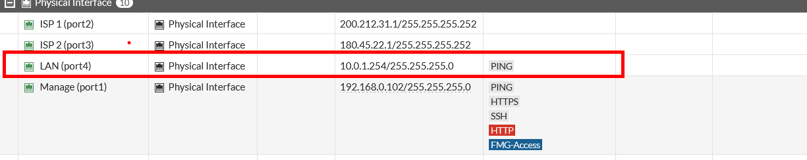

# Configuración de interfaces

## Configuración de interfaces

Tendremos en diseño de red para nuestros Firewalls


## Configuración de WAN

### Puerto 2

Para configurar una wan (ISP) elegiremos el puerto que deseamos configurar, en nuestro caso será el puerto 2 y 3.


Elegimos el puerto que deseamos configurar.

Tendremos que configurar y agregar los siguiente: Alias que en mi caso le puse `ISP 1` dandole un rol de `WAN` y asignado la IP `200.212.31.1/30`


Luego simplemente haremos click en `OK` y se guardara.

### Puerto 3

Ahora hagamos lo mismo para el Puerto 3 .


Luego podremos observar las direcciones IPs que le asignamos en la opción de interfaces.


Pero aun no tendremos conectividad con internet.


Esto ocurre porque nos falta configurar el `static Routes`.

### Configuración de Static Routes

Iremos al apartado de `static routes` y seleccionaremos `Create New`


Ahora tendremos estas opciones, en la cual ingresaremos la dirección del gateway y el puerto(si tabulas te deberia de agregar el puerto automaticamente)


Para guardar seleccionaremos la opción de `OK` y se guardaría. Hacemos lo mismo con la interface del puerto 3. Luego de configurarlo podremos observar lo siguiente con las direcciones que nosotros configuramos.


Ahora probamos nuevamente y debemos de tener conectividad con internet.


## Configuración de LAN

La configuración de LAN es parecida a la de WAN solo se diferencia en el rol

Ingresamos a la opción de `Interfaces` y seleccionamos el puerto que deseamos configurar.


En este caso le ponemos el Alias y el Rol, que es de una `LAN` y ingresamos la dirección IP.


Luego podremos observar de esta manera si lo configuramos bien:



## Configuración de WAN por consola

Para configurar la Wan del SITE B lo realizaremos por consola. En la siguiente imagen vemos que tenemos las interfaces sin configurar:


Ahora ingresaremos al terminal, lo podemos hacer desde el `cli` del sitio web o desde putty contactándonos por ssh

#### Port2

Primero debemos ingresar a la configuración de las interfaces con el comando:

```c
SITE-B # config system interface 
```

Luego editaremos(configuraremos) un puerto, en nuestro caso es el port2:

```c
SITE-B (interface) # edit port2 
```

Ahora asignaremos una dirección de IP:

```c
SITE-B (port2) # set ip 60.89.123.1/30
```

Agregamos el alias y el rol:

```c
SITE-B (port2) # set alias ISP-1
SITE-B (port2) # set role wan 
```

Finalmente guardamos con :

```c
SITE-B (port2) # next
```

La diferencia de `next` y `end` radica en que next te deja o no sale de la configuracion de interfaces y end da por entendido que terminaste de configurar las interfaces en nuestro caso.


#### Port3

Repitamos el proceso con el puerto 3

```c
SITE-B (interface) # edit port3
SITE-B (port3) # set ip 45.32.12.1/30
SITE-B (port3) # set alias ISP-2
SITE-B (port3) # set role wan 
SITE-B (port3) # next
```


Luego de configurar podemos observar desde la interfaz la configuración que realizamos desde la terminal.


### Configuración de Static Routes por consola

Para agregar la configuración de `static routes` ingresaremos a la configuración, en este caso podemos ingresar con el comando:

```c
SITE-B # config router static 
```

Con `show` podemos ver que no se tiene ninguna configuración.

Agregaremos y para ello debemos de ingresar el siguiente comando:

```c
SITE-B (static) # edit 1
```

Vemos que se añadió


Luego ingresamos `show` y en la siguiente imagen pusimos `get`, en show nos brinda menos información que get. Estos se diferencia en que `show` es usando para ver los cambios significativos o información relevante y `get` te brinda la información completa


Luego de aclarar la diferencia de show y get, vamos a agregar el gateway y el puerto.

```c
SITE-B (1) # set gateway 60.89.123.2
SITE-B (1) # set device port2 
```


En este caso podemos hacer lo mismo para el puerto 3:

```c
SITE-B (static) # edit 2
SITE-B (2) # show
SITE-B (2) # set gateway 45.32.12.2
SITE-B (2) # set device port3 
SITE-B (2) # set distance 15
SITE-B (2) # end
```

Luego de agregarlos o ingresado los comando indicados podremos ver la siguiente configuración :

luego verificamos que tengamos conectividad a internet:


## Configuración de LAN por consola

Para realizar la configuración de la `LAN` debemos ingresar los siguientes comandos, esto se parece mucho a la configuración de un wan a diferencia de que se asigna otro rol.

```c
SITE-B # config system interface 
SITE-B (interface) # edit port4 
SITE-B (port4) # set ip 10.0.2.254/24
SITE-B (port4) # set allowaccess ping 
SITE-B (port4) # set alias LAN
SITE-B (port4) # set role lan 
SITE-B (port4) # next
SITE-B (interface) # end
```


Luego de configurarlo podremos ver las interfaces configuradas:


