# Creando Politicas

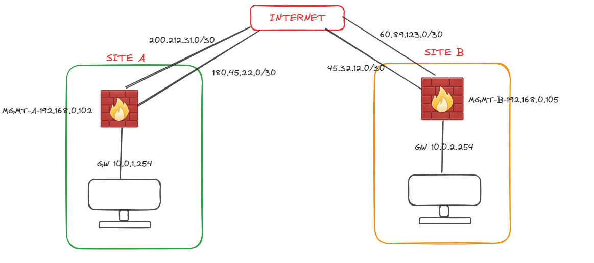

## Creando política a través de GUI 

Crearemos nuestra política que permita la conectividad desde nuestra pc del SITE A al internet.

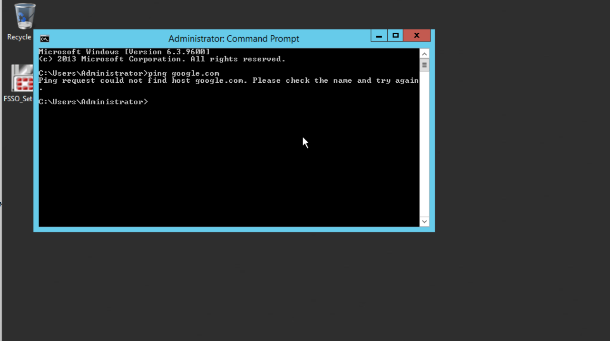

Para crear una política nos dirigimos a `Policy & Objects` luego a `Firewall Policy` :

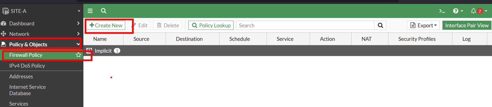

Una vez ahi, creamos una nueva politica. En este caso queremos que la Pc tenga conectividad con internet. 

Le damos un nombre y seleccionamos la interface por donde ingresara el trafico.

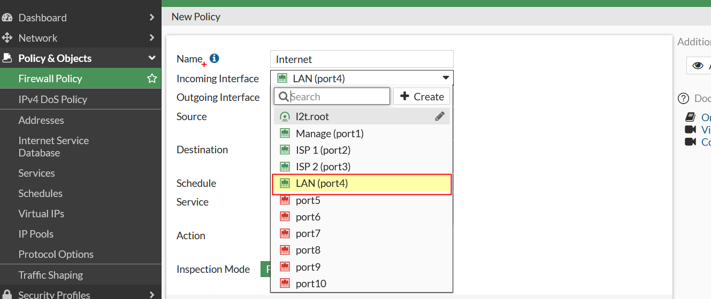

Ahora indicamos por donde saldrá el trafico

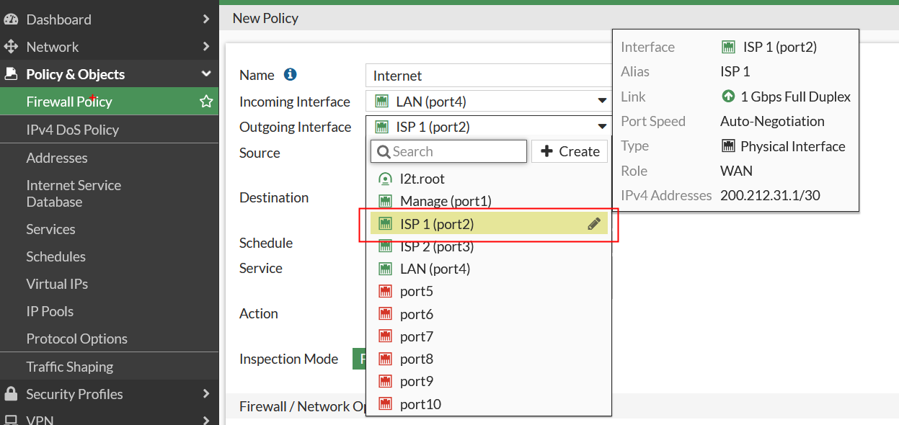

Seleccionamos un rango de direcciones o podemos filtrar y seleccionar una dirección IP especifica.

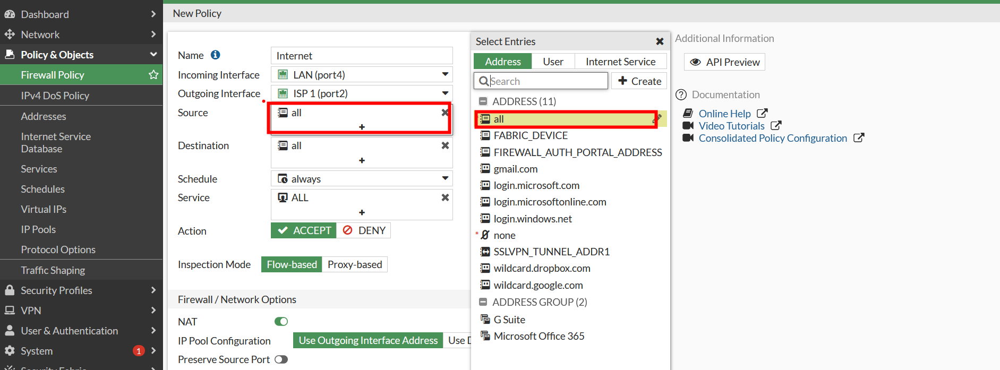

Agregamos a donde queremos que ingrese el trafico.

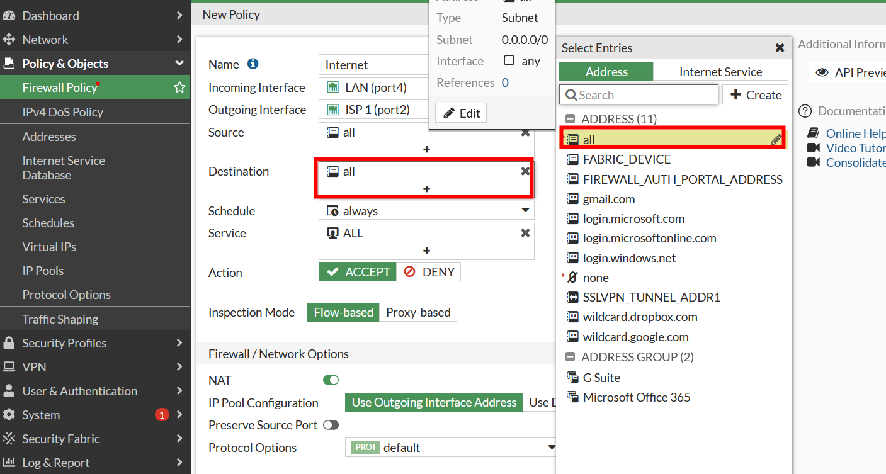

Luego elegimos a los servicios que queremos que tenga acceso, en este caso todos

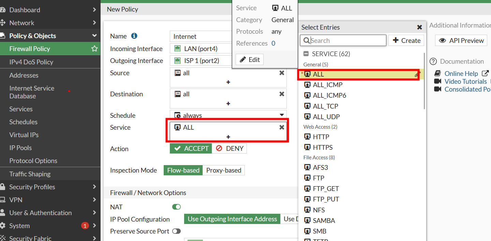

Luego seleccionamos la accion a ejecutar, en nuestro caso es de aceptar.

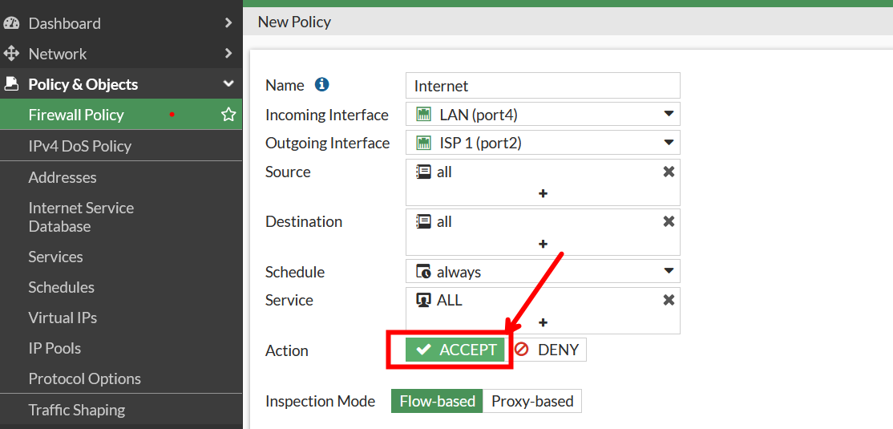

Ahora si podremos tener conectividad con internet:

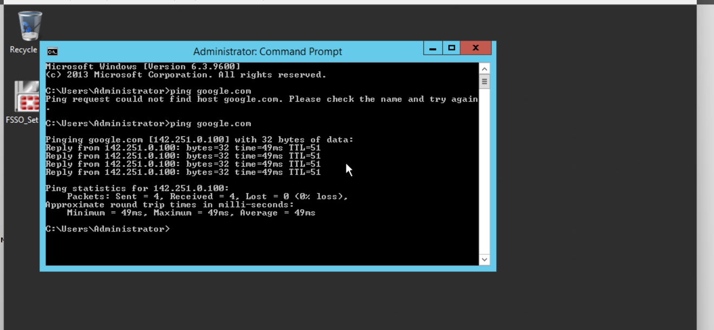

y nuestra política quedaría así:

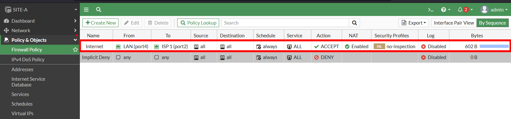

## Creando una política por la terminal

Ingresamos a la configuración de las politicas

```c
SITE-B # config firewall policy
```

Con el comando `show` podemos observar que no se tiene ninguna política creada.

```c
SITE-B (policy) # show
config firewall policy
end

```

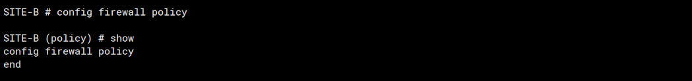

Añadimos una política  

```c
SITE-B (policy) # edit 1
new entry '1' added

SITE-B (1) # get
```

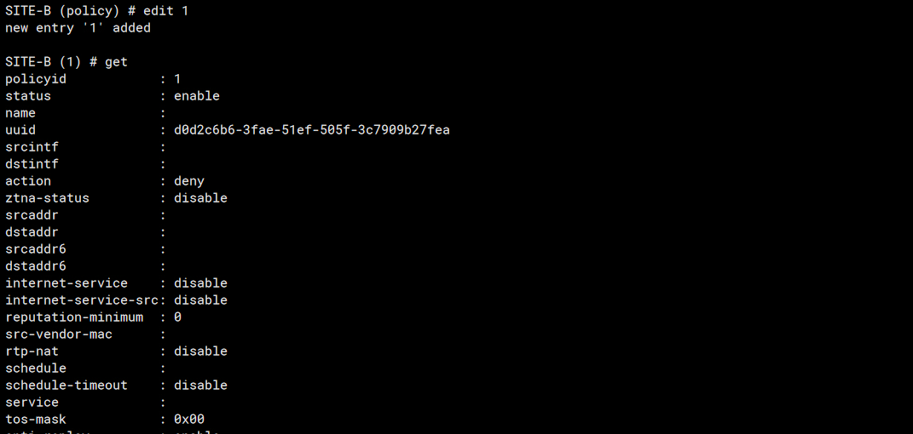

Ahora que creamos una procederemos a configurarla.

Le daremos un nombre a la política, que en nuestro caso es `INTERNET` 

```c
SITE-B (1) # set name INTERNET
```

Ahora la interface por donde ingresara el trafico.

```c
SITE-B (1) # set srcintf port4 
```

Interface por donde saldrá:

```c
SITE-B (1) # set dstintf port2
```

Rango de Ips las de las cuales se originaran el trafico:

```c
SITE-B (1) # set srcaddr all
```

Rango de direcciones IPs a donde podrán acceder:

```c
SITE-B (1) # set dstaddr all
```

Servicio o puertos a los que se accedan y también cuando se realizaran, en este caso será siempre `always`.

```c
SITE-B (1) # set schedule always 
SITE-B (1) # set service ALL 
```

Acción:

```c
SITE-B (1) # set action accept 
```

Habilitar la NAT:

```c
SITE-B (1) # set nat enable 
```

Y procedemos a guardar:

```c
SITE-B (1) # end
SITE-B # 
```


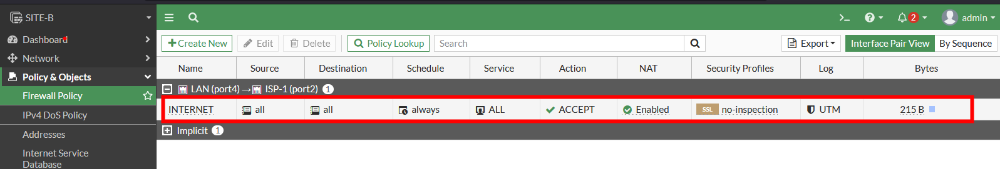

Y deberíamos de tener nuestra política creada.


