# Rutas estaticas

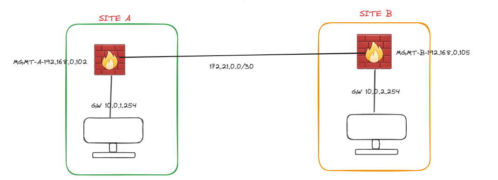

En esta practica configuraremos el Firewall de ambos sites para que tenga conectividad.

Los conectamos en el puerto numero 5. 

## SITE A
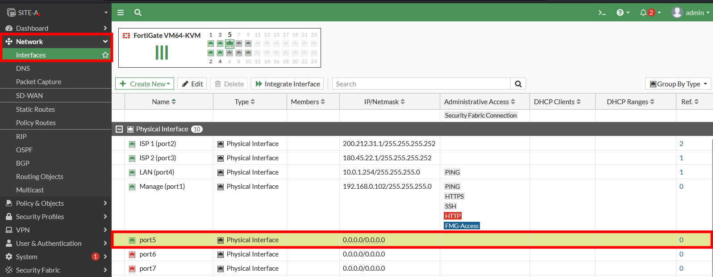

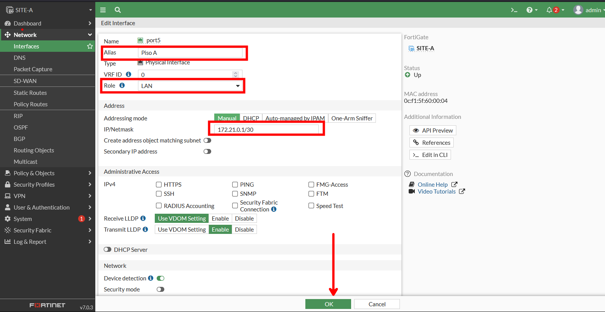

## SITE B

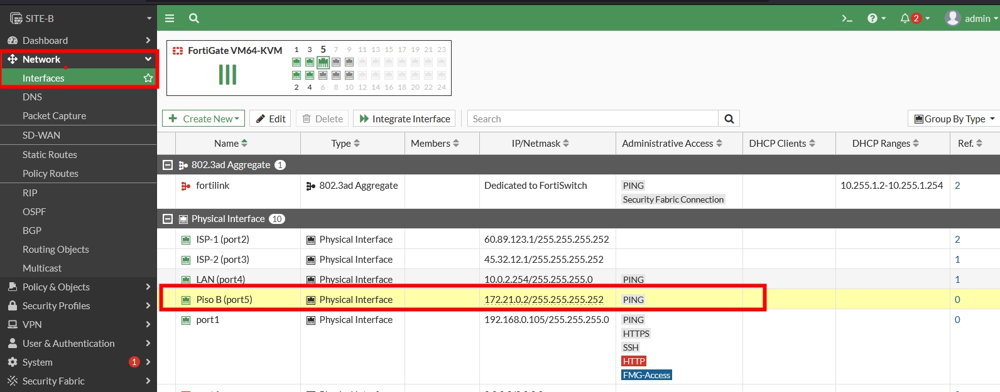

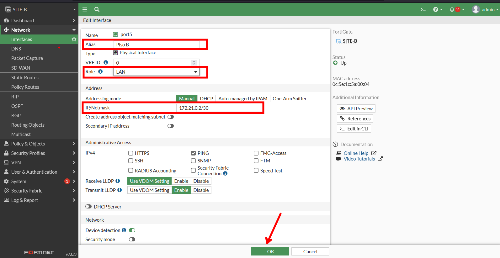

Luego de configurarlo y probamos aun no tendremos conectividad entre las PC.

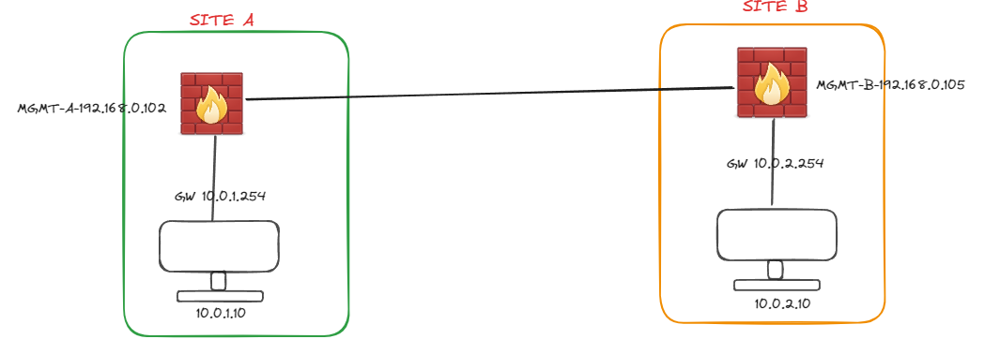

Teniendo las direcciones IPs que se muestran en la figura, realizaremos ping de ambos lados.

### Pc SITE A

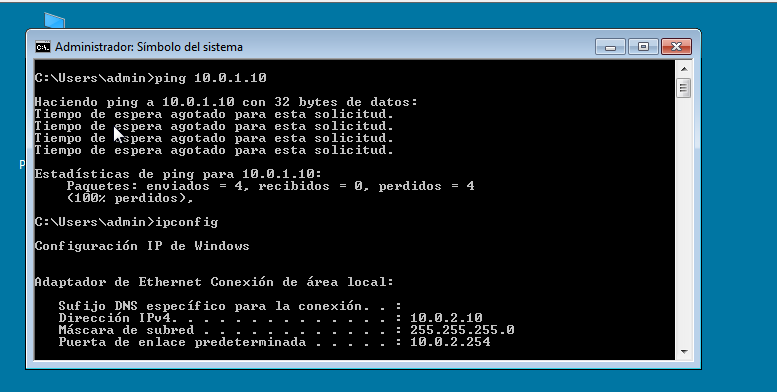

### PC SITE B

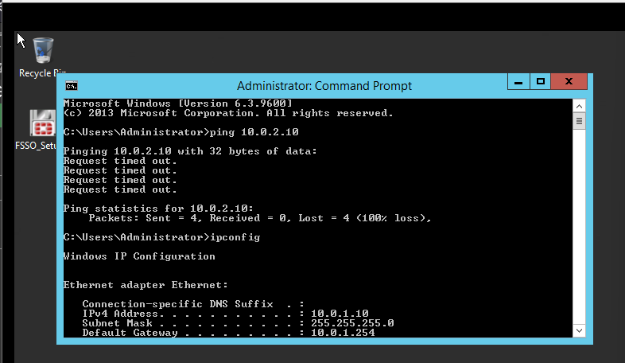

Podemos ver que no tenemos acceso, esto es debido a que tenemos que crear una política y también una ruta estática.

## Configuración de rutas estáticas

Para el caso de las rutas estaticas debemos recordar el grafico:

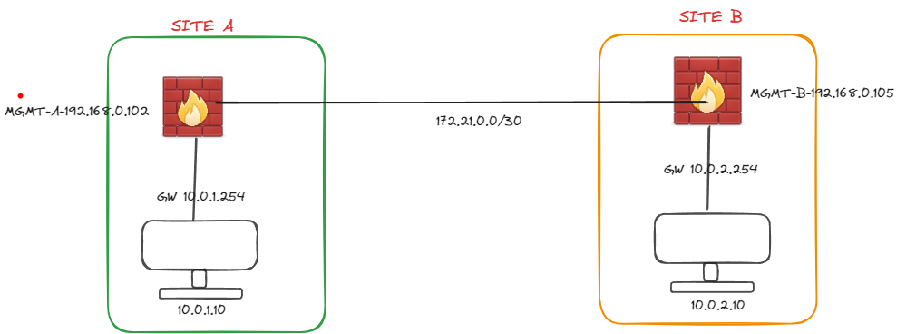

Entonces para el caso de configuración del SITE A tenemos que verlo de la siguiente manera: En la opción `Destination` colocaremos a donde queremos llevar que en este caso es la red `10.0.2.0/24` y colocar por que interface podemos llevar `Gateway` (IP `172.21.0.2`) que tiene conectividad con la red que en este caso es por la interface `port5`.

Para el caos de del SITE B es lo inverso, tenemos que verlo de la siguiente manera: En la opción `Destination` colocaremos a donde queremos llevar que en este caso es la red `10.0.1.0/24` y colocar por que interface podemos llevar `Gateway` (IP `172.21.0.1`) que tiene conectividad con la red que en este caso es por la interface `port5`.

### SITE A
Creamos una ruta estática.

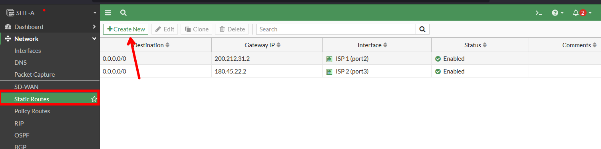

Luego configuraremos, en este caso colocamos a donde queremos llegar y cual es el gateway por la que podremos acceder a este. Luego seleccionamos la interface por la que se tendrá acceso a dicha red, que en este caso será `172.21.0.2` 

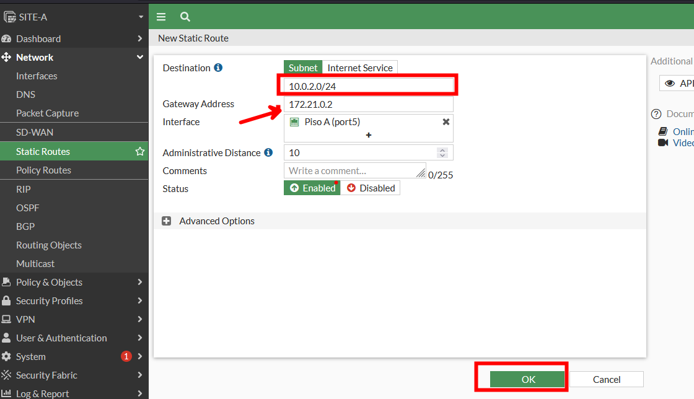

### SITE B
Creamos una ruta estatica

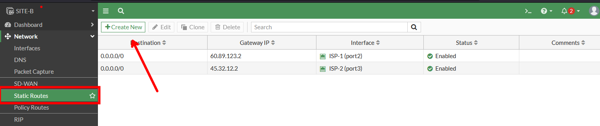

Ahora ingresamos el destino (`Destination`) a donde queremos acceder o rango de IP, en `Gateway` ingresamos la dirección IP que tiene acceso la IP que ingresamos anteriormente y luego la interface por donde tiene conectividad al otro Firewall  

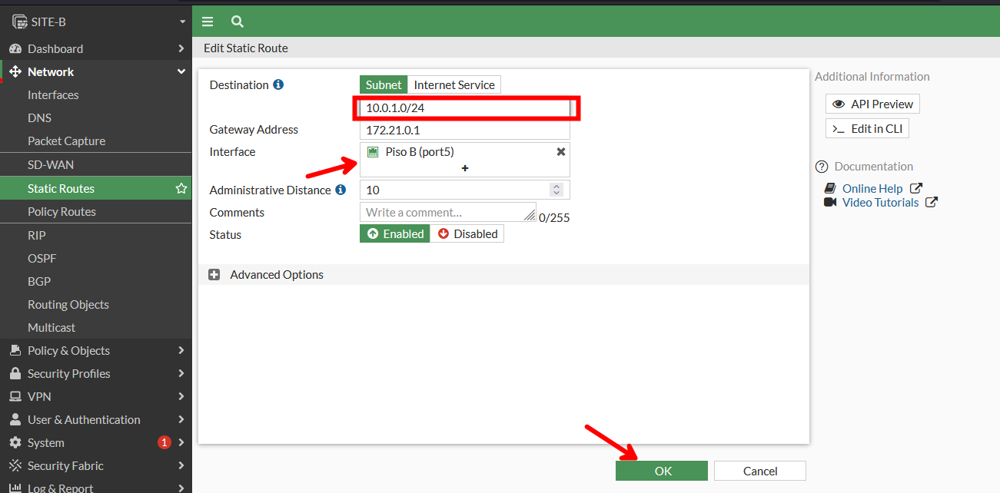

Pero a pesar de configurarlo no tendremos conectividad, por lo que debemos de configurar las políticas.

## Configuración de políticas
### SITE A
Nos dirigimos a  `Policy & Object > Firewall Policy` y creamos una nueva politica en ella ingresamos los siguiente:

- Le damos un nombre `TO PISO B`, la interface por donde ingresara el trafico `Incoming Interface`.
- Interface por donde saldrá el trafico `Outgoing Interface`.
- Rango o direcciones IP de las cuales se originaran el trafico `Source`.
- Rango o direcciones IP a las cuales ingresara el trafico `Destination`.
- En el apartado de `Schedule` se puede configurar el horario que puede permitir el trafico y en nuestro caso será siempre.
- En `Service` podemos indicarle el servicio o puerto al que queremos acceder en caso nuestro es `ALL`.  

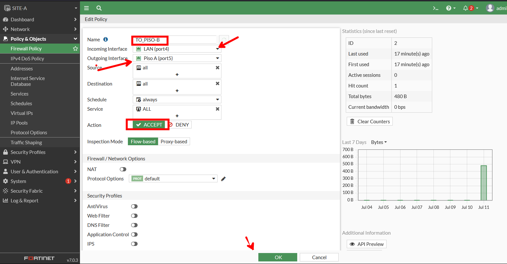

Ahora hacemos lo mismo para recibir el trafico invirtiendo la interface:

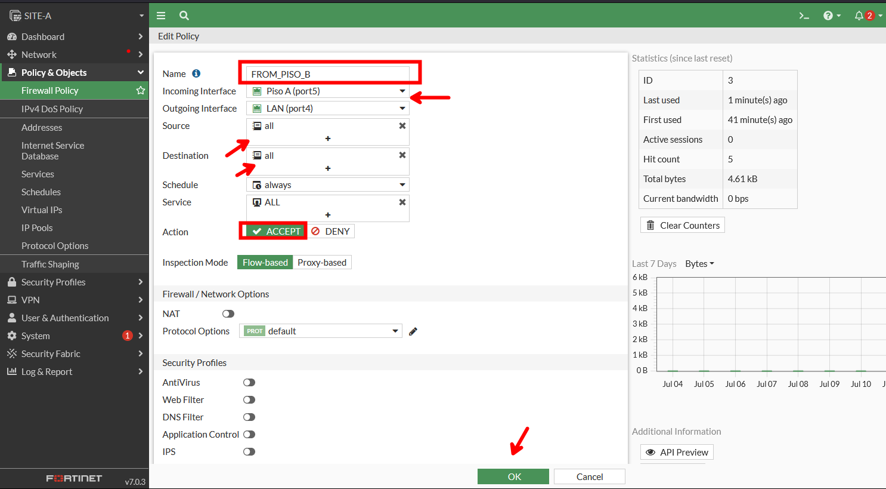

### SITE B
Realizamos lo mismos cambiando las interfaces de entrada y salida como en el SITE A.

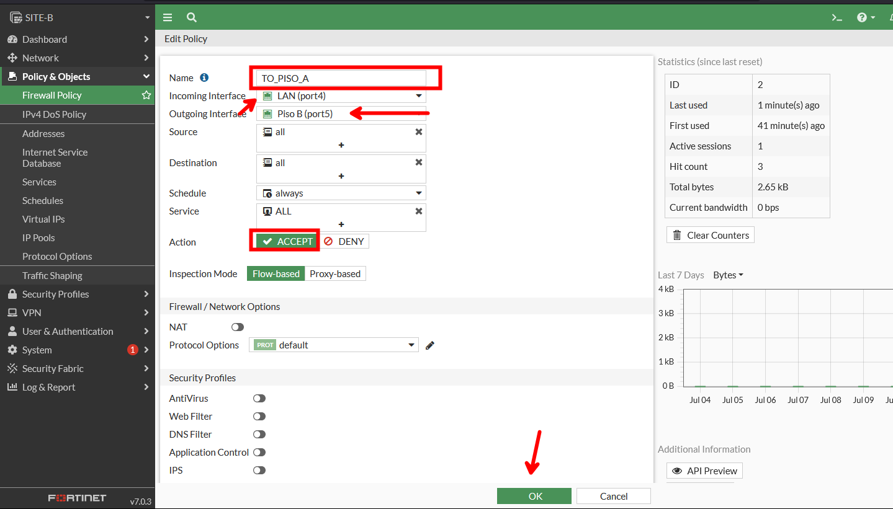

Lo mismo pero invirtiendo las interface para recibir el trafico.

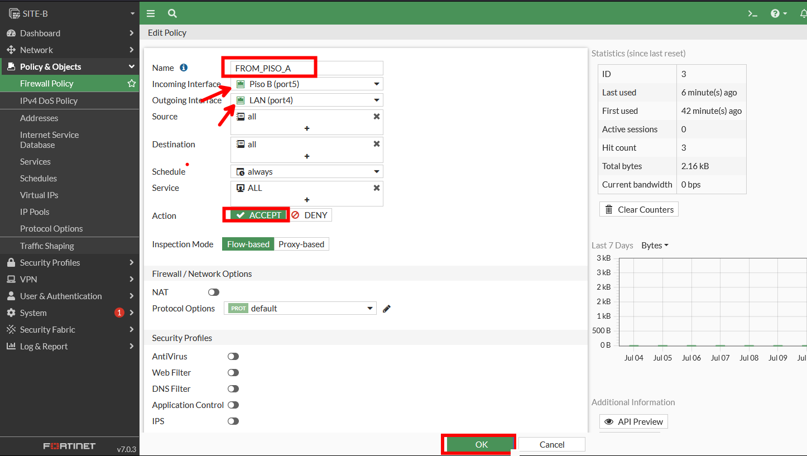

Luego de guardar, probaremos a realizar ping:

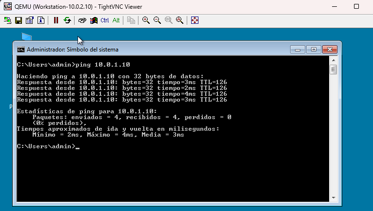

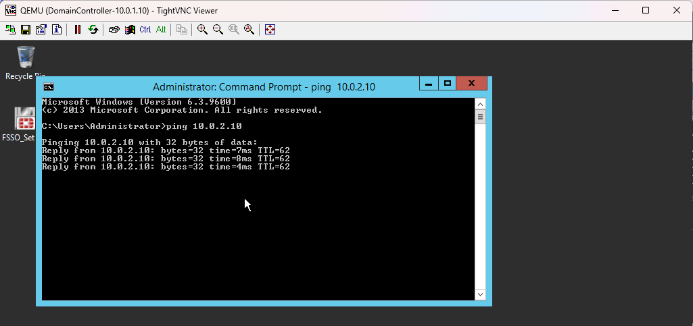

Y tenemos conectividad de ambos lados.