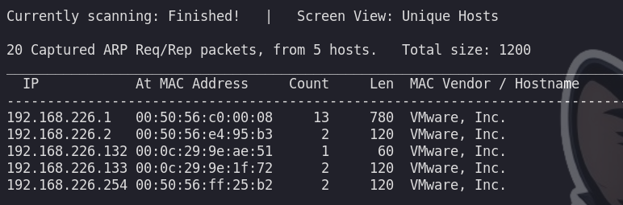
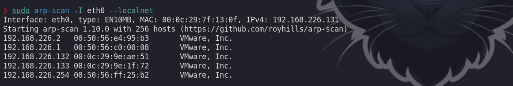

# Fping

```c
❯ fping -a -g 192.168.226.132/24 2>/dev/null
192.168.226.2
192.168.226.131
192.168.226.132
192.168.226.133
```

# Netdiscover

```c
❯ sudo netdiscover -i eth0 -r 192.168.226.1/24  
```



```c
❯ sudo arp-scan -I eth0 --localnet
```




# Nmap

Enumeración hosts en un rango :

```c
❯ sudo nmap 10.129.2.0/24 -sn -oA tnet | grep for | cut -d" " -f5

10.129.2.4
10.129.2.10
10.129.2.11
10.129.2.18
10.129.2.19
10.129.2.20
10.129.2.28
```

Enumeración pasando una lista de IPs:

```c
sudo nmap -sn -oA tnet -iL hosts.lst | grep for | cut -d" " -f5

10.129.2.18
10.129.2.19
10.129.2.20
```

Escaneo de multiples IPs:

```c
sudo nmap -sn -oA tnet 10.129.2.18 10.129.2.19 10.129.2.20| grep for | cut -d" " -f5

10.129.2.18
10.129.2.19
10.129.2.20
```

```c
sudo nmap -sn -oA tnet 10.129.2.18 10.129.2.19 10.129.2.20| grep for | cut -d" " -f5

10.129.2.18
10.129.2.19
10.129.2.20


