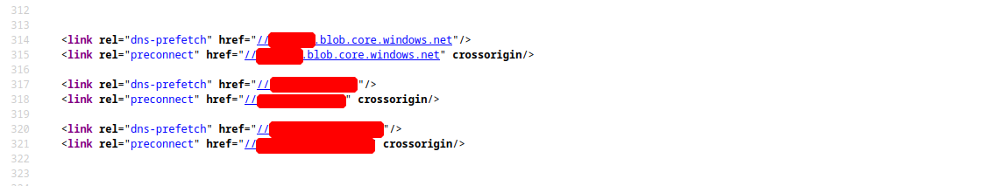
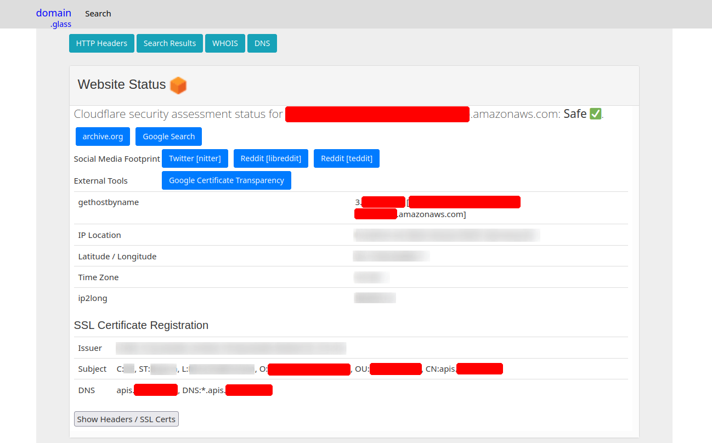
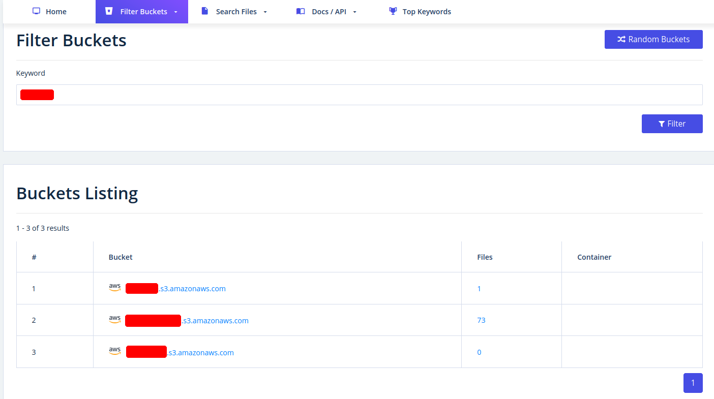
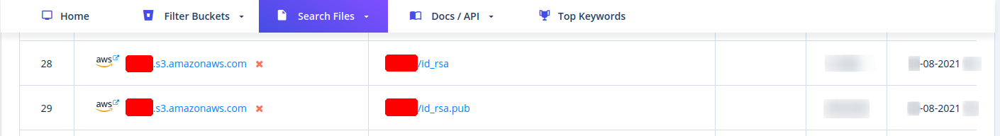

# Enumeración de subdominios

```c
curl -s https://crt.sh/\?q\=inlanefreight.com\&output\=json | jq .

[
  {
    "issuer_ca_id": 23451835427,
    "issuer_name": "C=US, O=Let's Encrypt, CN=R3",
    "common_name": "matomo.inlanefreight.com",
    "name_value": "matomo.inlanefreight.com",
    "id": 50815783237226155,
    "entry_timestamp": "2021-08-21T06:00:17.173",
    "not_before": "2021-08-21T05:00:16",
    "not_after": "2021-11-19T05:00:15",
    "serial_number": "03abe9017d6de5eda90"
  },
  {
    "issuer_ca_id": 6864563267,
    "issuer_name": "C=US, O=Let's Encrypt, CN=R3",
    "common_name": "matomo.inlanefreight.com",
    "name_value": "matomo.inlanefreight.com",
    "id": 5081529377,
    "entry_timestamp": "2021-08-21T06:00:16.932",
    "not_before": "2021-08-21T05:00:16",
    "not_after": "2021-11-19T05:00:15",
    "serial_number": "03abe90104e271c98a90"
  },
  {
    "issuer_ca_id": 113123452,
    "issuer_name": "C=US, O=Let's Encrypt, CN=R3",
    "common_name": "smartfactory.inlanefreight.com",
    "name_value": "smartfactory.inlanefreight.com",
    "id": 4941235512141012357,
    "entry_timestamp": "2021-07-27T00:32:48.071",
    "not_before": "2021-07-26T23:32:47",
    "not_after": "2021-10-24T23:32:45",
    "serial_number": "044bac5fcc4d59329ecbbe9043dd9d5d0878"
  },
  { ... SNIP ...
```

#### Company Hosted Servers

```c
for i in $(cat subdomainlist);do host $i | grep "has address" | grep inlanefreight.com | cut -d" " -f1,4;done

blog.inlanefreight.com 10.129.24.93
inlanefreight.com 10.129.27.33
matomo.inlanefreight.com 10.129.127.22
www.inlanefreight.com 10.129.127.33
s3-website-us-west-2.amazonaws.com 10.129.95.250
```

#### Shodan - IP List

```c
for i in $(cat subdomainlist);do host $i | grep "has address" | grep inlanefreight.com | cut -d" " -f4 >> ip-addresses.txt;done
```

```c
for i in $(cat ip-addresses.txt);do shodan host $i;done

10.129.24.93
City:                    Berlin
Country:                 Germany
Organization:            InlaneFreight
Updated:                 2021-09-01T09:02:11.370085
Number of open ports:    2

Ports:
     80/tcp nginx 
    443/tcp nginx 
	
10.129.27.33
City:                    Berlin
Country:                 Germany
Organization:            InlaneFreight
Updated:                 2021-08-30T22:25:31.572717
Number of open ports:    3

Ports:
     22/tcp OpenSSH (7.6p1 Ubuntu-4ubuntu0.3)
     80/tcp nginx 
    443/tcp nginx 
        |-- SSL Versions: -SSLv2, -SSLv3, -TLSv1, -TLSv1.1, -TLSv1.3, TLSv1.2
        |-- Diffie-Hellman Parameters:
                Bits:          2048
                Generator:     2
				
10.129.27.22
City:                    Berlin
Country:                 Germany
Organization:            InlaneFreight
Updated:                 2021-09-01T15:39:55.446281
Number of open ports:    8

Ports:
     25/tcp  
        |-- SSL Versions: -SSLv2, -SSLv3, -TLSv1, -TLSv1.1, TLSv1.2, TLSv1.3
     53/tcp  
     53/udp  
     80/tcp Apache httpd 
     81/tcp Apache httpd 
    110/tcp  
        |-- SSL Versions: -SSLv2, -SSLv3, -TLSv1, -TLSv1.1, TLSv1.2
    111/tcp  
    443/tcp Apache httpd 
        |-- SSL Versions: -SSLv2, -SSLv3, -TLSv1, -TLSv1.1, TLSv1.2, TLSv1.3
        |-- Diffie-Hellman Parameters:
                Bits:          2048
                Generator:     2
                Fingerprint:   RFC3526/Oakley Group 14
    444/tcp  
		
10.129.27.33
City:                    Berlin
Country:                 Germany
Organization:            InlaneFreight
Updated:                 2021-08-30T22:25:31.572717
Number of open ports:    3

Ports:
     22/tcp OpenSSH (7.6p1 Ubuntu-4ubuntu0.3)
     80/tcp nginx 
    443/tcp nginx 
        |-- SSL Versions: -SSLv2, -SSLv3, -TLSv1, -TLSv1.1, -TLSv1.3, TLSv1.2
        |-- Diffie-Hellman Parameters:
                Bits:          2048
                Generator:     2
```

#### DNS Records

```c
dig any inlanefreight.com

; <<>> DiG 9.16.1-Ubuntu <<>> any inlanefreight.com
;; global options: +cmd
;; Got answer:
;; ->>HEADER<<- opcode: QUERY, status: NOERROR, id: 52058
;; flags: qr rd ra; QUERY: 1, ANSWER: 17, AUTHORITY: 0, ADDITIONAL: 1

;; OPT PSEUDOSECTION:
; EDNS: version: 0, flags:; udp: 65494
;; QUESTION SECTION:
;inlanefreight.com.             IN      ANY

;; ANSWER SECTION:
inlanefreight.com.      300     IN      A       10.129.27.33
inlanefreight.com.      300     IN      A       10.129.95.250
inlanefreight.com.      3600    IN      MX      1 aspmx.l.google.com.
inlanefreight.com.      3600    IN      MX      10 aspmx2.googlemail.com.
inlanefreight.com.      3600    IN      MX      10 aspmx3.googlemail.com.
inlanefreight.com.      3600    IN      MX      5 alt1.aspmx.l.google.com.
inlanefreight.com.      3600    IN      MX      5 alt2.aspmx.l.google.com.
inlanefreight.com.      21600   IN      NS      ns.inwx.net.
inlanefreight.com.      21600   IN      NS      ns2.inwx.net.
inlanefreight.com.      21600   IN      NS      ns3.inwx.eu.
inlanefreight.com.      3600    IN      TXT     "MS=ms92346782372"
inlanefreight.com.      21600   IN      TXT     "atlassian-domain-verification=IJdXMt1rKCy68JFszSdCKVpwPN"
inlanefreight.com.      3600    IN      TXT     "google-site-verification=O7zV5-xFh_jn7JQ31"
inlanefreight.com.      300     IN      TXT     "google-site-verification=bow47-er9LdgoUeah"
inlanefreight.com.      3600    IN      TXT     "google-site-verification=gZsCG-BINLopf4hr2"
inlanefreight.com.      3600    IN      TXT     "logmein-verification-code=87123gff5a479e-61d4325gddkbvc1-b2bnfghfsed1-3c789427sdjirew63fc"
inlanefreight.com.      300     IN      TXT     "v=spf1 include:mailgun.org include:_spf.google.com include:spf.protection.outlook.com include:_spf.atlassian.net ip4:10.129.24.8 ip4:10.129.27.2 ip4:10.72.82.106 ~all"
inlanefreight.com.      21600   IN      SOA     ns.inwx.net. hostmaster.inwx.net. 2021072600 10800 3600 604800 3600

;; Query time: 332 msec
;; SERVER: 127.0.0.53#53(127.0.0.53)
;; WHEN: Mi Sep 01 18:27:22 CEST 2021
;; MSG SIZE  rcvd: 940
```

# Recursos en la nube

#### Sitio web de destino: código fuente



#### Domain.Glass



#### GrayHatWarfare



#### Private and Public SSH Keys Leaked



