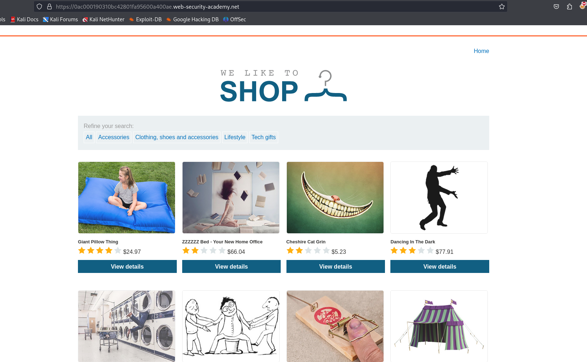
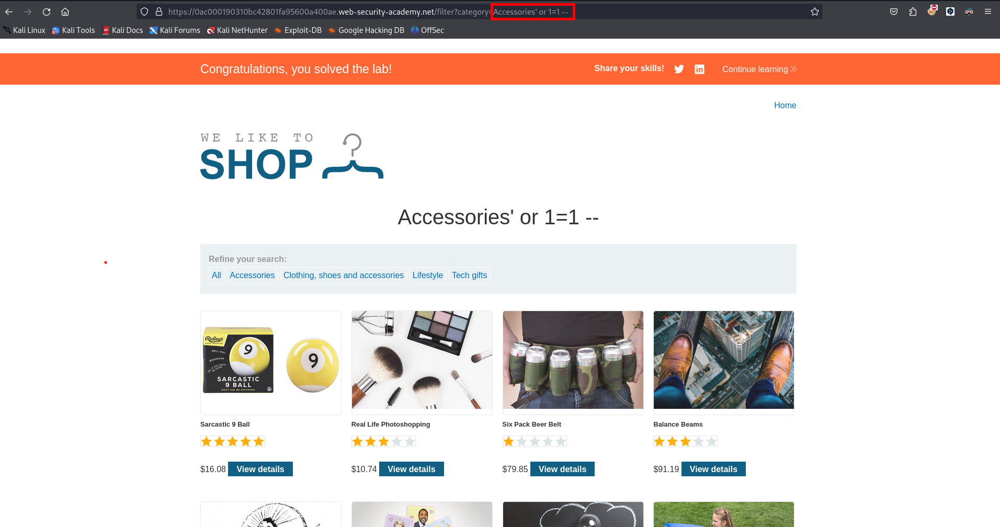

Tendremos en cuenta la siguiente consulta

```c
SELECT * FROM products WHERE category = 'Gifts' AND released = 1
```

iniciamos el laboratorio practico



Primero probamos con `'` para testear si es vulnerable a sql injection y efectivamente lo es, por lo que podemos poner:

```c
Accessories' or 1=1 --
```

Para listar todos los productos


