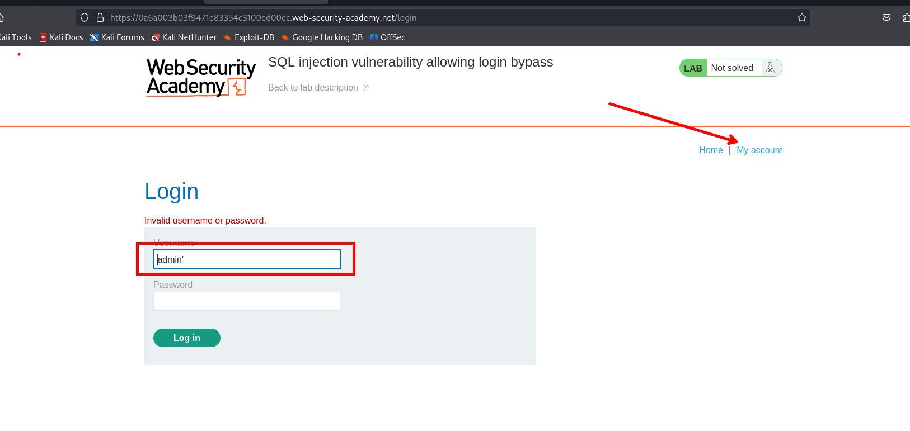
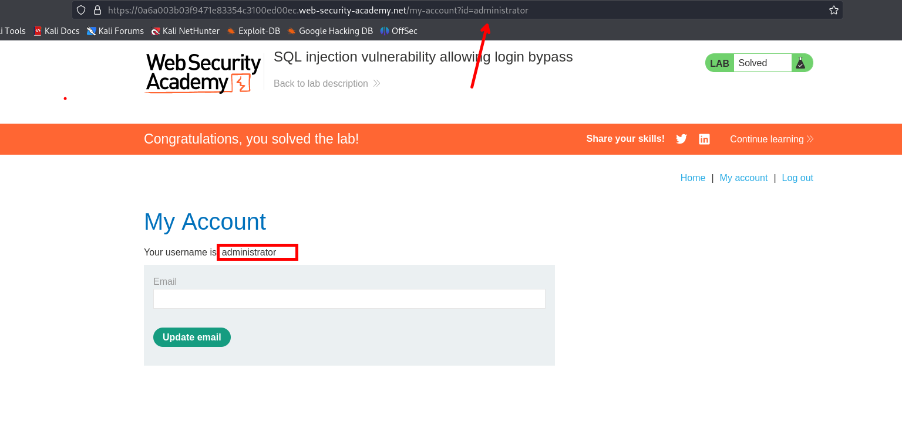

En este laboratorio intentaremos bypassear un panel de login, testeamos si es vulnerable a sql injection



No tenemos ningún tipo de respuesta por lo que ingresaremos la siguiente query

```c
admin' or 1=1--
```

Vemos que pudimos bypassear el panel de login 


