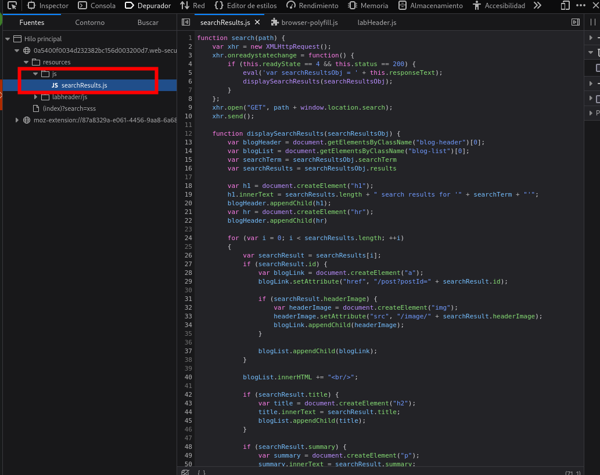

# Reflected DOM XSS



1. **Realiza una solicitud AJAX**:

```c
function search(path) {
    var xhr = new XMLHttpRequest();
    xhr.onreadystatechange = function() {
        if (this.readyState == 4 && this.status == 200) {
            eval('var searchResultsObj = ' + this.responseText);
            displaySearchResults(searchResultsObj);
        }
    };
    xhr.open("GET", path + window.location.search);
    xhr.send();
}

```

- La función `search` realiza una solicitud GET a la URL compuesta por `path` y los parámetros de la búsqueda (`window.location.search`).
- Cuando la respuesta se recibe y es exitosa (`status == 200`), el código evalúa la respuesta JSON como un objeto JavaScript usando `eval`.

1. **Mostrar los resultados de la búsqueda**:

```c
function displaySearchResults(searchResultsObj) {
    var blogHeader = document.getElementsByClassName("blog-header")[0];
    var blogList = document.getElementsByClassName("blog-list")[0];
    var searchTerm = searchResultsObj.searchTerm;
    var searchResults = searchResultsObj.results;

    var h1 = document.createElement("h1");
    h1.innerText = searchResults.length + " search results for '" + searchTerm + "'";
    blogHeader.appendChild(h1);
    var hr = document.createElement("hr");
    blogHeader.appendChild(hr);

    for (var i = 0; i < searchResults.length; ++i) {
        var searchResult = searchResults[i];
        if (searchResult.id) {
            var blogLink = document.createElement("a");
            blogLink.setAttribute("href", "/post?postId=" + searchResult.id);

            if (searchResult.headerImage) {
                var headerImage = document.createElement("img");
                headerImage.setAttribute("src", "/image/" + searchResult.headerImage);
                blogLink.appendChild(headerImage);
            }

            blogList.appendChild(blogLink);
        }

        blogList.innerHTML += "<br/>";

        if (searchResult.title) {
            var title = document.createElement("h2");
            title.innerText = searchResult.title;
            blogList.appendChild(title);
        }

        if (searchResult.summary) {
            var summary = document.createElement("p");
            summary.innerText = searchResult.summary;
            blogList.appendChild(summary);
        }

        if (searchResult.id) {
            var viewPostButton = document.createElement("a");
            viewPostButton.setAttribute("class", "button is-small");
            viewPostButton.setAttribute("href", "/post?postId=" + searchResult.id);
            viewPostButton.innerText = "View post";
        }
    }

    var linkback = document.createElement("div");
    linkback.setAttribute("class", "is-linkback");
    var backToBlog = document.createElement("a");
    backToBlog.setAttribute("href", "/");
    backToBlog.innerText = "Back to Blog";
    linkback.appendChild(backToBlog);
    blogList.appendChild(linkback);
}

```

1. - `displaySearchResults` se encarga de actualizar el DOM con los resultados de la búsqueda.

### Entrada Maliciosa: `\`

### Entrada Maliciosa: `\"-alert(1)}//`

Si un usuario malicioso ingresa la cadena `\"-alert(1)}//`, el código puede quedar vulnerable a un ataque XSS debido al uso de `eval`. Vamos a analizar por qué:

1. **Concatenación y Evaluación de la Respuesta**:
    
```c
eval('var searchResultsObj = ' + this.responseText);
```

Si el servidor devuelve una respuesta JSON que incluye la cadena maliciosa sin escaparla adecuadamente, `eval` ejecutará código JavaScript no seguro.

2. **Ejemplo de Respuesta del Servidor**: Supongamos que el servidor devuelve el siguiente JSON (simplificado):
    
```c
{
    "searchTerm": "\"-alert(1)}//",
    "results": []
}

```

3. **Evaluación Peligrosa**:
    
    - La línea `eval('var searchResultsObj = ' + this.responseText);` se convertiría en:

```c
eval('var searchResultsObj = {"searchTerm":"\"-alert(1)}//","results":[]}');
```

Debido a los caracteres de escape, la cadena de búsqueda se cierra prematuramente y se ejecuta `alert(1)`.

