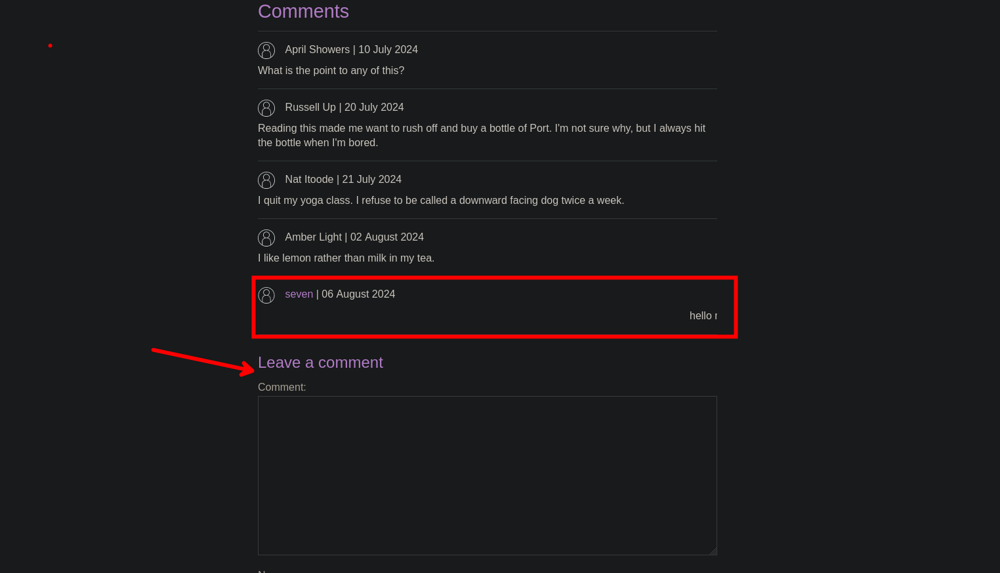
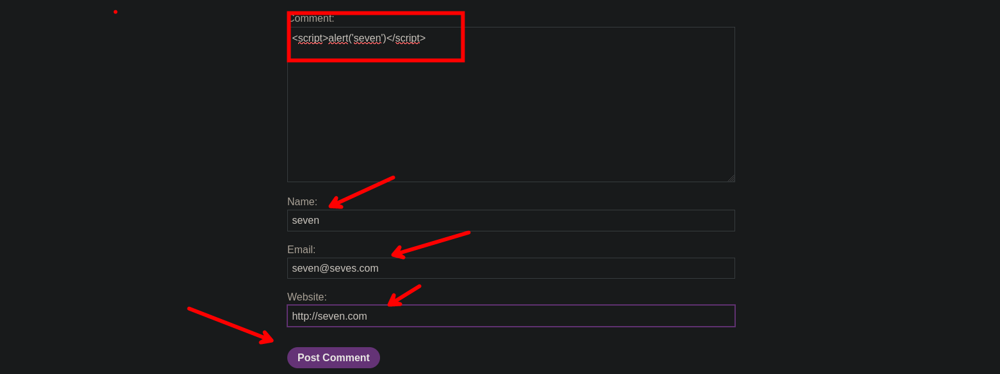

# Stored XSS into HTML context with nothing encoded

En este Lab tenemos una base de datos que almacena unos comentarios, si ingresamos código html y le damos a guardar para luego ver que se nos ejecuta como código html.



Ahora probamos código JavaScript

```c
<script>alert('seven')</script>
```



Si recargamos podemos ver que efectivamente se nos ejecuta el código JavaScript.


