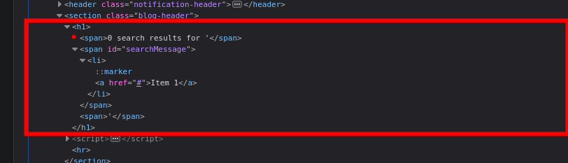
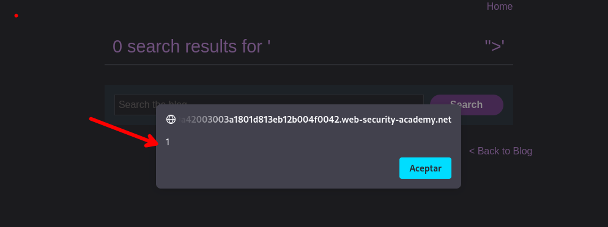

# DOM XSS in innerHTML sink using source location.search

En este laboratorio tenemos que explotar el `innerHTML` y su mala implementación.


Se tiene el siguiente script que se ejecuta cuando se realiza una busqueda

```c
 function doSearchQuery(query) {
	 document.getElementById('searchMessage').innerHTML = query;
	 }
var query = (new URLSearchParams(window.location.search)).get('search');
if(query) {
	doSearchQuery(query);
	}

```

Usaremos el siguiente código de HTML para realizar la búsqueda

```c
<li><a href="#">Item 1</a></li>
```


Luego de enviar la petición podemos observar que se nos interpreta el código html que ingresamos.



Ahora podemos hacer uso del siguiente payload para ejecutar código html

```c
<noscript><p title="</noscript>">
```



