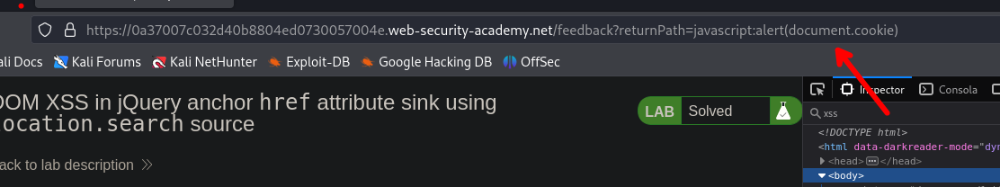

# DOM XSS in jQuery anchor `href` attribute sink using `location.search` source

En este caso tenemos que explotar `href`. Nos dirigimos al apartado de `submit feedback`


En esta pestaña tenemos un formulario


Pero lo que nos interesa es la url `returnPath=`, si observamos el código podemos ver que tenemos la etiqueta `<a id="backLink" href="xss">back</a>` por lo que tenemos una vulnerabilidad de xss


Ahora ejecutamos código JavaScript

```c
javascript:alert(document.cookie)
```

Entonces enviamos la petición



