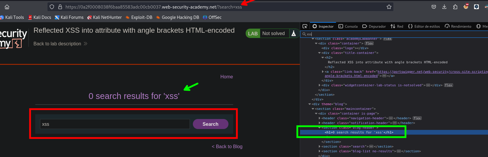

# Reflected XSS into attribute with angle brackets HTML-encoded

Ingresamos un texto en la caja de búsqueda



Luego de hacer click en el botón de `search` por lo que podemos ver en el codigo fuente que se tiene lo siguiente:

```c
<h1>0 search results for 'xss'</h1>
```

El texto que escribimos se coloca entre `''`, por lo que tendremos que buscar la manera de que nos interprete código JavaScript.

Llamar a una función al mover el puntero del mouse sobre una imagen:

```c

```

```c
"onmouseover="alert(xss)
```

Podemos ayudarnos con la documentación del sitio web:

- [https://www.w3schools.com/jsref/event_onmouseover.asp](https://www.w3schools.com/jsref/event_onmouseover.asp)


