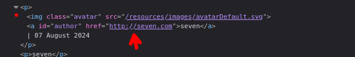
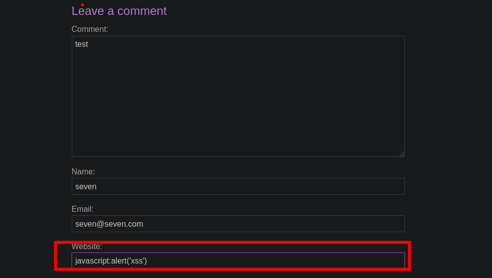
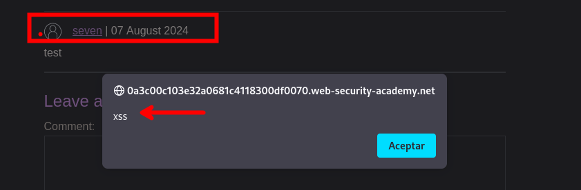

# Stored XSS into anchor `href` attribute with double quotes HTML-encoded

Al guardar nuestro comentario se nos guarda de la siguiente forma, por lo que tendremos que bypassear esto. 



Para ello debemos recordar que podemos ejecutar código en JavaScript de la siguiente manera.

```c
<a  href="javascript:void(0);">
```

Agregamos un comentario, en nuestro caso ejecutaremos un alert



Guardamos y hacemos click en nuestro enlace para luego obtener un alert con la palabra `xss`



## Referencias:

- https://hackviser.com/tactics/pentesting/web/xss
- https://swisskyrepo.github.io/PayloadsAllTheThings/XSS%20Injection/#common-payloads
