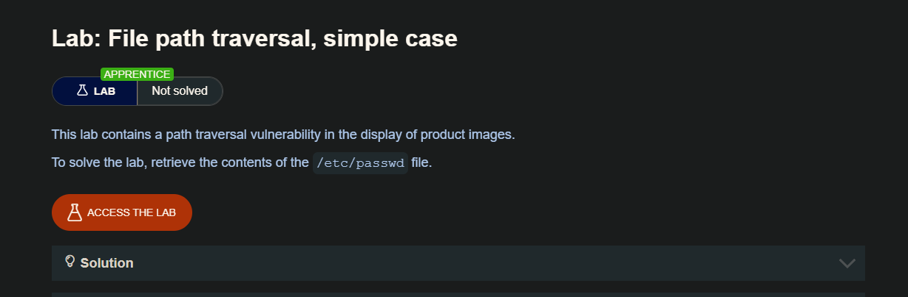
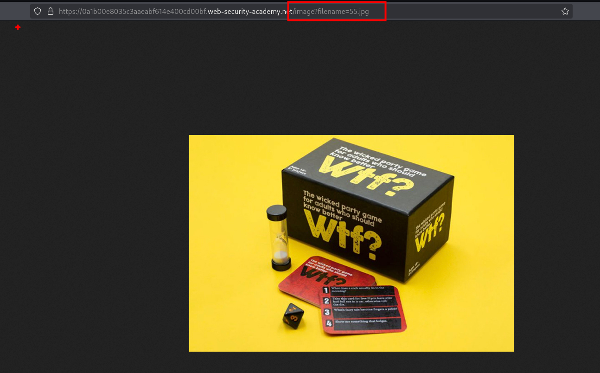
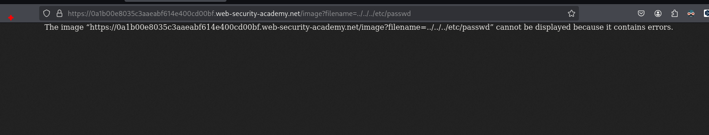
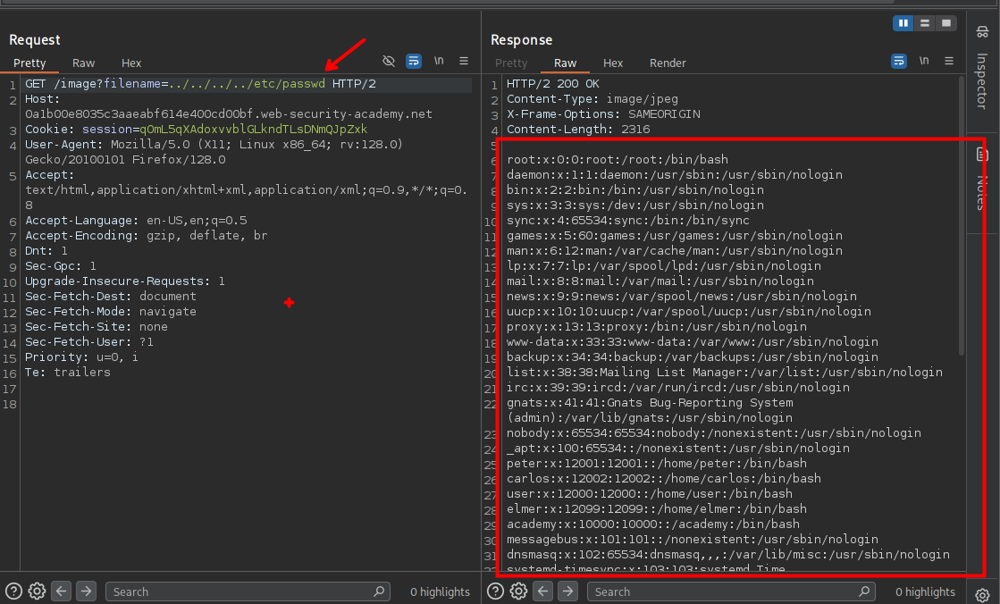

Imagine una aplicación de compras que muestra imágenes de artículos en venta. Esta podría cargar una imagen con el siguiente HTML:

```html

```

La `loadImage ` URL toma un filenameparámetro y devuelve el contenido del archivo especificado. Los archivos de imagen se almacenan en el disco en la ubicación /var/www/images/. Para devolver una imagen, la aplicación añade el nombre del archivo solicitado a este directorio base y utiliza una API del sistema de archivos para leer el contenido del archivo. En otras palabras, la aplicación lee desde la siguiente ruta de archivo:

```c
/var/www/images/218.png
```

Esta aplicación no implementa defensas contra ataques de cruce de ruta. Por lo tanto, un atacante puede solicitar la siguiente URL para recuperar el /etc/passwdarchivo del sistema de archivos del servidor:

```c
https://insecure-website.com/loadImage?filename=../../../etc/passwd
```

Esto hace que la aplicación lea desde la siguiente ruta de archivo:

```c
/var/www/images/../../../etc/passwd
```

La secuencia `../` es válida dentro de una ruta de archivo y significa ascender un nivel en la estructura de directorios. Las tres ../secuencias consecutivas ascienden desde `/var/www/images/` la raíz del sistema de archivos, por lo que el archivo que se lee es:

```c
/etc/passwd
```

En los sistemas operativos basados en Unix, este es un archivo estándar que contiene detalles de los usuarios registrados en el servidor, pero un atacante podría recuperar otros archivos arbitrarios utilizando la misma técnica.

En Windows, tanto `../` y `..\` son secuencias válidas de recorrido de directorio. El siguiente es un ejemplo de un ataque equivalente contra un servidor Windows:

```c
https://insecure-website.com/loadImage?filename=..\..\..\windows\win.ini
```

## LAB



Al iniciar el laboratorio encontraremos con un sitio web que contiene ciertas imagenes


Estas imágenes están siendo llamadas con el parámetro `filename`



```c
https://0a1b00e8035c3aaeabf614e400cd00bf.web-security-academy.net/image?filename=55.jpg
```

Inyectado un path traversal nos encontremos que la imagen no se puede mostrar debido a un error 



```c
https://0a1b00e8035c3aaeabf614e400cd00bf.web-security-academy.net/image?filename=../../../etc/passwd
```

Viendo en el historial de burpsuite, observaremos que podemos ver efectivamente el contenido del archivo `/etc/passwd`


