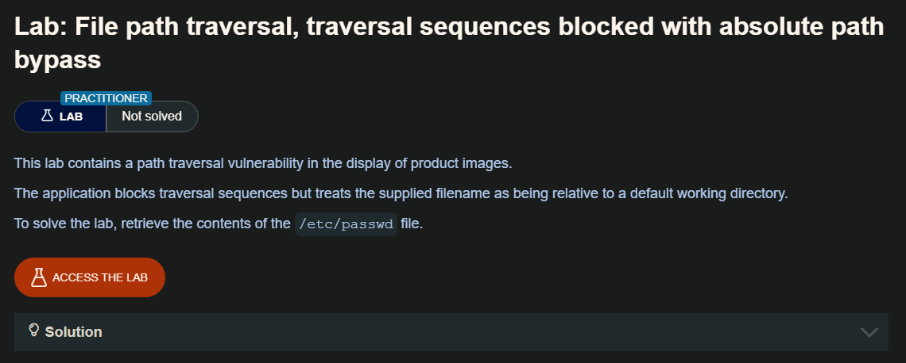
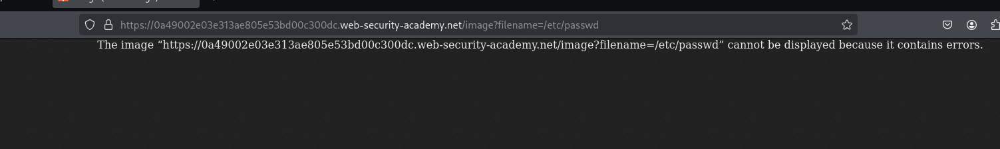
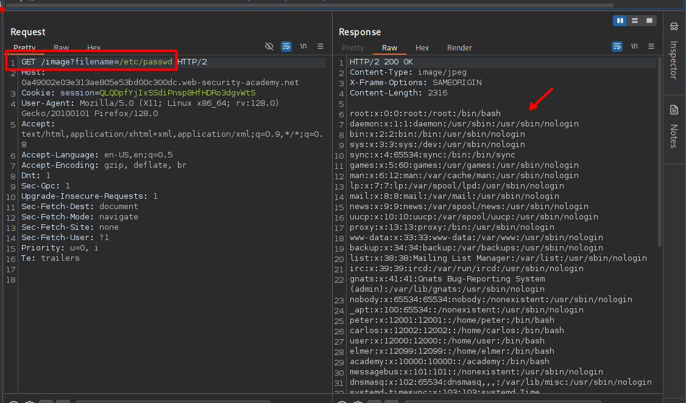

Muchas aplicaciones que introducen datos del usuario en las rutas de los archivos implementan defensas contra los ataques que atraviesan las rutas. A menudo se pueden eludir.

Si una aplicación elimina o bloquea las secuencias de recorrido de directorio del nombre de archivo proporcionado por el usuario, podría ser posible eludir la defensa utilizando una variedad de técnicas.

Puede utilizar una ruta absoluta desde la raíz del sistema de archivos, como `filename=/etc/passwd`, para hacer referencia directa a un archivo sin utilizar ninguna secuencia de navegación.

## LAB



Encontramos una imagen, la cual esta almacenada en la siguiente ruta `/image/`


```c
https://0a49002e03e313ae805e53bd00c300dc.web-security-academy.net/image?filename=49.jpg
```

al ingresar a la ruta vemos que esta esta siendo llamada por el parámetro `?filename`. Cambiando la ruta de la imagen por `/etc/passwd`. En el sitio web vemos que nos da un mensaje que no se puede abrir la imagen.



```c
https://0a49002e03e313ae805e53bd00c300dc.web-security-academy.net/image?filename=/etc/passwd
```

Desde burpsuite podemos ver que en la respuesta tenemos el contenido del archivo `passwd`

