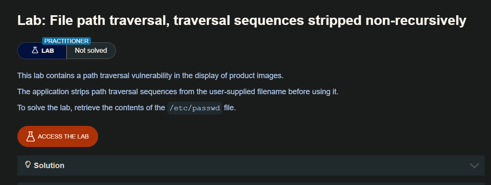
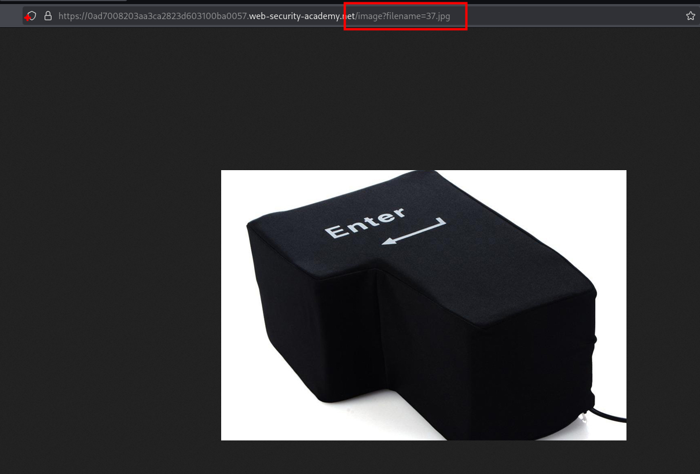
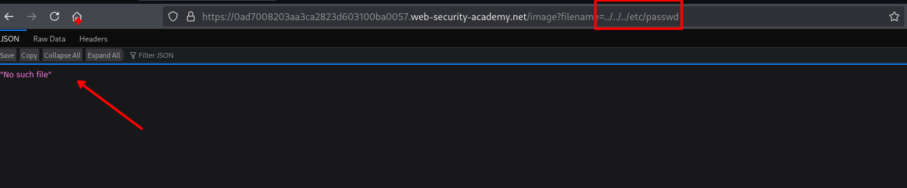
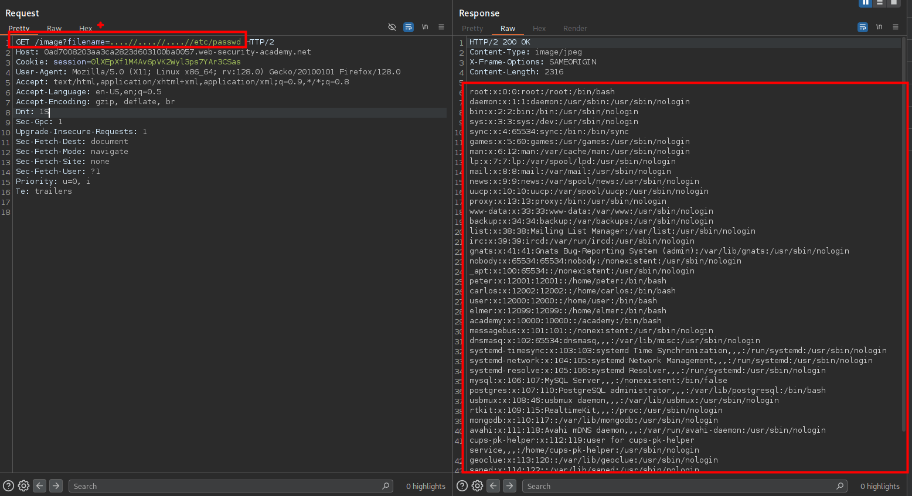

Puede utilizar secuencias transversales anidadas, como por ejemplo  `....//` o `....\/`. Estas secuencias se convierten en secuencias transversales simples cuando se elimina la secuencia interna.

## LAB

En el sitio web encontraremos con una tuenda en la que podemos ver imagenes.

Estas imágenes están siendo llamadas por un parámetro `filename` 

Al intentar realizar un path traversal este nos da un mensaje de `Not such file` indicando que el archivo no puede ser encontrado o no existe en la ruta.

Ahora probaremos esta ruta `....//....//....//etc/passwd` desde el burpsuite, y efectivamente obtenemos el contenido del `passwd`

